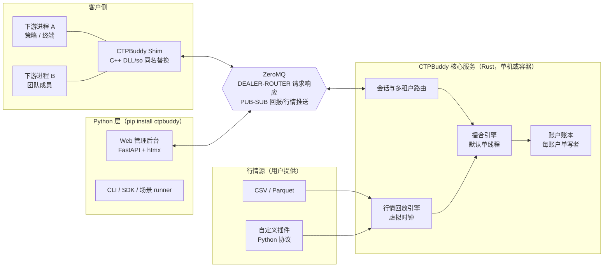
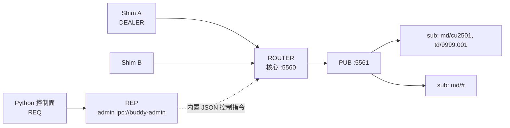

# CTPBuddy 设计文档

> 版本：v0.1（草案） · 2026-10-02 · 状态：待评审
>
> 2026-10-02 修订：依据 `docs/` 通读结论（30+ 份官方文档 + SDK CHM + LocalCTP 源码）校正设计，校正逐条记录见 §18；权威语义存档见 [`docs/CTP语义知识库.md`](docs/CTP语义知识库.md)。
>
> CTPBuddy 是一个本地 / 私有部署的 CTP 兼容仿真交易环境，为 CTP 下游系统（策略、交易终端、条件单）提供**确定性、可注入、可共享**的测试基础设施。

---

## 1. 项目定位

### 1.1 一句话

把 SimNow 的能力搬到本地：下游系统不改一行代码（替换同名 DLL），即可在一个行情可回放、场景可注入、账户可管理、多租户可共用的私有柜台里测试。

### 1.2 与现有方案的对比

| 能力 | SimNow | openctp | LocalCTP | **CTPBuddy** |
|---|---|---|---|---|
| 接入方式 | C/S，连远端 | C/S，连远端 | DLL 进程内替换 | DLL 替换（本机或私有） |
| 网络依赖 | 有 | 有 | 无 | 无（默认）/ 内网（团队模式） |
| 行情来源 | 服务端实盘映射 | 服务端 | 外部投喂（接口 hack） | 用户自带源（CSV/Parquet/插件） |
| 场景注入（跳空/停牌/流动性） | 无 | 无 | 无 | **有（场景 DSL）** |
| 确定性（同输入同输出） | 无 | 无 | 部分（回测模式） | **有（默认单线程）** |
| 多账户 / 多租户 | 弱 | 弱 | 弱 | **有（账户级隔离）** |
| 管理后台 | 官方弱后台 | 无 | 无 | **Web 后台** |
| 远程团队共享 | 否 | 否 | 否 | **私有部署** |
| CI 集成 | 不可 | 不可 | 难 | **断言 API + SDK** |

### 1.3 目标用户

- 用量化框架（vnpy / WonderTrader / ctpbee / 自研）做期货策略的个人与团队；
- CTP 交易终端、条件单、算法拆单等下游系统的开发者；
- 需要把 CTP 接入逻辑纳入 CI 的工程团队。

### 1.4 非目标（v1）

期权策略交易（数据结构预留，规则后做）、组合保证金与套利组合、实盘通道对接、营收化服务。

---

## 2. 命名与品牌

| 场景 | 名称 |
|---|---|
| 项目名 | **CTPBuddy**（CTP 全大写 + Buddy） |
| PyPI 包 | `ctpbuddy`（已确认未被占用） |
| 代码仓 | `github.com/charleszu/ctpbuddy`（已建仓并推送，main 分支） |
| 文档 / 下载站 | ctpbuddy.opentrade.one |
| Shim DLL | `thosttraderapi.dll` / `thostmduserapi.dll`（**原名替换**，不加后缀） |

**合规声明**（README 与官网固定文案）：CTPBuddy 是兼容 CTP 接口的开源测试工具，与上海期货信息技术有限公司（上期技术）无任何隶属关系；不附带任何官方 SDK 文件，头文件由使用者自备。

---

## 3. 设计原则

1. **零改造接入** —— 下游只换 DLL，代码不动；Client ID、回调线程模型与真 CTP 一致。
2. **确定性优先** —— 默认单线程撮合，同场景同输入必然同输出，可作回归测试基线。
3. **故障可注入** —— 断连、延迟、重复回报、部分成交、涨跌停锁死、流动性枯竭都是一等公民。
4. **解耦** —— 行情源、场景变换、回放时钟、撮合、账本各自独立可替换。
5. **多租户** —— 账户级状态隔离，共享同一虚拟市场；私有部署即团队测试环境。
6. **聚焦** —— 期货先行，期权与组合保证金后置，接口模型预留扩展位。

---

## 4. 总体架构



### 4.1 组件职责

| 组件 | 语言 | 职责 | 明确不做 |
|---|---|---|---|
| Shim DLL | C++ | CTP ABI 实现、结构体编解码、ZMQ 收发、SPI 分发 | 任何业务逻辑、行情文件解析 |
| 核心服务 | Rust | 会话路由、回放时钟、撮合、账本、结算、持久化、admin socket | 不做 Web 页面 |
| Python 层 | Python | CLI、SDK/断言、场景 runner、Web 后台、行情源插件 | 撮合、账本（绝不进 Python） |
| 行情源 | 用户侧 | 提供 tick 数据（CSV/Parquet/插件） | 不感知柜台 |

### 4.2 部署形态

- **形态 B（默认）本机单机**：`ctpbuddy up` 起核心 + Python 层，Shim 走 `ipc://` 或 loopback TCP。
- **形态 C 团队私有**：docker-compose 部署核心服务，团队成员机器上的 Shim 指向内网地址；多租户账户由后台开通。
- **形态 A（全进程内，类 LocalCTP）**：评估后不采用——崩溃耦合、无法多客户共享、Web 无处安放、版本编译负担重。

### 4.3 语言分层理由

- Shim 必须 C++：`CreateFtdcTraderApi` 返回 C++ 抽象类指针，导出 MSVC mangled 符号，Rust 实现要手拼符号名，痛苦且脆。
- 核心必须 Rust：撮合/账本是"不能随便崩"的单线程确定性引擎，内存安全有价值；performance 与 GC 可预期。
- 控制面必须 Python：量化社区的通用语；FastAPI + htm 的服务端渲染最快；行情源插件生态也靠 Python。

---

## 5. Shim DLL 设计（C++）

### 5.1 导出兼容

- 完整实现 `CThostFtdcTraderApi` / `CThostFtdcMdApi` 抽象类，导出 `CreateFtdcTraderApi` / `CreateFtdcMdApi` 等全部符号（与官方 DLL 同名同签名）；
- 随包提供匹配的 `.lib` 导入库，下游现有的官方 `.lib` 链接方式可直接用；
- 回调（SPI）由 ZMQ IO 线程分发，与真 CTP "SPI 在独立线程回调"的模型一致，下游无需改动线程假设。

### 5.2 职责边界

Shim 只做三件事：**ABI 适配 → 帧封装 → SPI 分发**。所有判断（报单校验、成交、资金）发生在核心服务。Shim 崩溃不得影响核心，核心重启不影响其他进程的 Shim（各自断链重连）。

### 5.3 连接配置

每个 API 实例的连接目标按以下优先级解析：

1. **`RegisterFront(addr)` 传入的地址即端点本身**（`ipc://` / `tcp://` 形式）——按 API 实例独立生效，一个下游进程因此可以同时连多个柜台（多 Broker 场景的标准姿势，与真实 CTP 多前置行为一致）；
2. `ctpbuddy.ini` 的 `[fronts]` 别名表：把下游既有的真实前置地址映射到 Buddy 端点——**下游生产配置文件可以一行不改**；
3. 环境变量 `CTPBUDDY_ADDR` > 默认 `ipc://ctpbuddy`（Windows 回退 `tcp://127.0.0.1:5560`）。

```ini
# ctpbuddy.ini 示例
[fronts]
tcp://180.168.146.187:10000 = ipc://ctpbuddy         ; 原 SimNow 前置 → 本机柜台
tcp://180.168.146.187:10001 = tcp://team-server:5560 ; 原实盘前置 → 团队柜台
```

配置同时决定本机模式 / 团队模式，**Shim 二进制只有一个**。

### 5.4 结构体注册表与代码生成

- `shim/codegen/` 解析 6.7.13 官方头文件，生成：
  1. 全部 CTP struct 的尺寸/布局 `static_assert` 表；
  2. struct 名 ↔ wire type id 的稳定映射（id 显式登记在 `registry.json`，生成器只校验不改号）；
  3. Req/Rtn/OnRsp 的消息目录。
- **头文件不入库**（合规）：CI 与本地构建时使用者放置自备头文件，或从发布包模板下载。
- v1 仅支持 **6.7.13**（SimNow 当前发布版）；下游必须用 6.7.1x 头文件编译——CTP struct 是尾部追加式演进，旧头文件struct 尺寸不一致会导致内存踩踏，此约束写在文档首页。

### 5.5 版本化发布

Shim 与核心服务版本独立（`shim 0.x` wire ver 与 `core 0.x` 匹配）；wire 帧头带版本号，不匹配时 Shim 在 `RegisterFront` 后以 `OnFrontDisconnected` 明确报错，绝不静默。

---

## 6. 通信协议（ZeroMQ + 自定义二进制帧）

### 6.1 Socket 拓扑



- 请求/响应：Shim 侧 DEALER ↔ 核心 ROUTER（多客户端、天然带身份）；
- 下行推送：核心 PUB ↔ Shim SUB，topic 过滤；
- 控制面：Python 层 REQ ↔ 核心 REP，仅监听 loopback/ipc，JSON 负载；
- 三组端口都在 `ctpbuddy up` 时打印，`--endpoint` 可改。

### 6.2 帧格式

```
+--------+-----+--------+----------+----------+------------------+
| magic  | ver | type   | req_id   | payload  | payload          |
| 2B 'CB'| 1B  | u16 LE | u32 LE   | _len     | (struct 裸字节   |
|        |     |        |          | u32 LE   |  或 UTF-8 JSON)  |
+--------+-----+--------+----------+----------+------------------+
```

- `type`：wire type id，见 6.3；
- `req_id`：透传 CTP `nRequestID`，响应回echo；
- `payload`：默认 struct 裸字节（`memcpy`，零转换零丢失）；flags/版本位预留（bit0=JSON，v1 只用于 admin 通道）；
- **不用 protobuf**：几百个 CTP struct 的转换是体力活且易错，两端同为自研程序，raw struct 最快最稳。

### 6.3 Type id 分配

type id 标识的是**消息**（一次 API 调用或一次回调），不是裸 struct：`CThostFtdcInputOrderField` 同时用于 `ReqOrderInsert`、`OnRspOrderInsert`、`OnErrRtnOrderInsert`，只有消息级 id 才能区分请求 / 响应 / 错误回报三种语义。

id 的来源即"API 使用的 struct 集合"：codegen 解析 API 类的全部 `Req*` 方法与 Spi 回调签名，提取 (消息名, struct, 方向) 三元组——约百余个消息，而非头文件全部 ~350 个 struct；未出现在 API 签名中的 struct 不占 id。

| 段 | 用途 |
|---|---|
| `0x0000` | 协议层：PING / PONG / HELLO（协商 wire ver） |
| `0x0100` | 会话层：AUTH / LOGOUT / SETTLE_CONFIRM（核心扩展消息，无对应 CTP struct） |
| `0x0200` | ADMIN（JSON 控制指令，REQ/REP 通道） |
| `0x1000+` | CTP 消息透传：每条 (Req/Rtn/Rsp, struct) 一个 id，`registry.json` 显式登记 |

- `registry.json` 人工评审后入库，**id 一经分配不再变更**；codegen 只做校验：① 每个 API 方法都有 id；② 每个被引用 struct 有布局断言（sizeof/offsetof）；③ 无孤儿 id；
- 纯客户端本地调用不过线：`GetApiVersion`、`GetTradingDay`（值由核心在 AUTH 时下发并缓存）、`Release`、`RegisterFront`、`RegisterSpi` 等在 Shim 本地完成。

### 6.4 消息目录（v1）

**Client → Core（DEALER）**

| 类型 | 对应 CTP API |
|---|---|
| AUTH | ReqAuthenticate / ReqUserLogin 合并（struct 透传） |
| LOGOUT / SETTLE_CONFIRM | ReqUserLogout / ReqSettlementInfoConfirm |
| ORDER_INSERT | ReqOrderInsert（`CThostFtdcInputOrderField`） |
| ORDER_ACTION | ReqOrderAction |
| SUB_MD / UNSUB_MD | SubscribeMarketData / UnSubscribeMarketData |
| QRY | 所有 ReqQry* 按 struct id 泛化 |

**Core → Client（DEALER 响应 / PUB 推送）**

| 通道 | topic | 内容 |
|---|---|---|
| DEALER | — | OnRsp* 系列（携带 req_id、error_id、is_last） |
| PUB | `md/{exchange}/{instrument}` | OnRtnDepthMarketData |
| PUB | `td/{broker}/{investor}` | OnRtnOrder / OnRtnTrade / OnErrRtnOrder* |
| PUB | `sys` | 广播：结算完成、系统公告 |

> 落地状态：帧格式与消息目录已按本节实现（M1）；传输层暂用 plain TCP（一连接一客户端、帧背靠背）承载相同帧，ZeroMQ 是既定目标传输—— framing 与传输解耦，替换 ZMQ 是传输适配层改动、不动协议（`core/ctpbuddy-server/src/lib.rs` 顶部注释同）。

- 查询语义对齐 CTP：多帧循环 + 末帧 `is_last=1`；
- **BrokerID 策略：单进程托管多 Broker**：broker 是核心内的一等实体（各有合约目录、保证金/手续费规则表、账户空间），默认 BrokerID 为 **8888**（不与 SimNow 的 9999 及主流实盘券商号冲突，金融俗惯例里的吉利号，`--broker-id` 可改）。AUTH 按核心的 broker 清单强校验，未知 BrokerID 按 CTP 语义拒登录。多 broker **共享同一路回放行情与虚拟时钟**——同一场景下不同经纪商的成交差异只来自费率/保证金/合约目录，这对多券商对比测试恰是有用属性。需要硬隔离（故障域/版本/管理边界）时可一个 broker 部署一个核心实例，两者只是运维选择、不动架构；下游单进程连多个柜台依赖 §5.3 的按实例端点解析；
- **订阅时机与可靠性**：Shim 在 AUTH 成功后订阅 `td/{broker}/{investor}`。注意 ZMQ PUB/SUB 两个特性：① 慢订阅者在 HWM 打满时被静默丢帧——核心与 Shim 均设大 HWM（本地 IPC/loopback 实际碰不到，团队远程模式才需留意）；② slow joiner 订阅建立瞬间可能丢头几帧。对策统一为：登录成功后核心主动补发一版快照（订单/持仓/成交/资金），与 CTP 下游"登录后先查一遍"的既有习惯天然对齐，不依赖订阅建立时刻；
- **断链语义**：ZMQ 无持久化无重投。Shim 检测到与核心断开即以 `OnFrontDisconnected` 回调下游——这是刻意的设计，下游可借此测试自身重连逻辑。核心重启后 Shim 重新 AUTH 即恢复；
- **安全**：默认仅 loopback/ipc；团队模式跨机部署使用 CURVE 加密（ZMQ 原生）或内网 VPN，文档明确禁止把 5560/5561 暴露公网。

---

## 7. 行情回放引擎（Rust 核心）

### 7.1 设计立场

Buddy 只做**回放逻辑、柜台集成、管理界面**；行情数据由使用者提供。行情源与柜台完全解耦，通过规范化 tick + 插件协议衔接。

### 7.2 规范化 tick（Canonical Tick）

| 字段 | 说明 |
|---|---|
| instrument_id / exchange_id / trading_day | 标识与交易日。**TradingDay 与 ActionDay 分离、且各所实现混乱**（上期/能源准确归次日；大商所夜盘两日期都是 TradingDay；郑商所日夜盘均当天）——不可假设统一，交易日一律取登录响应 / `GetTradingDay()` 下发的 TradingDay |
| update_time + update_millisec | 虚拟时钟唯一时间源。毫秒字段各所差异大：上期/能源/中金只出现 0 和 500、大商所真实毫秒、郑商所恒 0——回放时钟不得假设均匀间隔 |
| last_price / volume / turnover / open_interest | 最新价与**当日累计**量；切片成交量 = 本切片 Volume − 上切片 Volume（差分后才是一段时间内的成交） |
| pre_settlement_price / settlement_price | 昨结 / 今结（结算与浮动盈亏输入）；盘中 SettlementPrice 可能为无效值 |
| upper/lower_limit_price | 涨跌停（风控与撮合边界） |
| bid/ask_price[5] + bid/ask_volume[5] | 五档深度（挂单成交合理性的前提） |

字段口径细则（照录自官方文档，实现时逐条对账）：

- **CTP 推的是快照（切片）不是逐笔**：一段时间逐笔合成一个快照，一般 1 秒 2 笔（郑商所可能多笔）；「有更新才推」「首次连接推初始行情」；推送时刻不严格 000/500。回放引擎按快照序列驱动，不伪造逐笔；
- **无效值 = double 上限 `1.7976931348623157e+308`**（如盘中 SettlementPrice）——源数据清洗与断言比较都必须先过滤；
- `AveragePrice`：除郑商所外其余大所需**除以合约乘数**才是真实均价；Turnover 同类校正（郑商×乘数，大商/上期不需）；
- **无历史行情、无回补**：断线/未登录期间丢失不回补；盘后（15:00~15:30）结算完成会推含结算价的快照、郑商所盘后继续推——不当异常处理；日盘启动可能重演夜盘流水；
- 行情 API 无合约查询（靠交易 API `ReqQryInstrument` 或编码规则生成）；订阅必须登录后发起，`OnRspSubMarketData` 无论合约对错都返回 "CTP:No Error"——**只有编码正确的合约才有行情**（上期/能源小写+4 位、中金大写+4 位、郑商大写+3 位、大商小写+4 位）。

> 限制说明：若源只有最新价无深度，限价单只能退化为"即时成交模式"；场景文件应尽量带五档，文档中明确给出最低数据要求。

### 7.3 行情源

- **内置**：CSV（utf-8/gb18030）、Parquet（arrow 批量读取 → 预解码为 canonical binary 中间格式，倍速回放时避免重复解码开销）；
- **插件协议（Python）**：实现 `open(spec) -> Iterable[CanonicalTick]` 即成为一个源，用户可接自有钱兔/Level2/第三方库；插件在 Python 侧预导出 canonical binary 供核心直接消费，热路径不进 Python；
- 源按虚拟时间有序推进，**严禁未来数据**（core 只看见"当前 tick"）。

### 7.4 场景管道与 DSL

```yaml
# scenario.yaml 示例
name: flash-crash-cu
source:
  kind: csv            # csv | parquet | plugin
  path: ./ticks/cu2501.csv
transforms:
  - kind: freeze       # 停牌：指定时段无新行情
    at: "2025-03-14 10:29:00"
    duration: 90s
  - kind: gap          # 跳空：指定时刻价格平移
    at: "2025-03-14 11:00:00"
    shift: -3.0
  - kind: liquidity    # 流动性缩放：五档挂量 × 0.1
    from: "2025-03-14 13:30:00"
    scale: 0.1
clock:
  time_scale: 50        # 50 倍速
  start: "2025-03-14 09:00:00"
accounts:
  - investor: 001      # 自动开户，初始资金可配
    balance: 2000000
assertions:             # 可选：场景内断言（CI 用）
  - after: 30s
    investor: 001
    expect: { orders_filled: ">=1" }
```

管道：`source → transforms → virtual clock → 撮合/账本`。Transforms 顺序执行、可组合，自身也是确定性纯函数。

### 7.5 播放控制

- 运行 / 暂停 / **单步（一个 tick）** / 倍速（1–1000x）/ seek / 循环 / 停止；
- 控制入口：Web 后台、CLI（`ctpbuddy replay ...`）、ADMIN 帧；
- 单步与暂停是调试刚需，优先级高于倍速。

### 7.6 确定性边界（承诺的精确措辞）

**确定性指什么**：市场 + 柜台是一个封闭系统。给定同一场景文件（含源数据 hash）与同一串按序到达的请求，核心产出逐字节可复现——报单、成交、结算、错误码序列可用 hash 校验。这是回归测试基线的前提，也是 SimNow 给不了的东西。

**边界在哪**（同样重要，写清楚免得出事）：

1. **请求序列本身必须是确定性的**。下单方是鲜活下游进程时：tick 信号触发的下单 → 确定（tick 序列确定）；墙钟定时器触发的下单 → 不确定，Buddy 管不了真实线程调度，虚拟时钟只作用于世界内部；
2. **多进程并发下单时，时间优先不可复现**。两个下游进程对同一 tick 反应，到达顺序受网络与调度影响——这次 A 的单排队在前，下次可能 B 在前，真实交易所亦然。单进程单线程驱动无此问题；
3. **分片模式（见 8.5）下不保证**跨品种成交在账本上的应用顺序。

**获得确定性的标准姿势**：

- 测试驱动用 SDK 在虚拟时钟内脚本化下单，请求序列即场景文件的一部分；
- 或开启**录制模式**：把一次真实会话的请求流录成场景，回放即复现——行为 messy 的客户端也能拿到可复现基线。

对用户的承诺因此精确为：**场景文件（含录制的请求流）唯一决定核心输出**；剩下的不确定性来自被测系统自己，Buddy 负责把它隔离并暴露出来，而不是假装它不存在。

---

## 8. 撮合引擎与账户模型（Rust 核心）

### 8.1 事件循环

核心是**单线程世界循环**：MD tick、客户端请求、定时器（结算）、admin 指令全部入队串行处理。每个事件落**事件日志**，定期打**快照**；重启后快照 + 日志重放恢复。撮合写成"事件在 instrument 上的纯函数"，为将来并行只留调度切换点。

### 8.2 订单指令矩阵（v1）

指令类型是 **OrderPriceType × TimeCondition × VolumeCondition 三字段组合**，不是单字段（信易科技四所整理表全表照录于 `docs/notes/01`）：

| 指令 | OrderPriceType | TimeCondition | VolumeCondition | 备注 |
|---|---|---|---|---|
| 限价当日有效 | LimitPrice | GFD | AV | |
| 市价单 | AnyPrice | IOC（大商 GFD；中金撤销型 IOC、转限价型 GFD） | AV | LimitPrice=0；郑商所价格非 0 会被拒；**上期所生产环境暂不支持** |
| FAK 任意成交数量 | LimitPrice（郑商所可 AnyPrice） | IOC | AV | 能成交多少成交多少，剩余撤销 |
| FAK 指定成交数量 | LimitPrice | IOC | MV + MinVolume | **仅上期所/中金所**：可成交量 < MinVolume 整笔撤销 |
| FOK（全成全灭） | LimitPrice | IOC | CV | 不能全部成交则整笔撤销 |
| 止损/止盈（v1.5 候选） | AnyPrice | GFD | AV | **仅大商所**：CC_Touch/CC_TouchProfit + StopPrice，触发后另下新报单（OrderSysID 带 `TJBD_` 前缀） |
| 中金所五档市价/最优价 | FiveLevelPrice/BestPrice | IOC 撤销型 / GFD 转限价型 | AV | 仅中金所 |

规则要点：

- **FAK/FOK 不是单字段而是 TC+VC 组合**：FOK=`IOC+CV`，FAK=`IOC+AV` 或 `IOC+MV`；郑商所官方口径期货**仅 FAK**（无 FOK）；
- 交易所特殊指令差异（市价单按所语义、止损止盈仅大商所、套利指令）由 Core 归一化消化——客户端只看得到柜台归一化后的包（Q57）；
- 报单固定值：`VolumeCondition=AV`、`MinVolume=1`、`ForceCloseReason=FCC_NotForceClose`、`IsAutoSuspend=0`、`UserForceClose=0`；`CombOffsetFlag/CombHedgeFlag` 是长度 5 数组但当前只填 `[0]`；
- FAK/FOK **不得用于集合竞价**；其造成的自成交和撤单不计入异常交易监管；
- **GTC 过夜挂单不支持**（国内交易所不支持的语义直接拒绝，不静默丢弃）；撤单 `ActionFlag` 仅 `AF_Delete`（挂起/激活/修改无此功能）。

### 8.3 风控规则表（可配置，勿 if-else 写死）

- 价格超涨跌停 → 拒绝（对齐交易所错误码）；
- 可用资金/持仓不足 → 拒绝（错误码语义对齐）；**可平数量口径**：多头 `Position − ShortFrozen − CombShortFrozen`，空头 `Position − LongFrozen − CombLongFrozen`（防重复平仓）；
- 冻结与解冻规则：买开→多头持仓 `LongFrozen += 报单量`；买平→空头持仓 `LongFrozen += 报单量`（挂单即冻，防"还有 1 手可平"误判）；报单被拒按报单量解冻、撤单按 `VolumeTotal`（未成交量）解冻；
- 自成交预防（同账户同合约对冲单检查，可开关）；
- 报单频率限制（模拟 CTP 流控，可注入用于测试下游限流处理）：现代柜台口径为**显式拒绝**（`OnRspOrderAction`「CTP:下单频率限制」），区别于 2009 FAQ 时代「默认每会话 6 笔/秒、超限排队不报错」的历史口径——CTPBuddy 默认复刻现代口径，历史口径可经规则表注入用于测试旧下游；
- 单笔最大手数 / 单合约持仓上限；
- 平今/平昨费率严格区分（即使大商所也分平今/平昨两套费率，统一用平昨费率会有较大偏差）；
- 交易所差异归一化（平今转换、市价单按所语义、成交开平标志）在 Core 完成，客户端不看原始交易所包。

### 8.4 撮合模式

1. **即时成交模式（默认）**：市价/FAK/FOK 按当前行情对手价成交（对齐 SimNow/LocalCTP 语义）；
2. **限价簿模式**：价格优先、时间优先排队，按五档量与队列位置估算成交——**依赖深度数据**，无深度时降级为模式 1 并在日志告警。

按所差异：大商所市价单内部转涨跌停限价撮合，**成交价可能不等于对手价**（其余所按最优对手价）——规则表按交易所配置；撮合结果以成交回报为准（见 §8.9）。

### 8.5 并行策略（可选，默认关闭）

- 单线程全品种为默认；
- 容量不足时：**按 instrument 哈希分片到 K 个撮合线程**（同品种恒落同片，仍单写），账户账本保持单写者（fills 经账本队列串行落账）；
- 分片模式 = 吞吐模式，严格确定性仅在默认模式成立（见 7.6）；
- **不采用"每品种一个线程"**：跨品种策略落账顺序不可复现，且真实瓶颈在行情解码与 ZMQ I/O。

### 8.6 账户 / 持仓 / 资金模型

口径权威来源：《CTP账户持仓和资金的维护》（逐日盯市），公式与算例完整照录于 `docs/notes/04`。

- **资金恒等式（ledger 核心口径）**：
  ```
  静态权益 = PreBalance + Deposit − Withdraw
  Balance  = 静态权益 + PositionProfit + CloseProfit + CashIn − Commission   ← 即「动态权益」
  Available = Balance − CurrMargin − FrozenMargin − FrozenCommission − FrozenCash − DeliveryMargin
  ```
  **CTP 的 `Balance` 字段 = 动态权益（含当日浮动/平仓盈亏），不是静态权益**——这是 ledger 实现最容易错的口径；PositionProfit/CloseProfit/Commission/CurrMargin/FrozenMargin/FrozenCommission/CashIn 均为按持仓汇总的**当日值，结算后清零**；
- 持仓维护 `InvestorPosition` + `InvestorPositionDetail`：昨仓 / 今仓分开，平仓严格区分**平昨 / 平今**（上期所平今手续费更高、大商所平今单独、中金/郑商所无区分但费率表不同）——全部走**规则表按交易所配置**，字段含 CloseToday/CloseYesterday 分开统计；`YdPosition = Position − TodayPosition`；持仓明细单条 = (OpenDate, TradeID, Direction, OpenPrice, Volume, Margin, ...)，按 (OpenDate, TradeID) 排序实现**先开先平**；
- **平仓盈亏按明细算**：昨仓明细持仓价 = **昨结算价**、今仓明细持仓价 = **开仓价**——顺序错了盈亏就算错（算例见 notes/04 E2）；持仓盈亏（浮动）多头 `(最新价−持仓均价)×乘数×手数`，空头反向；
- 保证金：期货 `(MarginRatioByVolume + MarginRatioByMoney × Price × VolumeMultiple) × Volume`；**实际计算用公司保证金率**（`ReqQryInstrumentMarginRate` 口径，即最终费率）；`ReqQryInstrument` 返回的是交易所率，仅展示不用；**MarginPriceType** 四值（昨仓恒用昨结算价；今仓按公司配置：昨结'1'/最新'2'/成交均价'3'/开仓价'4'——只有最新价/成交均价模式下今仓保证金随行情波动）；市价单冻结按涨跌停价；期权保证金归纳式 `MAX(权利金+不变部分, 最小保证金)` 预留扩展位；优惠（品种内大单边、跨品种大单边、套利取高）按规则表配置；
- 手续费：`成交量 × (成交价 × 乘数 × RatioByMoney + RatioByVolume)`，开仓/平仓/平今各一套费率；**申报费**（OrderCommRate，中金所特有）：报单+撤单都计，FAK/FOK 的自动撤单也计（一次 FAK/FOK = 2 次信息量），盘中实时资金不含申报费、只体现在结算单；
- 浮动盈亏、风险度（CurMargin/Balance）随行情实时更新（mark-on-read，见 §8.8）；
- 出入金 / 账户重置经 Web 后台与 ADMIN 帧操作，全部入审计日志。

### 8.7 结算

- **结算确认前置（对齐真实 CTP，非 LocalCTP）**：每交易日首次登录成功后，必须 `ReqQrySettlementInfoConfirm` 查确认状态 → 未确认才 `ReqQrySettlementInfo`（不填日期取上一交易日）→ 展示确认 → `ReqSettlementInfoConfirm`，**完成后才能报单**（当天已确认的会话再次登录可直接交易）。LocalCTP「不校验结算单确认」是参考实现的简化，不作为 CTPBuddy 口径；
- 虚拟收盘时刻（默认 17:00，可配）自动对全部账户结算：今仓转昨、按结算价重算持仓盈亏、生成结算单文本（对齐 `ReqQrySettlementInfo` 返回）；结算单 `Content` **分多条返回**，中文可能在两条交界处被拆半个字符——必须用大 char 数组拼接全部响应后统一 GBK 解码；
- 结算字段重置清单：`PreBalance=Balance`、`PreSettlementPrice=SettlementPrice`、`YdPosition=Position`，当日盈亏/手续费/保证金字段清零，tradingDay 推进；到期合约模拟强平；
- 结算完成 PUB 广播 `sys` topic；
- 长假/节假日识别常见简化（LocalCTP 未识别；CTPBuddy TODO，规则表配置）。

### 8.8 流控语义与实现位置

权威来源：SDK docs《报单流控、查询流控和会话数控制》。真实 CTP 把流控分布在 API / 前置 / 柜台 / 交易所多处，CTPBuddy 按同一分工复刻——**Shim 只复刻 API 侧控制，Core 复刻前置与柜台侧控制**：

| 流控 | 真实 CTP 的配置 / 执行侧 | CTPBuddy 实现 | 触发症状（文档原文口径） |
|---|---|---|---|
| 查询在途流控（1 笔） | API 内置（客户端） | **Shim**：`send_request` 锁内闸门 `qry_in_flight_`，请求不上线 | 查询函数返回 **-2**「未处理请求超过许可数」 |
| 查询每秒流控 `QryFreq` | 交易前置 `front_se` 配置 | **Core**：每会话 1s 窗口计数，`--qry-freq`（默认 2，env `CTPBUDDY_QRY_FREQ`） | `OnRspError`[90]「CTP：查询未就绪，请稍后重试」，查询不执行 |
| 报单流控（报单/撤单每秒笔数） | CTP 柜台端【程序化交易频繁报撤单管理】 | **Core**（归入 §8.3 风控规则表，M2 实现） | `OnRspOrderAction`「CTP:下单频率限制」 |
| FTD 报文流控 `FTDMaxCommFlux` | 交易前置 | Core（TODO） | 无错误返回，超限指令被前置缓存到下一秒发出（表现为延迟） |
| 前置连接数流控 `ConnectFreq` | 交易前置 | Core（TODO） | 超限被主动断开，触发 `OnFrontDisconnected` |
| 同一用户最大在线会话数 | 柜台 / 交易核心 | Core（TODO） | `OnRspUserLogin`「CTP:用户在线会话超出上限」 |
| 交易所 API 流控 | 交易所端（阈值经交易所 API 查询） | Core（TODO） | `OnRtnOrder` 报「CTP：交易所每秒发送请求数超过许可数」 |

- 刻意两边都实现而不是只做一边：只有 Shim 的 -2 闸门，Core 不答 90，那么「不懂重试 NEED_RETRY 的客户端」在 SimNow 上会暴露的缺陷，在 CTPBuddy 上会被掩盖——仿真环境失去暴露问题的意义。
- 穿透式监管版本起，API 连接前置时会取到前置的 `QryFreq`（经 `GetFrontInfo` 上报，Shim 已实现 FrontAddr/QryFreq/FTDPkgFreq 回填）；历史版本（穿透式监管前）每秒 1 笔的限制内置在 API 内，现已按前置配置执行。
- `ReqQuery*` 开头的函数（走交易核心、不经查询核心）不受查询流控限制（文档原文）。
- 客户端契约：Python SDK 的 `_query_stream` 与 demo 的 `qry_with_retry` 对 90 透明重试——等窗口过去后用同一 `nRequestID` 重发，这是生产 CTP 客户端框架的标准行为。
- 查询一致性：CTP 的 `Balance` 是动态权益（含浮动盈亏）。Core 在账户 / 持仓查询入口即执行 mark-to-market（mark-on-read），不让 10ms pulse 与查询之间的窗口带出过期浮动盈亏。
- 完整 CTP 语义存档（流控/生命周期/会话/报单回报时序/状态机/资金持仓/保证金手续费/行情/结算/LocalCTP 对账）见 [`docs/CTP语义知识库.md`](docs/CTP语义知识库.md)，M2 实现清单在该文档 §10。

### 8.9 回报时序与订单状态机（M2 落地规范）

权威来源：《报单回调规则》（CTP 6.7.2 API 说明内置）+【定单状态】图；原文与七场景精确序列照录于 `docs/notes/01`。

**回调分流表（六个回调都要挂，且语义两两不同）**：

| 回调 | 触发场景 |
|---|---|
| `OnRspOrderInsert` | **CTP 层拒绝**报单（参数校验/风控失败），ErrorID+ErrorMsg |
| `OnErrRtnOrderInsert` | 报单被 CTP 或交易所拒绝后的**错单回报**（与 OnRspOrderInsert 两回事；不填 UserID 的报单被拒后收不到它——拒单通知按报单 UserID 推送） |
| `OnRtnOrder` | 报单状态回报（每笔交易所状态迁移推「前态+新态」两条） |
| `OnRtnTrade` | 成交回报（每笔成交一次；无 FrontID/SessionID，用 OrderSysID 反查订单；`Volume` 只是本笔，总量看 `OnRtnOrder.VolumeTraded`） |
| `OnRspOrderAction` | 撤单被 CTP 层拒绝 |
| `OnErrRtnOrderAction` | 撤单被交易所拒绝（与 OnRspOrderAction **成对出现**，先响应后回报） |

**固定回调顺序（交易所回报顺序既定前提下，CTP 给 API 的回调顺序固定）**：

1. 报单提交后先推一笔「未知单('a')」`OnRtnOrder`；此后交易所每来一笔状态迁移，CTP 先补推一笔「前状态」、再推「新状态」——**同一报单会收到重复的前态回报，按条数计数会双倍，必须按 OrderStatus 去重/幂等**；
2. `OnRtnTrade` 总在新状态的 `OnRtnOrder` **之后**；
3. 立即全部成交（未收到未成交回报）时连推两笔未知单再全部成交。

**大商所特例**：全部成交后大商所只返成交回报、不返全部成交报单回报，由 CTP **自补**全部成交报单回报且不重复前态；且大商所只要委托进报单簿必返未成交回报（即使立即成交）。跨所用同一套成交判定逻辑必须为大商所开特例。

**OrderStatus 九态**（CTPBuddy 复刻全集，含暂不使用位）：

| 值 | 含义 | | 值 | 含义 |
|---|---|---|---|---|
| '0' | 全部成交（终态） | | '4' | 未成交不在队列中（暂不使用） |
| '1' | 部分成交还在队列中 | | '5' | 撤单（撤单成功/废单；终态） |
| '2' | 部分成交不在队列中（暂不使用） | | 'a' | 未知（CTP 已收单并发给交易所，未收到确认，含废单） |
| '3' | 未成交还在队列中（收到交易所报单确认） | | 'b'/'c' | 条件单：尚未触发 / 已触发（暂不使用） |

**OrderSubmitStatus 七态**（针对指令）：'0'报单已提交 / '1'撤单已提交 / '2'修改已提交（暂不使用）/ '3'已经接受（交易所接收）/ '4'报单已被拒绝 / '5'撤单已被拒绝 / '6'改单已被拒绝（暂不使用）。终态四个：AllTraded / Canceled / NoTradeNotQueueing / PartTradedNotQueueing（「部成部撤」终态即 Canceled）。「不在队列中」是上期所自动挂起标志的历史产物，**官方要求 IsAutoSuspend 恒设 0，永不挂起**。

**成交判定与撤单来源**：

- **成交判断必须以 `OnRtnTrade` 为准**（核心收到成交回报才更新报单状态）——以 OnRtnOrder 判成交并立即平仓，极小概率平仓指令到达时报单状态未更新导致平仓失败；
- 撤单来源：`OrderSysID` 非空 = 进过交易所撮合队列的自撤；空 = 被拒/未进交易所；或看 `ActiveUserID`（自撤=本账户名）、`OrderSubmitStatus`（自撤='3' Accepted）；
- **成交回报的开平方向 ≠ 报单开平方向**：大商所/郑商所/中金所平仓一律回 Close('1')，只有上期所/能源中心区分平今/平昨（SimNow 走上期所规则，仿真与实盘不一致的坑）。

---

## 9. Python 层（`ctpbuddy` 包）

### 9.1 CLI

```
ctpbuddy up [--endpoint tcp://0.0.0.0:5560]   # 起核心 + Web 后台
ctpbuddy down                                  # 停止
ctpbuddy install-shim --target-dir <目录>      # 备份原 DLL → 替换 → 生成还原脚本
ctpbuddy restore-shim --target-dir <目录>      # 一键还原
ctpbuddy replay --scenario s.yaml [--step]     # 无 UI 跑场景
ctpbuddy scenario run --assert                 # CI 模式：跑场景 + 断言报告
```

`install-shim` 是刻意的显式命令：DLL 替换无法靠 pip 安装钩子优雅完成，不如把"替换 / 还原"做成一等操作。

### 9.2 SDK 与断言 DSL

```python
from ctpbuddy import Client, Scenario

c = Client("ipc://ctpbuddy")
c.login(broker="9999", investor="001")
c.subscribe(["cu2501"])

# 等待型断言：比 sleep 靠谱
filled = c.wait_order_filled(order_ref="1", timeout=10)
assert filled.price <= c.market("cu2501").ask_price

report = Scenario("s.yaml").run(assert_all=True)  # CI 退出码即结果
```

### 9.3 Web 管理后台

FastAPI + htmx 服务端渲染（不上 SPA 全家桶）。页面：账户管理（开户/入金/重置/额度）、订单与成交查询、持仓与资金、合约与费率管理、回放控制台（上传场景/启停/倍速/单步/seek）、内置场景市场、审计日志、系统状态。

### 9.4 内部 ADMIN API

REST/JSON，经 ADMIN 通道转发核心：`/api/replay*`、`/api/accounts*`、`/api/orders|trades|positions|funds`、`/api/instruments`、`/api/scenarios/run`。此 API 同时是断言 API 的底座。

---

## 10. 多租户

- 账户身份 = `(BrokerID, InvestorID)`：**BrokerID 是一等实体**（合约目录、费率规则表、账户空间按 broker 组织），**InvestorID 是租户维度**（团队成员即多 investor 共享同一虚拟市场）；
- **隔离**：资金、持仓、订单、保证金、结算按账户完全隔离；账本单写者天然无锁；
- **共享**：同一路虚拟行情喂所有 broker 的所有账户（对齐真实交易所"一个市场多个账户"）；
- 管理：Web 后台按 broker 分域开户 / 充值 / 重置 / 风控额度；未识别账户首次登录可自动开户（默认资金可配）；
- 审计：所有写操作（含 admin）带 `(broker, operator, timestamp, payload)` 落日志。

---

## 11. 存储与持久化

### 11.1 决策：SQLite，但不由 Rust 核心直连

- **查询 / 管理面用 SQLite**（`data/ctpbuddy.db`）：嵌入式、零运维、Python 标准库 `sqlite3` 直读（Web 后台 / CLI 不需要驱动或 ORM）、单文件可整体拷贝——一个"回归用例目录"随时打包复现；
- **事件日志（journal）由 Rust 核心写 JSONL**（`data/journal/<trading_day>.jsonl`）：世界循环每个事件一行 JSON，批量刷盘。这是**唯一的权威事件流**，也是确定性回放的录制输入（§7.6）；
- **SQLite 只是 journal 的投影**，随时可用 `ctpbuddy journal rebuild` 重建——SQLite 损坏/丢失不构成事故，**不进入恢复关键路径**；
- Rust 核心**不链接 SQLite**：保持零外部 crate 依赖（离线可构建、单二进制分发）；Windows 上为 journal 链接 libsqlite3 是纯负担，而 Python 侧 `sqlite3` 是标准库、白拿。

### 11.2 分层与写入真相

| 层 | 文件 | 写者 | 权威性 |
|---|---|---|---|
| 行情 | `scenarios/*/ticks.csv`（用户数据） | 用户 | tick 唯一事实源 |
| 事件流 | `data/journal/*.jsonl` | 核心世界循环 | 请求流 + 管理指令 + 释放水位的唯一记录 |
| 投影 | `data/ctpbuddy.db` | Python 层 | 可重建；仅供查询 / Web |
| 审计 | `data/ctpbuddy.db` 的 `audit_log` | Python CLI / Web | install-shim、出入金等管理面操作 |

- **不落每一条 md tick**：tick 由场景文件 + 虚拟时钟确定性重放，journal 只批量记录释放水位（`md_watermark`）——事件量 ∝ 报单/成交/管理指令，不随 tick 数膨胀；
- **不落 CTP struct 裸字节**：journal payload 用 JSON 关键字段（人读、diff 友好）；位级一致性由 wire 协议（raw struct 透传）保证，JSON 摘要足以定位问题；
- **回放 = scenario × journal 的确定性合并**：客户端请求与 admin 指令都带虚拟时钟戳 `vt_ms`，重放时请求流与 tick 流按 `vt_ms` 归并（同时刻按 journal 记录序）——即 §7.6"录制的请求流唯一决定输出"的落地；
- **崩溃恢复**（M2+）：定期快照 + journal 增量重放；快照前的输入零丢失，因为 journal 才是权威，SQLite 随时可重建。

### 11.3 表结构（v1 定稿）

```sql
-- ============ 维度与规则（跨日长期存在） ============

-- 租户：BrokerID 一等实体（§10）
CREATE TABLE broker (
  broker_id     TEXT PRIMARY KEY,
  name          TEXT NOT NULL DEFAULT '',
  status        INTEGER NOT NULL DEFAULT 1,        -- 1=active 0=suspended
  created_at    TEXT NOT NULL                       -- ISO8601 墙钟
);

-- 账户：余额的持久权威（出入金的落点）
CREATE TABLE account (
  broker_id     TEXT NOT NULL,
  investor_id   TEXT NOT NULL,
  currency_id   TEXT NOT NULL DEFAULT 'CNY',
  initial_funds REAL NOT NULL,
  balance       REAL NOT NULL,                      -- 静态权益（浮盈未入）
  deposit       REAL NOT NULL DEFAULT 0,
  withdraw      REAL NOT NULL DEFAULT 0,
  created_at    TEXT NOT NULL,
  updated_at    TEXT NOT NULL,
  PRIMARY KEY (broker_id, investor_id)
);

-- 合约目录 + 费率规则表（版本化：费率可按生效日变更，M2 规则表）
CREATE TABLE instrument (
  broker_id     TEXT NOT NULL,
  instrument_id TEXT NOT NULL,
  exchange_id   TEXT NOT NULL DEFAULT '',
  product_id    TEXT NOT NULL DEFAULT '',
  name          TEXT NOT NULL DEFAULT '',
  product_class INTEGER NOT NULL DEFAULT 1,
  volume_multiple INTEGER NOT NULL DEFAULT 1,
  price_tick    REAL NOT NULL DEFAULT 0.01,
  long_margin_ratio  REAL NOT NULL DEFAULT 0.10,
  short_margin_ratio REAL NOT NULL DEFAULT 0.10,
  commission_rate    REAL NOT NULL DEFAULT 0.0001,
  commission_per_lot REAL NOT NULL DEFAULT 1.0,
  min_order_volume INTEGER NOT NULL DEFAULT 1,
  max_order_volume INTEGER NOT NULL DEFAULT 500,
  is_trading    INTEGER NOT NULL DEFAULT 1,
  effective_from TEXT NOT NULL,                     -- 'YYYYMMDD'
  PRIMARY KEY (broker_id, instrument_id, effective_from)
);

-- ============ 当日投影（scenario + journal 可重建） ============

CREATE TABLE order_record (
  trading_day TEXT NOT NULL,
  broker_id TEXT NOT NULL,
  investor_id TEXT NOT NULL,
  order_ref TEXT NOT NULL DEFAULT '',
  order_sys_id TEXT NOT NULL DEFAULT '',
  front_id INTEGER NOT NULL DEFAULT 0,
  session_id INTEGER NOT NULL DEFAULT 0,
  instrument_id TEXT NOT NULL,
  exchange_id TEXT NOT NULL DEFAULT '',
  direction INTEGER NOT NULL,                        -- 0=buy 1=sell
  offset_flag INTEGER NOT NULL,                      -- 0/1/3/4
  price REAL NOT NULL DEFAULT 0,
  volume_total_original INTEGER NOT NULL DEFAULT 0,
  volume_traded INTEGER NOT NULL DEFAULT 0,
  status TEXT NOT NULL DEFAULT '',                   -- CTP OrderStatus 字符
  insert_time TEXT NOT NULL DEFAULT '',
  update_time TEXT NOT NULL DEFAULT '',
  cancel_time TEXT NOT NULL DEFAULT '',
  msg TEXT NOT NULL DEFAULT '',                      -- StatusMsg / 拒单原因
  PRIMARY KEY (trading_day, broker_id, investor_id, order_sys_id, order_ref)
);

CREATE TABLE trade_record (
  trading_day TEXT NOT NULL,
  broker_id TEXT NOT NULL,
  investor_id TEXT NOT NULL,
  trade_id TEXT NOT NULL,
  order_sys_id TEXT NOT NULL DEFAULT '',
  order_ref TEXT NOT NULL DEFAULT '',
  instrument_id TEXT NOT NULL,
  exchange_id TEXT NOT NULL DEFAULT '',
  direction INTEGER NOT NULL,
  offset_flag INTEGER NOT NULL,
  hedge_flag INTEGER NOT NULL DEFAULT 1,
  price REAL NOT NULL,
  volume INTEGER NOT NULL,
  trade_time TEXT NOT NULL DEFAULT '',
  commission REAL NOT NULL DEFAULT 0,
  close_profit REAL NOT NULL DEFAULT 0,
  PRIMARY KEY (trading_day, broker_id, trade_id)
);

-- 定期快照（mark-to-market 打点，Web 画资金曲线）
CREATE TABLE account_snapshot (
  trading_day TEXT NOT NULL,
  broker_id TEXT NOT NULL,
  investor_id TEXT NOT NULL,
  vt_ms REAL NOT NULL,
  balance REAL NOT NULL,
  available REAL NOT NULL,
  curr_margin REAL NOT NULL,
  position_profit REAL NOT NULL,
  risk REAL NOT NULL,
  PRIMARY KEY (trading_day, broker_id, investor_id, vt_ms)
);

CREATE TABLE position_snapshot (
  trading_day TEXT NOT NULL,
  broker_id TEXT NOT NULL,
  investor_id TEXT NOT NULL,
  instrument_id TEXT NOT NULL,
  side INTEGER NOT NULL,                             -- 0=long 1=short
  volume INTEGER NOT NULL,
  today_position INTEGER NOT NULL,
  yd_position INTEGER NOT NULL,
  avg_cost REAL NOT NULL DEFAULT 0,
  margin REAL NOT NULL DEFAULT 0,
  position_profit REAL NOT NULL DEFAULT 0,
  vt_ms REAL NOT NULL,
  PRIMARY KEY (trading_day, broker_id, investor_id, instrument_id, side, vt_ms)
);

-- 结算单（ReqQrySettlementInfo 内容体）
CREATE TABLE settlement (
  trading_day TEXT NOT NULL,
  broker_id TEXT NOT NULL,
  investor_id TEXT NOT NULL,
  content TEXT NOT NULL,
  confirmed_at TEXT,                                 -- NULL=未确认
  PRIMARY KEY (trading_day, broker_id, investor_id)
);

-- 管理面审计（Python CLI/Web 侧发生：install-shim、出入金、账户重置）
CREATE TABLE audit_log (
  id INTEGER PRIMARY KEY AUTOINCREMENT,
  ts_wall TEXT NOT NULL,
  actor TEXT NOT NULL,                               -- cli | admin | web
  action TEXT NOT NULL,                              -- install_shim | deposit | reset_account | ...
  broker_id TEXT,
  investor_id TEXT,
  detail TEXT NOT NULL DEFAULT '{}'                  -- JSON
);
```

### 11.4 journal 事件格式（JSONL）

一行一事件，核心唯一写者，行序 = 世界循环序：

```json
{"seq":1,"ts_wall":"2026-10-02T14:30:00.123+08:00","trading_day":"20261002","vt_ms":34200000.0,"type":"scenario_loaded","data":{"path":"scenarios/sample","ticks":340}}
{"seq":2,"ts_wall":"...","vt_ms":34200000.0,"type":"order_insert","broker":"8888","investor":"test01","data":{"order_ref":"1","instrument":"rb2610","direction":0,"offset":0,"price_type":"2","limit_price":3100.0,"volume":2,"outcome":{"accepted":true,"order_sys_id":"0000000001","fills":[{"price":3098.0,"volume":2,"trade_id":"0000000001"}]}}}
{"seq":3,"ts_wall":"...","vt_ms":34210000.0,"type":"md_watermark","data":{"idx":42}}
```

事件类型：`server_start` / `server_stop` / `scenario_loaded` / `session_auth` / `session_login` / `session_logout` / `order_insert` / `order_cancel` / `fill` / `deposit` / `withdraw` / `reset_account` / `settle` / `admin` / `md_watermark`。

### 11.5 写路径与性能

- 世界循环内**内存批量**：事件先进 `Vec`，每 100ms 或 1000 条一次落盘、按交易日轮转文件；不逐条 fsync（最坏丢最后一批 = 重放时少几条请求，起始快照兜底）；
- SQLite 侧（Python）：WAL 模式 + `synchronous=NORMAL`，同样批量提交；Web 查询走只读连接；
- 体积预估：10 万条事件 journal ≈ 30MB、投影 ≈ 20MB——用例目录体量可控，`ctpbuddy export-case` 打 zip 即可交付复现。

---

## 12. 范围与路线图

### 12.1 v1 范围

期货 only；四交易所核心规则表；交易 + 行情主链路；CSV 场景回放 + 播放控制 + 内置场景 2–3 个；Web 后台查询/入金/回放控制；Shim 6.7.13；断言 API + Python SDK。

### 12.2 里程碑

| 里程碑 | 内容 | 出口标准 |
|---|---|---|
| M1 骨架 ✅ | 仓库 + 头文件 codegen + 核心事件循环 + wire/admin 帧 + 即时成交撮合 + 账户/持仓/资金 + journal 事件日志 + Python SDK/CLI + e2e 冒烟（m1_smoke.py 全绿）+ C++ Shim + 真实下游 demo 全链路（m1_shim_e2e.py 全绿：普通 CTP 6.7.13 应用零改造接入，两类查询流控真实触发）+ 查询流控双实现（DESIGN §8.8） | 已完成 |
| M2 回放 | CSV 源 + 场景 DSL + 时钟/播放控制 + 限价簿撮合 + journal 录制/重放恢复 + 报单流控规则表 + 订单状态机与回报时序（§8.9）+ FAK/FOK 精确语义 + 结算确认前置校验 | 同一场景跑两次输出 hash 一致 |
| M3 账户 | 保证金/手续费/平今平昨/结算 + SQLite 投影（§11.3）+ Web 后台 + install-shim | 结算单字段与 CTP 语义逐项对账 |
| M4 交付 | 断言 DSL + e2e CI + 三渠道发布 + 文档站 | 全新 venv pip 安装 → demo 策略 CI 全绿 |

### 12.3 后续

期权（数据结构已预留）→ 组合保证金/套利组合 → Mini API 并行 → FTDC 双模 DLL（Shim 同时可连真 CTP 前置机，配置切换——openctp CTPAPICompat 的路线，v1 明确不做）。

---

## 13. 技术选型记录（ADR 摘要）

| 决策 | 结论 | 主要理由 | 放弃的备选 |
|---|---|---|---|
| 接入方式 | DLL 同名替换 | 下游零改造，覆盖 C++/C#/Python/Java 绑定 | FTDC 协议直连（实现重、易被协议演进绑架） |
| CTP 版本 | 仅 6.7.13 | SimNow 当前版，先出一个版本 | 全版本矩阵（成本后置为 codegen CI） |
| 部署拓扑 | Shim + 独立核心进程 | 崩溃隔离、多客户共享、Web 有家、与生产拓扑一致 | 全进程内（LocalCTP 模式） |
| 传输 | ZeroMQ + raw struct 帧 | 无 broker、模式现成、跨语言、零转换 | protobuf（struct 转换体力活） |
| 撮合并发 | 默认单线程，可选分片 | 确定性优先；瓶颈不在撮合 | 每品种一线程（确定性失守 + actor 复杂度） |
| 核心语言 | Rust | 确定性引擎 + 内存安全 + 生态 | Go（GC 抖动）、C++ 全家桶（Web 慢） |
| 控制面 | Python (FastAPI + htmx) | 量化社区通用语、插件生态 | 控制面进 Rust（重复造轮子） |
| 分发 | pip 为主 + Release zip + docker-compose | 三种用户都不落下 | 只发 pip（纯 C++ 用户被劝退） |
| 行情源 | 内置 CSV/Parquet + Python 插件协议 | 解耦 + 用户可扩展 | 固定格式、写死两种 |
| 存储 | SQLite 投影 + JSONL journal（§11） | 嵌入式零运维、Python 标准库直读、投影可重建、核心零依赖 | 核心直连 SQLite（Windows 链接负担）、PostgreSQL（运维过量）、纯 JSONL（即席查询难） |

---

## 14. 测试策略

1. **黄金场景**：内置场景的完整事件流比对（成交、结算、错误码序列）；
2. **确定性校验**：场景 hash 比对，CI 强制（默认模式）；
3. **真实头文件矩阵**：用官方 6.7.13 头文件 + 官方 `.lib` 编译 demo 程序，对接 Shim 全流程跑通（防 ABI 漂移的最后防线）；
4. **自举测试**：CTPBuddy 的 e2e 测试本身就是它的下游用户（Shim 在 CI 里跑断言场景）；
5. **Wheel 冒烟**：fresh venv 安装 → `ctpbuddy up` → demo 策略 → 断言报告；
6. **账户模型对账**：与工作区文档（保证金/手续费算法、四家交易所指令整理）逐公式单测；
7. **journal 重放对账**：同场景 + 同请求流重放，事件序列逐条 diff（§11.4）。

---

## 15. 法律与合规

- README / 官网固定 not-affiliated 声明（见 §2）；
- **不分发**上期技术任何原始文件（头文件、DLL、文档）；头文件可由用户自备，构建脚本提供放置指引；
- DLL 名字与真 CTP 相同是"兼容"的标准做法（LocalCTP/openctp 先例），但还原命令（`restore-shim`）必须显著可用，避免用户困惑；
- Linux 端中文合约名走 GB18030（CTP 惯例），发布与镜像内置 locale。

---

## 16. 开放问题

1. Web 后台是否开放"运营操作"（改行情、改订单）给非 owner 角色 —— 倾向只读 + owner 全部；
2. 条件单（ContingentCondition）是否进 v1.5；
3. Parquet 源列布局的社区约定（是否兼容 vnpy 的 rqdata 导出格式）；
4. Mini API（ctp_mini）与经典 API 双轨支持的启动时机；
5. 结算单文本格式与真实柜台的逐字段对齐深度（对齐到什么粒度算"够用"）。

---

## 17. 仓库结构（目标态）

```
ctpbuddy/
├── docs/                  # 设计文档 + 官网源码（ctpbuddy.opentrade.one）
├── shim/                  # C++ Shim（DLL/so）
│   ├── src/               #   ABI 实现、帧收发、SPI 分发
│   ├── codegen/           #   头文件 → 结构体注册表 + type id
│   └── headers/ctp6.7.13/ #   用户自备头文件放置处（不入库）
├── core/                  # Rust workspace
│   ├── ctpbuddy-wire/     #   帧协议与 type 注册
│   ├── ctpbuddy-market/   #   canonical tick、源、场景管道
│   ├── ctpbuddy-matching/ #   撮合引擎
│   ├── ctpbuddy-ledger/   #   账户/持仓/资金/结算
│   └── ctpbuddy-server/   #   可执行文件：端点 + admin + journal 写者
├── py/                    # Python 包
│   └── ctpbuddy/{cli,sdk,web,sources,scenarios,store}
│                        # store = SQLite 投影（§11.3）+ journal rebuild
├── scenarios/             # 示例场景与 tick 数据
├── docker/                # docker-compose 团队部署
├── tests/e2e/             # 端到端（Shim 在 CI 里当真实下游）
└── .github/workflows/     # CI 矩阵
```

运行时数据不入库（`.gitignore`）：

```
~/.ctpbuddy/                       # 或 CTPBUDDY_DATA_DIR
├── journal/<trading_day>.jsonl    # 核心写的权威事件流（§11.4）
├── ctpbuddy.db                    # Python 侧 SQLite 投影 + audit_log
└── log/                           # 运行日志
```

---

## 18. 文档校正记录（2026-10-02，依据 docs 通读结论）

按「重大变更走 ADR 追加」原则，本轮依据 `docs/CTP语义知识库.md`（30+ 份官方文档 + SDK CHM + LocalCTP 源码通读）对本文档的校正逐条记录如下；原始出处标注为知识库章节 / notes 分册。

| # | 位置 | 校正内容 | 依据 |
|---|---|---|---|
| 1 | §7.2 | trading_day「夜盘归次日，遵循 CTP 约定」→ TradingDay/ActionDay 各所实现混乱、不可假设统一，取登录响应 TradingDay | 知识库 §7 |
| 2 | §7.2 | 补充 tick 字段口径：快照非逐笔（约 1s 2 笔）、Volume 当日累计需差分、UpdateMillisec 各所差异、无效值 1.797e308、AveragePrice/Turnover 校正、无回补 | 知识库 §7 |
| 3 | §8.2 | 指令矩阵从 5 行扩到 7 行：FAK 指定成交量（IOC+MV+MinVolume，仅上期所/中金所）、止损止盈（仅大商所，触发后另下新报单 TJBD_ 前缀）、中金所五档市价；补市价单按所差异、郑商所期货仅 FAK、报单固定值、集合竞价禁用、GTC 不支持 | 知识库 §4.1/§4.2/§4.4，notes/01 |
| 4 | §8.3 | 风控规则表补：可平数量口径、冻结/解冻规则、报单流控显式拒绝 vs 2009 FAQ 历史排队口径的区分、平今/平昨费率严格区分、交易所归一化在 Core | 知识库 §1/§4.5/§6.2 |
| 5 | §8.4 | 补大商所市价单转涨跌停限价撮合、成交价可能≠对手价 | 知识库 §4.1 |
| 6 | §8.6 | 资金口径重写：Balance=动态权益恒等式、Available 扣减项、持仓明细先开先平、平仓盈亏昨仓按昨结/今仓按开仓价、保证金用公司率 + MarginPriceType 四值、申报费（中金所，FAK/FOK 自动撤单也计） | 知识库 §6.1-6.4，notes/04 |
| 7 | §8.7 | 「结算后不强制确认结算单（对齐 LocalCTP）」→ **结算确认前置**（每交易日首次登录必须确认后才能报单，对齐真实 CTP）；补字段重置清单、结算单分条 GBK 拼接 | 知识库 §5.5/§8 |
| 8 | §8.9（新增） | 回报时序与订单状态机整节：六回调分流表、前态+新态两笔去重、Trade 后置、大商所自补全部成交特例、OrderStatus 九态 / OrderSubmitStatus 七态、终态四个、IsAutoSuspend 恒 0、成交以 Trade 为准、撤单来源、成交开平≠报单开平 | 知识库 §5，notes/01 |
| 9 | §6.4 | 删重复的 OnRtnDepthMarketData 行；补 M1 传输层落地状态（plain TCP 承载相同帧，ZMQ 为传输适配层替换） | M1 代码现状 |
| 10 | §12.2 | M2 出口标准内容扩充：报单流控规则表、订单状态机与回报时序、FAK/FOK 精确语义、结算确认前置 | 知识库 §10.2 |

---

*本文档随迭代更新；重大变更走 ADR 追加，不静默改写历史决策。*
