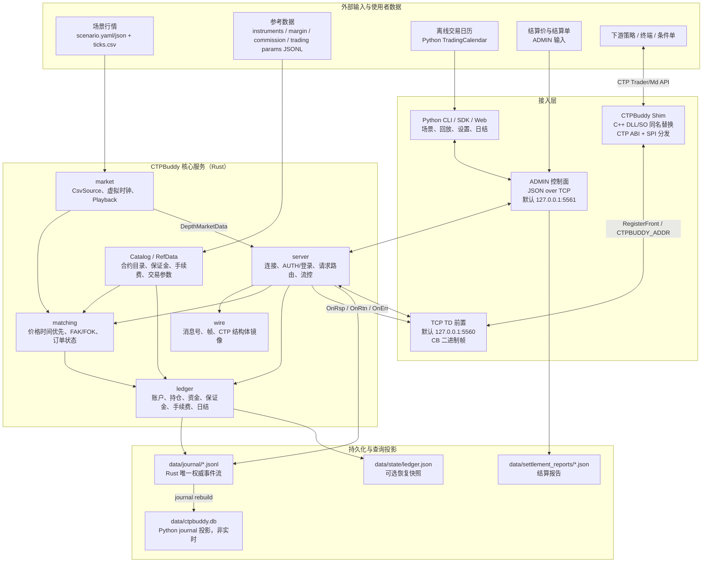
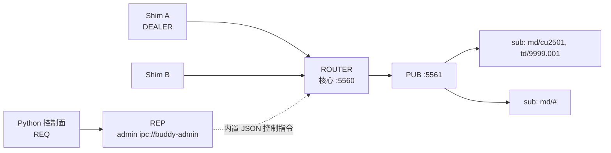

# CTPBuddy 设计文档

> 版本：v0.1（草案） · 2026-10-02 · 状态：待评审
>
> 2026-10-02 修订：依据 `docs/` 通读结论（30+ 份官方文档 + SDK CHM + LocalCTP 源码）校正设计，校正逐条记录见 §18；权威语义存档见 [`docs/CTP语义知识库.md`](docs/CTP语义知识库.md)。通用 CTP 开发指南另见 [`docs/CTP开发知识库/README.md`](docs/CTP开发知识库/README.md)，仅作分层检索和工程参考，不替代官方 HTML、notes 或真实环境核验。
>
> CTPBuddy 是一个本地 / 私有部署的 CTP 兼容仿真交易环境，为 CTP 下游系统（策略、交易终端、条件单）提供**确定性、可注入、可共享**的测试基础设施。

---

## 0.5 交易日历边界

Python 侧 `ctpbuddy.calendar.TradingCalendar` 使用固定版本 JSON 快照，运行时不联网。快照区分自然日（`YYYY-MM-DD`）、期货交易日（`TradingDay=YYYYMMDD`）和夜盘的 `ActionDay`/`TradingDay`；缺失日期不是休市，缺失夜盘映射也不允许推断。`Admin.settle_day` 的 `next_trading_day` 可省略，此时仅由已加载快照根据当前期货 TradingDay 推导；显式参数仍保留。

官方交易日历只能按交易所/中期协公开公告固定版本落地；公告可能只给节假日休市安排，不等价于全年逐日交易日快照。当前 `calendar/production/` 有上期所公告〔2025〕157号的元旦样本，以及 2026 全年日盘候选快照（`scope: day-session-only`，夜盘只固化公告明确的 closed 边界）；manifest 记录公告 URL、固定摘录 revision、覆盖范围、SHA256 和缺口。未取得完整逐日资料时不得用股票日历或周末规则伪造夜盘映射。夜盘开放记录必须同时给出 ActionDay/TradingDay；官方明确关闭记录用 `status: closed`，其余缺失一律拒绝查询。

GitHub 开源项目仅作为离线数据源候选，必须记录仓库、固定 commit、许可证和覆盖边界后人工生成快照。已核查 `gerrymanoim/exchange_calendars`（Apache-2.0，commit `bbda29fed902374bdb75acab008f421fbd567823`）：其 README 说明这是证券交易所常规时段日历，且用户贡献维护；不含 CTP 期货夜盘字段，因此不能直接替代期货日历。用户快照可通过 `with_overrides` 按自然日整条覆盖，并用 SHA256 固定复现。

## 0.6 设计与当前实现的已知差距（集中登记）

本文多处描述的是**目标设计**。以下条目在当前代码中尚未实现或实现方式不同，阅读后续章节时以此表为准：

| 设计条目 | 当前实现 | 影响 |
|---|---|---|
| §6 ZeroMQ DEALER/ROUTER + PUB/SUB | plain TCP，一连接一客户端，帧格式一致 | 无 CURVE 加密；团队远程部署需自行加 VPN/隧道 |
| §5.3 `ctpbuddy.ini` 前置别名表、`CTPBUDDY_ADDR`、`ipc://` | Shim 只解析 `tcp://<IPv4>:<port>` 字面地址 | 下游需把前置地址改为 CTPBuddy 地址，「生产配置一行不改」暂不成立 |
| §6.4 / §10 单进程托管多 Broker | 每个核心实例只服务一个 `--broker-id`；费率表只按合约索引 | 多 Broker 需多实例部署 |
| §8.3 风控规则表（勿 if-else 写死） | 交易所差异（FAK 布局、DCE 前态特例、SHFE/INE 今昨拆分、成交开平归一化）集中在 `ctpbuddy-matching/src/exchange_rules.rs` 的静态规则表，引擎/账本均查表；未知交易所取默认行（CancelFirst、不拆今昨） | 表是编译期常量，换规则仍需改代码重编；价格笼子等风控项未入表 |
| §6.4 TERT_RESTART/RESUME 私有流重传 | 已实现：Shim 的 `SubscribePrivateTopic(nResumeType)` 经 AUTH 的 `private_resume` 上报；登录响应后 RESTART(0) 重放当日全部 RtnOrder/RtnTrade，RESUME(1) 只重放该投资者无在线会话期间产生的回报（服务端按投资者游标，非 API 本地流文件序号，nSeqNo 忽略），QUICK(2) 或未调用则不重放；日结/重置清空 | 游标不随进程重启保存（`--recover` 后当日回报为空）；多会话同账号共享一个游标；登录时不推送持仓/资金快照（与真实 CTP 一致，下游本就需 ReqQry*）；未调用 SubscribePrivateTopic 时保持旧行为（只推实时） |
| §5 Shim DLL/so | Windows DLL（`shim/build_msvc.py`）与 Linux `.so`（`shim/build_linux.py`，g++/WSL 已通过 `m1_shim_e2e`）；`CTPBUDDY_ADDR` 环境变量可整体重定向前置，前置地址支持主机名 | 前置别名表 `ctpbuddy.ini` 仍未实现；ADMIN 无认证，核心拒绝绑定非回环地址（`CTPBUDDY_ALLOW_REMOTE_ADMIN=1` 显式放行） |
| §7.3 Parquet / 插件行情源 | 仅 CSV | — |
| §8.6 / §8.7 昨仓保证金按昨结算价计 | `settle_trading_day` 推进 `last_settlement_price` 但**不重估存续持仓的保证金**（`PositionDetail.margin` 仍为成交时刻按 `MarginPrice::{PreSettlement,Last,Average,Open}` 算出的快照）；`Last`/`Average` 也只在成交时刻取值，不随行情/结算滚动 | 真实柜台日结按当日结算价重算全部持仓保证金；跨日持仓的 `CurrMargin`/`Available` 与真实结算单会有偏差，跨日场景断言不要拿保证金对账 |
| §8.10 挂单成交价与触发条件 | tick 到达时 resting 单按 **tick 档位价**成交而非自身限价（买 3001 挂单遇 bid1=3002 成交在 3002，即「价格改善」，见 `m2_flow` flow008）；只看五档深度是否穿越，**不看 `LastPrice` 穿越**，深度为空的源（仅 LastPrice）退化为按最新价成交：限价单仅在最新价穿越其限价时成交，成交价取最新价；设 `CTPBUDDY_MAKER_AT_LIMIT=1` 后 resting 限价单按自身限价成交（maker 语义） | 真实交易所 maker 按自身限价成交；以成交价断言滑点的下游会看到正向偏差；默认仍有价格改善偏差（可用 `CTPBUDDY_MAKER_AT_LIMIT=1` 消除）；LastPrice 穿越即成交不模拟队列位置，偏乐观 |
| §8.3 / §8.10 自成交预防 | **默认关闭**（柜台设置 `self_trade_prevention`，CLI `--self-trade-prevention true` / env `CTPBUDDY_SELF_TRADE_PREVENTION`，运行时可经 ADMIN `settings_update` 切换；引擎侧 `MatchingEngine::set_self_trade_prevention`），同账户交叉直接成交，与真实 CTP 一致；显式开启时跳过同账户挂单会**跨过该档位继续向后匹配**，破坏价格时间优先 | 开启后的成交序不是任何真实交易所的行为，仅供需要仿真「自成交被拦」的 desk 自行打开；默认配置下不影响 |

**关于正文中的「落地口径（M2-x / #xx，YYYY-MM-DD）」段落**：§7.4、§7.5、§8.10~§8.14 等带日期的落地口径是当时实测的**历史变更记录**（按「重大变更走 ADR 追加、不静默改写」原则保留），其中的数字、开关默认值与待办可能已被后续改动超越；**当前实现与已知差距以本 0.6 表为准**，错误码三态统计以 [`docs/错误码全集.md`](docs/错误码全集.md)（`tools/fill_errorcode_status.py --check`）为准。

---

## 1. 项目定位

### 1.1 一句话

把 SimNow 的能力搬到本地：下游系统不改一行代码（替换同名 DLL），即可在一个行情可回放、场景可注入、账户可管理、多租户可共用的私有柜台里测试。

### 1.2 与现有方案的对比

| 能力 | SimNow | openctp | LocalCTP | **CTPBuddy** |
|---|---|---|---|---|
| 接入方式 | C/S，连远端 | C/S，连远端 | DLL 进程内替换 | DLL 替换（本机或私有） |
| 网络依赖 | 有 | 有 | 无 | 无（默认）/ 内网（团队模式） |
| 行情来源 | 服务端实盘映射 | 服务端 | 外部投喂（接口 hack） | 用户自带源（CSV/Parquet/插件） |
| 场景注入（跳空/停牌/流动性） | 无 | 无 | 无 | **有（场景 DSL）** |
| 确定性（同输入同输出） | 无 | 无 | 部分（回测模式） | **有（默认单线程）** |
| 多账户 / 多租户 | 弱 | 弱 | 弱 | **有（账户级隔离）** |
| 管理后台 | 官方弱后台 | 无 | 无 | **Web 后台** |
| 远程团队共享 | 否 | 否 | 否 | **私有部署** |
| CI 集成 | 不可 | 不可 | 难 | **断言 API + SDK** |

### 1.3 目标用户

- 用量化框架（vnpy / WonderTrader / ctpbee / 自研）做期货策略的个人与团队；
- CTP 交易终端、条件单、算法拆单等下游系统的开发者；
- 需要把 CTP 接入逻辑纳入 CI 的工程团队。

### 1.4 非目标（v1）

期权策略交易（数据结构预留，规则后做）、组合保证金与套利组合、实盘通道对接、营收化服务。

---

## 2. 命名与品牌

| 场景 | 名称 |
|---|---|
| 项目名 | **CTPBuddy**（CTP 全大写 + Buddy） |
| PyPI 包 | `ctpbuddy`（已确认未被占用） |
| 代码仓 | `github.com/charleszu/ctpbuddy`（已建仓并推送，main 分支） |
| 文档 / 下载站 | ctpbuddy.opentrade.one |
| Shim DLL | `thosttraderapi.dll` / `thostmduserapi.dll`（**原名替换**，不加后缀） |

**合规声明**（README 与官网固定文案）：CTPBuddy 是兼容 CTP 接口的开源测试工具，与上海期货信息技术有限公司（上期技术）无任何隶属关系；仓库不包含 `ctpsdk/*/` 下的官方二进制 SDK（`.dll`/`.lib`，由使用者自备），但 `docs/api-doc-html/files/` 附带由官方 CHM 文档转换得到的头文件、`error.xml` 与 PDF 供文档交叉引用（详见 §15）。

---

## 3. 设计原则

1. **零改造接入** —— 下游只换 DLL，代码不动；Client ID、回调线程模型与真 CTP 一致。
2. **确定性优先** —— 默认单线程撮合，同场景同输入必然同输出，可作回归测试基线。
3. **故障可注入** —— 断连、延迟、重复回报、部分成交、涨跌停锁死、流动性枯竭都是一等公民。
4. **解耦** —— 行情源、场景变换、回放时钟、撮合、账本各自独立可替换。
5. **多租户** —— 账户级状态隔离，共享同一虚拟市场；私有部署即团队测试环境。
6. **聚焦** —— 期货先行，期权与组合保证金后置，接口模型预留扩展位。

---

## 4. 总体架构



图中需要区分两条通道：

- **TD 数据面**：下游 CTP 应用经同名 Shim 进入 `TCP TD`，传递认证、登录、行情订阅、查询、报撤单和回报。当前实现使用明文 TCP 承载 CB 帧；ZeroMQ 是后续传输适配方向，不能视为当前运行时依赖。
- **ADMIN 控制面**：Python CLI、SDK 和 Web 通过独立的 ADMIN JSON 通道控制场景、回放、柜台设置、结算和报告写入。ADMIN 默认只绑定回环地址。
- **数据加载面**：行情和参考数据从文件进入 Rust 核心；交易日历由 Python 读取，只在调用日结时协助推导下一交易日。
- **持久化面**：Rust 写 journal 和恢复快照；SQLite 由 Python 从 journal 重建，只作为查询投影，不是核心账本的写入路径。

### 4.1 组件职责

| 组件 | 语言 | 职责 | 明确不做 |
|---|---|---|---|
| Shim DLL/SO | C++ | CTP ABI、结构体编解码、CB 帧收发、SPI 分发 | 业务判断、行情文件解析、账本 |
| TD 前置 | Rust server | TCP 接入、认证登录、请求路由、流控、CTP 回报面 | 不实现 CTP 客户端 ABI |
| 行情回放 | Rust market | CSV tick、虚拟时间、播放控制和行情推送 | 不读取账户或执行资金计算 |
| 参考数据 | Rust Catalog/RefData | 合约、保证金、手续费、交易参数查询与计算输入 | 不从网络自动更新 |
| 撮合引擎 | Rust matching | 订单簿、价格时间优先、FAK/FOK、交易所回报形状 | 不负责连接和 Web |
| 账户账本 | Rust ledger | 账户、持仓、资金、保证金、手续费和显式日结 | 不直接连接 SQLite |
| Python 层 | Python | CLI、SDK、场景编译、Web、日历、journal 投影 | 撮合、账本（绝不进 Python） |
| 外部数据 | 用户侧 | 提供行情、参考数据、交易日历和结算资料 | 不感知柜台协议 |

### 4.2 部署形态

- **本机单机（默认）**：核心监听 TD `127.0.0.1:5560` 和 ADMIN `127.0.0.1:5561`，Shim 通过 `RegisterFront()` 或 `CTPBUDDY_ADDR` 连接。
- **团队私有部署**：核心可部署在内网主机或容器，团队成员机器上的 Shim 指向 TD 内网地址；ADMIN 仍应保持回环或置于受控网络边界内。
- **多 Broker 隔离**：当前一个核心实例服务一个 `BrokerID`；需要硬隔离时运行多个核心实例，分别使用不同 TD/ADMIN 端口和数据目录。
- **形态 A（全进程内，类 LocalCTP）**：评估后不采用——崩溃耦合、无法多客户共享、Web 无处安放、版本编译负担重。

### 4.3 语言分层理由

- Shim 必须 C++：`CreateFtdcTraderApi` 返回 C++ 抽象类指针，导出 MSVC mangled 符号，Rust 实现要手拼符号名，痛苦且脆。
- 核心必须 Rust：撮合/账本是"不能随便崩"的单线程确定性引擎，内存安全有价值；performance 与 GC 可预期。
- 控制面必须 Python：量化社区的通用语；本地设置 Web 使用 stdlib `ThreadingHTTPServer`，无 CDN / 云服务 / 框架依赖；行情源插件生态也靠 Python。

---

## 5. Shim DLL 设计（C++）

### 5.1 导出兼容

- 完整实现 `CThostFtdcTraderApi` / `CThostFtdcMdApi` 抽象类，导出 `CreateFtdcTraderApi` / `CreateFtdcMdApi` 等全部符号（与官方 DLL 同名同签名）；
- 随包提供匹配的 `.lib` 导入库，下游现有的官方 `.lib` 链接方式可直接用；
- 回调（SPI）由 ZMQ IO 线程分发，与真 CTP "SPI 在独立线程回调"的模型一致，下游无需改动线程假设。

### 5.2 职责边界

Shim 只做三件事：**ABI 适配 → 帧封装 → SPI 分发**。所有判断（报单校验、成交、资金）发生在核心服务。Shim 崩溃不得影响核心，核心重启不影响其他进程的 Shim（各自断链重连）。

### 5.3 连接配置

每个 API 实例的连接目标按以下优先级解析：

1. **`RegisterFront(addr)` 传入的地址即端点本身**（`ipc://` / `tcp://` 形式）——按 API 实例独立生效，一个下游进程因此可以同时连多个柜台（多 Broker 场景的标准姿势，与真实 CTP 多前置行为一致）；
2. `ctpbuddy.ini` 的 `[fronts]` 别名表：把下游既有的真实前置地址映射到 Buddy 端点——**下游生产配置文件可以一行不改**；
3. 环境变量 `CTPBUDDY_ADDR` > 默认 `ipc://ctpbuddy`（Windows 回退 `tcp://127.0.0.1:5560`）。

```ini
# ctpbuddy.ini 示例
[fronts]
tcp://180.168.146.187:10000 = ipc://ctpbuddy         ; 原 SimNow 前置 → 本机柜台
tcp://180.168.146.187:10001 = tcp://team-server:5560 ; 原实盘前置 → 团队柜台
```

配置同时决定本机模式 / 团队模式，**Shim 二进制只有一个**。

### 5.4 结构体注册表与代码生成

- `shim/codegen/` 解析 6.7.13 官方头文件，生成：
  1. 全部 CTP struct 的尺寸/布局 `static_assert` 表；
  2. struct 名 ↔ wire type id 的稳定映射（id 显式登记在 `registry.json`，生成器只校验不改号）；
  3. Req/Rtn/OnRsp 的消息目录。
- **头文件不入库**（合规）：CI 与本地构建时使用者放置自备头文件，或从发布包模板下载。
- v1 仅支持 **6.7.13**（SimNow 当前发布版）；下游必须用 6.7.1x 头文件编译——CTP struct 是尾部追加式演进，旧头文件struct 尺寸不一致会导致内存踩踏，此约束写在文档首页。

### 5.5 版本化发布

Shim 与核心服务版本独立（`shim 0.x` wire ver 与 `core 0.x` 匹配）；wire 帧头带版本号，不匹配时 Shim 在 `RegisterFront` 后以 `OnFrontDisconnected` 明确报错，绝不静默。

---

## 6. 通信协议（ZeroMQ + 自定义二进制帧）

### 6.1 Socket 拓扑



- 请求/响应：Shim 侧 DEALER ↔ 核心 ROUTER（多客户端、天然带身份）；
- 下行推送：核心 PUB ↔ Shim SUB，topic 过滤；
- 控制面：Python 层 REQ ↔ 核心 REP，仅监听 loopback/ipc，JSON 负载；
- 三组端口都在 `ctpbuddy up` 时打印，`--endpoint` 可改。

### 6.2 帧格式

```
+--------+-----+--------+----------+----------+------------------+
| magic  | ver | type   | req_id   | payload  | payload          |
| 2B 'CB'| 1B  | u16 LE | u32 LE   | _len     | (struct 裸字节   |
|        |     |        |          | u32 LE   |  或 UTF-8 JSON)  |
+--------+-----+--------+----------+----------+------------------+
```

- `type`：wire type id，见 6.3；
- `req_id`：透传 CTP `nRequestID`，响应回echo；
- `payload`：默认小端 C struct 布局；Rust 按字段编解码、padding 清零，不读取对象的未初始化填充字节。**结构体内所有字符字段按 GBK 编码**（CTP 惯例；`ctpbuddy_wire::gbk`，Rust 的 `cstr`/`set_cstr`、Python 生成的 `pack`/`unpack`、Shim 的 `set_text` 均在字段边界转换）。flags/版本位预留（bit0=JSON，v1 只用于 admin 通道）；
- **不用 protobuf**：几百个 CTP struct 的转换是体力活且易错，两端同为自研程序，raw struct 最快最稳。

### 6.3 Type id 分配

type id 标识的是**消息**（一次 API 调用或一次回调），不是裸 struct：`CThostFtdcInputOrderField` 同时用于 `ReqOrderInsert`、`OnRspOrderInsert`、`OnErrRtnOrderInsert`，只有消息级 id 才能区分请求 / 响应 / 错误回报三种语义。

id 的来源即"API 使用的 struct 集合"：codegen 解析 API 类的全部 `Req*` 方法与 Spi 回调签名，提取 (消息名, struct, 方向) 三元组——约百余个消息，而非头文件全部 ~350 个 struct；未出现在 API 签名中的 struct 不占 id。

| 段 | 用途 |
|---|---|
| `0x0000` | 协议层：PING / PONG / HELLO（协商 wire ver） |
| `0x0100` | 会话层：AUTH / LOGOUT / SETTLE_CONFIRM（核心扩展消息；AUTH 由标准 ReqAuthenticate 或兼容自动登录触发） |
| `0x0200` | ADMIN（JSON 控制指令，REQ/REP 通道） |
| `0x1000+` | CTP 消息透传：每条 (Req/Rtn/Rsp, struct) 一个 id，`registry.json` 显式登记 |

- `registry.json` 人工评审后入库，**id 一经分配不再变更**；codegen 只做校验：① 每个 API 方法都有 id；② 每个被引用 struct 有布局断言（sizeof/offsetof）；③ 无孤儿 id；
- 纯客户端本地调用不过线：`GetApiVersion`、`GetTradingDay`（值由核心在 AUTH 时下发并缓存）、`Release`、`RegisterFront`、`RegisterSpi` 等在 Shim 本地完成。

### 6.4 消息目录（v1）

**Client → Core（DEALER）**

| 类型 | 对应 CTP API |
|---|---|
| AUTH | CTPBuddy JSON handshake；标准 ReqAuthenticate 透传 BrokerID/UserID/AuthCode/AppID，成功后绑定连接身份；兼容 ReqUserLogin 自动触发；AuthCode/AppID 未配置时不做柜台授权比对 |
| LOGOUT / SETTLE_CONFIRM | ReqUserLogout / ReqSettlementInfoConfirm |
| ORDER_INSERT | ReqOrderInsert（`CThostFtdcInputOrderField`） |
| ORDER_ACTION | ReqOrderAction |
| SUB_MD / UNSUB_MD | SubscribeMarketData / UnSubscribeMarketData |
| QRY | 所有 ReqQry* 按 struct id 泛化 |

已分配的 QRY type id：`0x1040` Instrument / `0x1042` TradingAccount / `0x1044` InvestorPosition / `0x1046` Order / `0x1048` Trade；参考数据查询 `0x1051` InstrumentMarginRate / `0x1053` InstrumentCommissionRate / `0x1055` InstrumentOrderCommRate / `0x1057` BrokerTradingParams；`0x1050` QRY_LAST 终结查询流。四处（`core/ctpbuddy-wire/src/msgs.rs`、`shim/src/api_core.hpp`、`py/ctpbuddy/wire.py`、`shim/codegen/gen_shim.py`）必须同步。

**费率查询的官方语义**（6.7.13 接口描述逐字复刻，notes/04 G）：`InstrumentID` 留空表示「返回该投资者**持仓对应**合约的费率」，**不是全市场**——「目前无法通过一次查询得到所有合约保证金率，如果要查询所有，则需要通过多次查询得到」；`BrokerID`/`InvestorID`（及 `BrokerTradingParams` 的 `CurrencyID`）为必填，「不填的话返回值就为空」。这两条写反是最常见的实现错误，故直接固化为 e2e 断言。

**Core → Client（DEALER 响应 / PUB 推送）**

| 通道 | topic | 内容 |
|---|---|---|
| DEALER | — | OnRsp* 系列（携带 req_id、error_id、is_last） |
| PUB | `md/{exchange}/{instrument}` | OnRtnDepthMarketData |
| PUB | `td/{broker}/{investor}` | OnRtnOrder / OnRtnTrade / OnErrRtnOrder* |
| PUB | `sys` | 广播：结算完成、系统公告 |

> 落地状态：帧格式与消息目录已按本节实现（M1）；传输层暂用 plain TCP（一连接一客户端、帧背靠背）承载相同帧，ZeroMQ 是既定目标传输—— framing 与传输解耦，替换 ZMQ 是传输适配层改动、不动协议（`core/ctpbuddy-server/src/lib.rs` 顶部注释同）。

- 查询语义对齐 CTP：多帧循环 + 末帧 `is_last=1`；
- **BrokerID 策略：单进程托管多 Broker**：broker 是核心内的一等实体（各有合约目录、保证金/手续费规则表、账户空间），默认 BrokerID 为 **8888**（不与 SimNow 的 9999 及主流实盘券商号冲突，金融俗惯例里的吉利号，`--broker-id` 可改）。AUTH 按核心的 broker 清单强校验，未知 BrokerID 按 CTP 语义拒登录。多 broker **共享同一路回放行情与虚拟时钟**——同一场景下不同经纪商的成交差异只来自费率/保证金/合约目录，这对多券商对比测试恰是有用属性。需要硬隔离（故障域/版本/管理边界）时可一个 broker 部署一个核心实例，两者只是运维选择、不动架构；下游单进程连多个柜台依赖 §5.3 的按实例端点解析；
- **订阅时机与可靠性**：Shim 在 AUTH 成功后订阅 `td/{broker}/{investor}`。注意 ZMQ PUB/SUB 两个特性：① 慢订阅者在 HWM 打满时被静默丢帧——核心与 Shim 均设大 HWM（本地 IPC/loopback 实际碰不到，团队远程模式才需留意）；② slow joiner 订阅建立瞬间可能丢头几帧。对策统一为：登录成功后核心主动补发一版快照（订单/持仓/成交/资金），与 CTP 下游"登录后先查一遍"的既有习惯天然对齐，不依赖订阅建立时刻；
- **断链语义**：ZMQ 无持久化无重投。Shim 检测到与核心断开即以 `OnFrontDisconnected` 回调下游——这是刻意的设计，下游可借此测试自身重连逻辑。核心重启后 Shim 重新 AUTH 即恢复；
- **身份边界**：显式 ReqAuthenticate 成功后，Shim 保存 BrokerID/UserID；ReqUserLogin 必须与该身份一致，Core 对连接认证绑定再次校验，拒绝 Auth A -> Login B。认证仅做身份绑定，不伪造 AuthCode/AppID 授权校验。
- **错误码边界**：本地认证字段错误保留官方 `15 BAD_FIELD`，服务端未认证登录使用 `64 NOT_AUTHENT`；`auth_in_flight` 的 `ReqAuthenticate` 同步返回 `-2`（在途许可超过），不再返回 0 后异步 `-3`。已认证重复认证及断线认证失败没有确认精确柜台重复码，统一采用已实现 `63 AUTH_FAILED`（`CTP:客户端认证失败`）兼容策略；网络原因仅通过 `OnFrontDisconnected` 报告。认证响应保留官方 `UserProductInfo` 字段；`AppType` 未配置、不编造标值。
- **安全**：默认仅 loopback/ipc；团队模式跨机部署使用 CURVE 加密（ZMQ 原生）或内网 VPN，文档明确禁止把 5560/5561 暴露公网。

---

## 7. 行情回放引擎（Rust 核心）

### 7.1 设计立场

Buddy 只做**回放逻辑、柜台集成、管理界面**；行情数据由使用者提供。行情源与柜台完全解耦，通过规范化 tick + 插件协议衔接。

### 7.2 规范化 tick（Canonical Tick）

| 字段 | 说明 |
|---|---|
| instrument_id / exchange_id / trading_day | 标识与交易日。**TradingDay 与 ActionDay 分离、且各所实现混乱**（上期/能源准确归次日；大商所夜盘两日期都是 TradingDay；郑商所日夜盘均当天）——不可假设统一，交易日一律取登录响应 / `GetTradingDay()` 下发的 TradingDay |
| update_time + update_millisec | 虚拟时钟唯一时间源。毫秒字段各所差异大：上期/能源/中金只出现 0 和 500、大商所真实毫秒、郑商所恒 0——回放时钟不得假设均匀间隔 |
| last_price / volume / turnover / open_interest | 最新价与**当日累计**量；切片成交量 = 本切片 Volume − 上切片 Volume（差分后才是一段时间内的成交） |
| pre_settlement_price / settlement_price | 昨结 / 今结（结算与浮动盈亏输入）；盘中 SettlementPrice 可能为无效值 |
| upper/lower_limit_price | 涨跌停（风控与撮合边界） |
| bid/ask_price[5] + bid/ask_volume[5] | 五档深度（挂单成交合理性的前提） |

字段口径细则（照录自官方文档，实现时逐条对账）：

- **CTP 推的是快照（切片）不是逐笔**：一段时间逐笔合成一个快照，一般 1 秒 2 笔（郑商所可能多笔）；「有更新才推」「首次连接推初始行情」；推送时刻不严格 000/500。回放引擎按快照序列驱动，不伪造逐笔；
- **无效值 = double 上限 `1.7976931348623157e+308`**（如盘中 SettlementPrice）——源数据清洗与断言比较都必须先过滤；
- `AveragePrice`：除郑商所外其余大所需**除以合约乘数**才是真实均价；Turnover 同类校正（郑商×乘数，大商/上期不需）；
- **无历史行情、无回补**：断线/未登录期间丢失不回补；盘后（15:00~15:30）结算完成会推含结算价的快照、郑商所盘后继续推——不当异常处理；日盘启动可能重演夜盘流水；
- 行情 API 无合约查询（靠交易 API `ReqQryInstrument` 或编码规则生成）；订阅必须登录后发起，`OnRspSubMarketData` 无论合约对错都返回 "CTP:No Error"——**只有编码正确的合约才有行情**（上期/能源小写+4 位、中金大写+4 位、郑商大写+3 位、大商小写+4 位）。

> 限制说明：若源只有最新价无深度，限价单只能退化为"即时成交模式"；场景文件应尽量带五档，文档中明确给出最低数据要求。

### 7.3 行情源

- **内置**：CSV（utf-8/gb18030）、Parquet（arrow 批量读取 → 预解码为 canonical binary 中间格式，倍速回放时避免重复解码开销）；
- **插件协议（Python）**：实现 `open(spec) -> Iterable[CanonicalTick]` 即成为一个源，用户可接自有钱兔/Level2/第三方库；插件在 Python 侧预导出 canonical binary 供核心直接消费，热路径不进 Python；
- 源按虚拟时间有序推进，**严禁未来数据**（core 只看见"当前 tick"）。

### 7.4 场景管道与 DSL

```yaml
# scenario.yaml 示例
name: flash-crash-cu
source:
  kind: csv            # csv | parquet | plugin
  path: ./ticks/cu2501.csv
transforms:
  - kind: freeze       # 停牌：指定时段无新行情
    at: "2025-03-14 10:29:00"
    duration: 90s
  - kind: gap          # 跳空：指定时刻价格平移
    at: "2025-03-14 11:00:00"
    shift: -3.0
  - kind: liquidity    # 流动性缩放：五档挂量 × 0.1
    from: "2025-03-14 13:30:00"
    scale: 0.1
clock:
  time_scale: 50        # 50 倍速
  start: "2025-03-14 09:00:00"
accounts:
  - investor: 001      # 自动开户，初始资金可配
    balance: 2000000
assertions:             # 可选：场景内断言（CI 用）
  - after: 30s
    investor: 001
    expect: { orders_filled: ">=1" }
```

管道：`source → transforms → virtual clock → 撮合/账本`。Transforms 顺序执行、可组合，自身也是确定性纯函数。

**落地口径（M2-2，2026-10-02）**：

- **YAML 是编写格式，JSON 是核心消费格式**。唯一解析器/校验器在 Python 控制面（`py/ctpbuddy/scenario.py`，stdlib-only 的受限 YAML 子集：块映射/块序列/标量/一级 flow mapping/注释，错误带行号）。归一化后经 ADMIN `start_scenario` 的 `spec` 字段内联下发，或由 `ctpbuddy scenario compile DIR` 写 `scenario.json` 供核心启动路径（`--scenario`）读取；Rust 核心零 YAML、零 locale、纯确定性管道。启动路径与 ADMIN 路径共用同一个 `build_scenario`，保证两条加载路径管道一致。
- 时间全部归一为「交易日时间轴」毫秒：日盘为当日零点起的毫秒数；**18:00 起的夜盘时刻映射为负值**（21:00 → −3h，00:30 → +0.5h），使夜盘 → 跨零点 → 日盘在同一轴上单调递增，回放节奏、seek、transforms、`clock.start` 与断言都在这条轴上比较（Rust `ctpbuddy_market::session_ms` 与 Python `scenario.session_ms` 同一口径）。输入格式 `HH:MM:SS[.mmm]`（接受 `YYYY-MM-DD HH:MM:SS` 日期前缀，取时间部分）；时长 `90s` / `5m` / `1h30m` / 裸秒数。ticks.csv 可选第 41 列 `action_day` 给出夜盘的实际自然日（缺省 = trading_day）。
- **transforms 纯函数、顺序执行、可组合**（market crate `transform.rs`）：freeze 丢弃 `[at, at+duration)` 窗口内 tick；gap 从 at 起平移 last/average/五档价格（**涨跌停价不动**——涨跌停是规则表概念，跳空穿停板由引擎限价检查拒单，符合真实行为）；liquidity 从 from 起五档挂量 ×scale（round half away from zero，clamp ≥0）。
- clock：`time_scale`（0 = 尽快，否则为倍速）优先于服务默认；`start` 之前的 tick 直接丢弃、永不投放。显式 speed 参数 > spec `clock.time_scale` > 服务默认 > 0。
- accounts：场景加载时按 (investor, balance) 开户（既有账户状态不动；balance ≤ 0 回落服务默认资金）；未列出的账号首次登录按默认资金开户。
- **任务41最小初仓闭环已完成（2026-10-03）**：每账户 `positions` 逐笔列表使用 `instrument/exchange/direction/open_date/trade_id/open_price/volume/pre_settlement`，可选 `margin` 覆盖 booked margin；普通期货投机、空投资单元。Python/Rust 严格校验、先验证后 staged apply；`YdPosition` 为静态交易日起始值。注意两种口径：当前仍存昨仓 = `Position - TodayPosition`，静态查询字段 `YdPosition` 不因平昨减少。SHFE/INE 查询按逐笔 detail 的今昨年龄桶累加 Position/成本/保证金/手续费/PnL/冻结，禁止总量比例粗分；其他交易所单行且 `PositionDate=1`。真实 e2e 覆盖启动导入、mixed SHFE、DCE 单行、平昨静态 YdPosition、全平保留静态 Position 行、detail 空、无 fill/trade/order 流水。任务41不包含日结（42）、OrderSysID（43）、组合或套保。
- assertions：**one-shot**——虚拟时钟越过 `t0 + after_ms`（t0 = 首个投放 tick）时在 pulse 求值一次，journal `assertion` 事件（metric/op/value/actual/pass/after_ms），admin status 暴露 total/evaluated/passed/failed/items。指标 10 个：balance（=dynamic_equity）/available/close_profit/commission/position_profit/used_margin/frozen_margin/orders_filled（今日 VolumeTraded>0 的去重 OrderSysID 数）/open_orders/fills；比较符 `>=`/`<=`/`>`/`<`/`==`/`!=`（`=` 归一为 `==`）。`expect` flow mapping 按指标展开为逐指标断言。
- 编译缓存：`scenario.json` 不旧于 `scenario.yaml`（mtime 判断）时优先，否则重解析 yaml；`ctpbuddy scenario validate DIR` 同时校验 ticks.csv 与 DSL。
- 参考场景 `scenarios/dsl_demo/`（12 tick 原始流经 freeze/liquidity/gap 后 11 tick，含 4 条断言其中 1 条设计为失败路径）；e2e `tests/e2e/m2_scenario.py` 逐 tick 断言变换后的行情序列与成交价。

### 7.5 播放控制

- 运行 / 暂停 / **单步（一个 tick）** / 倍速（0–1000，0 = 尽快）/ seek / 循环 / 停止；
- 控制入口：Web 后台、CLI（`ctpbuddy replay ...`）、ADMIN 帧；
- 单步与暂停是调试刚需，优先级高于倍速。

**落地口径（M2-2，2026-10-02）**：

- pause/resume/step 随 M1 场景加载落地；**seek/loop 为 M2-2 新增**。`seek(target_ms)` 定位到首个 vt ≥ target 的 tick——跳过的 tick 永不投放，之后从该位续播；`loop(on)` 在流结束后重置 idx=0、virtual_time=ticks[0].vt 并重锚墙钟基线（引擎/账本状态**不**重置，账户重置走 `reset_account` 或重载场景）。
- 控制入口：ADMIN 帧、CLI、Python SDK 已覆盖完整回放控制；Web 只开放真实 ADMIN 的 `status`、`pause`、`resume`、`step`、`set_speed`、可选 `loop`，以及受确认/CSRF/白名单保护的 workspace 场景加载；不开放 `seek`、reset、shutdown、任意 ADMIN、任意 cmd 或 SQL。场景仅允许 `workspace/scenarios/<name>` 直接子目录和其安全 CSV/spec 文件，路径必须为 workspace 相对路径且拒绝 `..`、绝对路径、NUL、命令执行。账户/初始持仓为只读摘要；实时账户来自已有 ADMIN status，Core 未提供实时持仓查询时明确显示不可用，持仓只读查看 journal 快照。SQLite 投影仍是非实时查询；结算报告/`settle_day` 沿用已有受控写入口并写审计。
- `step` 在暂停时释放恰好一个 tick；loop 重启在暂停时同样发生（重置位置但不投放，随后一步即重播首 tick）——e2e 以此确定性验证。
- 播放状态可观测：admin status 的 `playback` 暴露 loaded/idx/total/paused/speed/looping/virtual_time/trading_day。

### 7.6 确定性边界（承诺的精确措辞）

**确定性指什么**：市场 + 柜台是一个封闭系统。给定同一场景文件（含源数据 hash）与同一串按序到达的请求，核心产出逐字节可复现——报单、成交、结算、错误码序列可用 hash 校验。这是回归测试基线的前提，也是 SimNow 给不了的东西。

**边界在哪**（同样重要，写清楚免得出事）：

1. **请求序列本身必须是确定性的**。下单方是鲜活下游进程时：tick 信号触发的下单 → 确定（tick 序列确定）；墙钟定时器触发的下单 → 不确定，Buddy 管不了真实线程调度，虚拟时钟只作用于世界内部；
2. **多进程并发下单时，时间优先不可复现**。两个下游进程对同一 tick 反应，到达顺序受网络与调度影响——这次 A 的单排队在前，下次可能 B 在前，真实交易所亦然。单进程单线程驱动无此问题；
3. **分片模式（见 8.5）下不保证**跨品种成交在账本上的应用顺序。

**获得确定性的标准姿势**：

- 测试驱动用 SDK 在虚拟时钟内脚本化下单，请求序列即场景文件的一部分；
- 或开启**录制模式**：把一次真实会话的请求流录成场景，回放即复现——行为 messy 的客户端也能拿到可复现基线。

对用户的承诺因此精确为：**场景文件（含录制的请求流）唯一决定核心输出**；剩下的不确定性来自被测系统自己，Buddy 负责把它隔离并暴露出来，而不是假装它不存在。

---

## 8. 撮合引擎与账户模型（Rust 核心）

### 8.1 事件循环

核心是**单线程世界循环**：MD tick、客户端请求、定时器（结算）、admin 指令全部入队串行处理。当前 journal 用于独立实验录制与重放；复用数据目录重启时，旧 journal 归档到 `journal-run-<时间戳>-<进程号>/journal/`，当前 `journal/` 从序号 1 开始，不混合不同账本实例。定期快照及崩溃后自动恢复仍是目标能力，不是现有启动行为。撮合为将来并行保留调度切换点。

### 8.2 订单指令矩阵（v1）

指令类型是 **OrderPriceType × TimeCondition × VolumeCondition 三字段组合**，不是单字段（信易科技四所整理表全表照录于 `docs/notes/01`）：

| 指令 | OrderPriceType | TimeCondition | VolumeCondition | 备注 |
|---|---|---|---|---|
| 限价当日有效 | LimitPrice | GFD | AV | |
| 市价单 | AnyPrice | IOC（大商 GFD；中金撤销型 IOC、转限价型 GFD） | AV | LimitPrice=0；郑商所价格非 0 会被拒；**上期所生产环境暂不支持** |
| FAK 任意成交数量 | LimitPrice（郑商所可 AnyPrice） | IOC | AV | 能成交多少成交多少，剩余撤销 |
| FAK 指定成交数量 | LimitPrice | IOC | MV + MinVolume | **仅上期所/中金所**：可成交量 < MinVolume 整笔撤销 |
| FOK（全成全灭） | LimitPrice | IOC | CV | 不能全部成交则整笔撤销 |
| 止损/止盈（v1.5 候选） | AnyPrice | GFD | AV | **仅大商所**：CC_Touch/CC_TouchProfit + StopPrice，触发后另下新报单（OrderSysID 带 `TJBD_` 前缀） |
| 中金所五档市价/最优价 | FiveLevelPrice/BestPrice | IOC 撤销型 / GFD 转限价型 | AV | 仅中金所 |

规则要点：

- **FAK/FOK 不是单字段而是 TC+VC 组合**：FOK=`IOC+CV`，FAK=`IOC+AV` 或 `IOC+MV`；郑商所官方口径期货**仅 FAK**（无 FOK）；
- 交易所特殊指令差异（市价单按所语义、止损止盈仅大商所、套利指令）由 Core 归一化消化——客户端只看得到柜台归一化后的包（Q57）；
- 报单固定值：`VolumeCondition=AV`、`MinVolume=1`、`ForceCloseReason=FCC_NotForceClose`、`IsAutoSuspend=0`、`UserForceClose=0`；`CombOffsetFlag/CombHedgeFlag` 是长度 5 数组但当前只填 `[0]`；
- FAK/FOK **不得用于集合竞价**；其造成的自成交和撤单不计入异常交易监管；
- **GTC 过夜挂单不支持**（国内交易所不支持的语义直接拒绝，不静默丢弃）；撤单 `ActionFlag` 仅 `AF_Delete`（挂起/激活/修改无此功能）。

### 8.3 风控规则表（可配置，勿 if-else 写死）

- 价格超涨跌停 → 拒绝（对齐交易所错误码）；
- 可用资金/持仓不足 → 拒绝（错误码语义对齐）；**可平数量口径**：多头 `Position − ShortFrozen − CombShortFrozen`，空头 `Position − LongFrozen − CombLongFrozen`（防重复平仓）；
- 冻结与解冻规则：买开→多头持仓 `LongFrozen += 报单量`；买平→空头持仓 `LongFrozen += 报单量`（挂单即冻，防"还有 1 手可平"误判）；报单被拒按报单量解冻、撤单按 `VolumeTotal`（未成交量）解冻；
- 自成交预防（同账户同合约对冲单检查，可开关；**默认关闭**，与真实 CTP 一致，开启后的跳档行为见 §0.6）；
- 报单频率限制（模拟 CTP 流控，可注入用于测试下游限流处理）：现代柜台口径为**显式拒绝**（`OnRspOrderAction`「CTP:下单频率限制」），区别于 2009 FAQ 时代「默认每会话 6 笔/秒、超限排队不报错」的历史口径——CTPBuddy 默认复刻现代口径，历史口径可经规则表注入用于测试旧下游；
- 单笔最大手数 / 单合约持仓上限；
- 平今/平昨费率严格区分（即使大商所也分平今/平昨两套费率，统一用平昨费率会有较大偏差）；
- 交易所差异归一化（平今转换、市价单按所语义、成交开平标志）在 Core 完成，客户端不看原始交易所包。

### 8.4 撮合模式

1. **即时成交模式（默认）**：市价/FAK/FOK 按当前行情对手价成交（对齐 SimNow/LocalCTP 语义）；
2. **限价簿模式**：价格优先、时间优先排队，按五档量与队列位置估算成交——**依赖深度数据**，无深度时降级为模式 1 并在日志告警。

按所差异：大商所市价单内部转涨跌停限价撮合，**成交价可能不等于对手价**（其余所按最优对手价）——规则表按交易所配置；撮合结果以成交回报为准（见 §8.9）。

模式 2 已由 M2-1 落地（簿结构 / FAK-FOK / 自成交预防 / 双份 Trade / 冻结闭环），完整口径见 §8.10。

### 8.5 并行策略（可选，默认关闭）

- 单线程全品种为默认；
- 容量不足时：**按 instrument 哈希分片到 K 个撮合线程**（同品种恒落同片，仍单写），账户账本保持单写者（fills 经账本队列串行落账）；
- 分片模式 = 吞吐模式，严格确定性仅在默认模式成立（见 7.6）；
- **不采用"每品种一个线程"**：跨品种策略落账顺序不可复现，且真实瓶颈在行情解码与 ZMQ I/O。

### 8.6 账户 / 持仓 / 资金模型

口径权威来源：《CTP账户持仓和资金的维护》（逐日盯市），公式与算例完整照录于 `docs/notes/04`。

- **资金恒等式（ledger 核心口径）**：
  ```
  静态权益 = PreBalance + Deposit − Withdraw
  Balance  = 静态权益 + PositionProfit + CloseProfit + CashIn − Commission   ← 即「动态权益」
  Available = Balance − CurrMargin − FrozenMargin − FrozenCommission − FrozenCash − DeliveryMargin
  ```
  **CTP 的 `Balance` 字段 = 动态权益（含当日浮动/平仓盈亏），不是静态权益**——这是 ledger 实现最容易错的口径；PositionProfit/CloseProfit/Commission 与冻结资金为当日值，结算后清零；`CurrMargin` 是存续持仓占用，不能随当日统计一起清零；
- 持仓维护 `InvestorPosition` + `InvestorPositionDetail`：昨仓 / 今仓分开，平仓严格区分**平昨 / 平今**（上期所平今手续费更高、大商所平今单独、中金/郑商所无区分但费率表不同）——字段含 CloseToday/CloseYesterday 分开统计；**上期所/能源中心报入「平仓」(`Close`) 等同平昨，今仓只能用平今平掉**（`ctpbuddy_ledger::close_buckets`），其他交易所任何平仓标志都按先开先平跨今昨消耗；当前昨仓 = `Position − TodayPosition`，查询 `YdPosition` 则为交易日起始的静态昨仓初值（用户初仓供给），平昨不减少；持仓明细单条 = (OpenDate, TradeID, Direction, OpenPrice, Volume, Margin, ...)，按 (OpenDate, TradeID) 排序实现**先开先平**；
- **先开先平与今/昨是两个正交的轴，不可混为一谈**（M3 修正）：消耗明细的顺序**只按开仓时间**（先开先平）；`平今`/`平昨` 决定的是**可以动哪个年龄桶**，不是允许跳到最新那笔。若把「平今」实现成「今仓优先取最新」，会按错的口径结盈亏并破坏先开先平的保证——客户端靠后者复现柜台持仓。实现见 `Position::take_details_filtered`；
- **平仓盈亏按明细算**：昨仓明细持仓价 = **昨结算价**、今仓明细持仓价 = **开仓价**——顺序错了盈亏就算错（算例见 notes/04 E2）；持仓盈亏（浮动）多头 `(最新价−持仓均价)×乘数×手数`，空头反向；
- 保证金：期货 `(MarginRatioByVolume + MarginRatioByMoney × Price × VolumeMultiple) × Volume`；**实际计算用公司保证金率**（`ReqQryInstrumentMarginRate` 口径，即最终费率）；`ReqQryInstrument` 返回的是交易所率，仅展示不用；**MarginPriceType** 四值（昨仓恒用昨结算价；今仓按公司配置：昨结'1'/最新'2'/成交均价'3'/开仓价'4'）；市价单冻结按既有冻结估算口径；期权保证金归纳式 `MAX(权利金+不变部分, 最小保证金)` 预留扩展位；**品种内大单边已实现**：由用户 RefData 的 `MaxMarginSideAlgorithm` 控制，按交易所 + `ProductID` 聚合，多空取大，未启用优惠的合约保持求和；跨品种映射、套利取高、仓单折抵仍未实现，见 §8.7.2；
- 手续费：`成交量 × (成交价 × 乘数 × RatioByMoney + RatioByVolume)`，开仓/平仓/平今各一套费率；**申报费**（OrderCommRate，中金所特有）：报单+撤单都计，FAK/FOK 的自动撤单也计（一次 FAK/FOK = 2 次信息量），盘中实时资金不含申报费、只体现在结算单；**平今手数的判定轴按交易所分流（2026-10-08，§10.4 #10）**：中金所按**成交时间序开仓池**（`ExchangeRules.fee_close_pool` + `Position.fee_open_pool`）——开仓逐笔累池、平仓取 `min(手数, 池)` 作平今手数、日结随 `today_position` 同点清零，与持仓明细的先开先平消耗**互不参考**（昨仓被平收平今费、池尽后平今仓收平昨费，生产数据 81/81 判别）；其他交易所跟随被平明细年龄。明细分摊按本次实收总额逐笔比例（末笔吃定点残差，Σ明细 = 实收）；
- 浮动盈亏、风险度（CurMargin/Balance）随行情实时更新（mark-on-read，见 §8.8）；
- 出入金 / 账户重置经 Web 后台与 ADMIN 帧操作，全部入审计日志。
- **显式日结（第一阶段）**：仅由 ADMIN `settle_day` 触发，不按固定时刻自动触发，也不复用 `reset_account`。请求必须提供用户/场景供给的 `settlement_prices`（instrument→price）与严格递增的 `next_trading_day`；调用前 playback 必须暂停且撮合簿无活动订单，否则拒绝且无副作用。账本先克隆并完成全部账户/持仓校验与最终结算价 mark-to-market，再一次性替换；任一账户失败则全批不变。结算后账户 `PreBalance` 滚存为最终动态权益（官方 `Balance` 口径），当日 `Deposit/Withdraw/CloseProfit/PositionProfit/Commission/Frozen*` 清零；持仓剩余今仓转昨仓，`YdPosition`/`TodayPosition`/结算价推进，明细保留原 `OpenDate` 与 key；清理 orders_today/trades_today，旧 settlement confirmation 失效。只记录完整 `settlement` journal 事件，不伪造 SettlementInfo 查询回报。

#### 8.6.1 参考数据来源与「一份数据、两处消费」（M3 落地，2026-10-03）

上述所有费率与合约参数的取值**一律来自使用者提供的数据，核心不内置任何编造值**。字段集合不自行设计，而是直接以官方查询返回结构体为建模依据：

| 表 | 对应 CTP 查询 | 记账必需性 |
|---|---|---|
| `Instrument` | `ReqQryInstrument` | 必需（合约乘数、最小变动价位、大单边标志…） |
| `MarginRate` | `ReqQryInstrumentMarginRate` | **公司保证金率 = 实际冻结/占用所用** |
| `CommissionRate` | `ReqQryInstrumentCommissionRate` | 开仓/平昨/平今 各一套 ByMoney + ByVolume |
| `OrderCommRate` | `ReqQryInstrumentOrderCommRate` | 申报费：报单 + 撤单各一笔 |
| `TradingParams` | `ReqQryBrokerTradingParams` | `MarginPriceType`（今仓保证金基准） |

**核心决策：查询面与计算面共用同一份 `RefData`。** 若把费率表劈成「核心算账用」与「客户端查询用」两份，二者必然漂移，且漂移在客户端拿 `ReqQryInstrumentMarginRate` 与自己的 `CurrMargin` 交叉核对之前不可见。因此账本计算与四个 `ReqQry*Rate` 处理器读取同一张表——`tests/e2e/m3_refdata.py` 把这条性质固化为断言（查到的费率 × 昨结算 ×乘数 × 手数 == `CurrMargin`；查到的开仓费率 × 成交额 == `Commission`）。

**供给机制（与 §7.3 行情插件同构）**：插件在 Python 侧运行，导出规范化 JSONL 目录，核心直接读文件——热路径不进解释器。协议是鸭子类型的 provider（`py/ctpbuddy/refdata`），实现任意子集表方法即可，**缺省方法视为「本desk 无此规则」而非错误**（没配手续费就是零手续费，这是合法柜台配置）。核心侧三级取用优先级：`--refdata` / `CTPBUDDY_REFDATA` > `<scenario>/refdata/` > 随包 bundled 数据；显式 `--refdata` 加载失败是硬错误，不用编造费率兜底。

**随包数据（`refdata/`）**：789 个真实期货合约（六所全覆盖）+ 公司费率快照，源自 LocalCTP 参考实现的 `instrument.csv`。**刻意不随包分发手续费表与申报费表**——一个看起来合理但编造的手续费比没有更糟，会让断言变得不诚实；需要手续费的 desk 自带 `commission_rates.jsonl`。查询这三张表返回空流是**正确答案**，不是「未实现」。

**两个易错点已用类型固化**：① `MarginPriceType` 只影响今仓，昨仓恒用昨结算价（`MarginPrice::PreSettlement` 在昨仓分支无条件返回，账本无法悄悄改成最新价）；② 一笔 `Close` 成交若吃掉 2 手昨仓 + 1 手今仓，手续费按**两腿分别计价**（`CommissionKind::{CloseYesterday, CloseToday}`），而非按 offset flag 取单一费率。**第三点同样固化**：③ 中金所平今手数不看明细年龄——`ExchangeRules.fee_close_pool`（仅 CFFEX true）驱动 `Position.fee_open_pool` 时间序池，账本无法对 CFFEX 悄悄退回年龄计费（§8.6）。

### 8.7 结算

- **结算确认前置（对齐真实 CTP，非 LocalCTP）**：每交易日首次登录成功后，必须 `ReqQrySettlementInfoConfirm` 查确认状态 → 未确认才 `ReqQrySettlementInfo`（不填日期取上一交易日）→ 展示确认 → `ReqSettlementInfoConfirm`，**完成后才能报单**（当天已确认的会话再次登录可直接交易）。LocalCTP「不校验结算单确认」是参考实现的简化，不作为 CTPBuddy 口径；
- 日结当前为显式 `ADMIN settle_day`：用户供给结算价与下一期货交易日，并在 playback 暂停且无活动订单时执行；今仓转昨、按结算价重算持仓盈亏。不会按默认 17:00 自动触发。显式 `ADMIN settlement_report` 可在查询前供给真实/外部结算正文并持久化，字段以原始 GBK 字节保存。未供给正文时，`settle_day` 生成明确标注 `modeled_ledger_minimal` 的当前账本最小可审计文本，不伪造未建模字段。
- `ReqQrySettlementInfo/OnRspQrySettlementInfo` 按 `Content` 每段最多 500 字节返回，`SequenceNo` 从 1 递增；每段携带 `TradingDay/SettlementID/BrokerID/InvestorID`（以及已建模的 AccountID/CurrencyID），随后发送空 `QRY_LAST`，由 Shim 映射为 `pSettlementInfo=null,bIsLast=true`。未命中查询只返回该终止回调。
- 已实现结算字段重置：`PreBalance=最终动态权益`、`PreSettlementPrice=供给结算价`、`YdPosition=剩余持仓`、`TodayPosition=0`，当日盈亏/手续费/冻结清零，TradingDay 推进；**存续持仓的保证金原样保留、不按结算价重估**（真实柜台日结按当日结算价重算持仓保证金，这是已知差距，见 §0.6；§8.6 「昨仓恒用昨结算价」因此只对成交时刻的保证金快照成立，跨日不滚动）；到期合约自动强平尚未实现。
- 当前完成后写入 `settlement` journal 事件；PUB `sys` 广播属于规划，不按已实现描述。
- 长假/节假日不由核心按固定时刻自动推断；CTPBuddy 仅使用用户提供并校验的离线 `TradingCalendar` 快照，运行时不联网。

#### 8.7.1 真实结算单对账（M3 落地，2026-10-02）

上述口径此前全部来自文档推导。M3 用**真实期货公司结算单与账户导出**（`ctp_settlement/` **983 份**盯市单 = 顶层 773 + `2024/` 子目录 210、`ctp_export/` 153 个交易日 × 3 账号的 order/trade/account 三表）逐项复核，`tools/audit_real_accounts.py` 把结论固化为可复跑断言。数据按交易日 + 账号严格对齐，因此「报单/成交流水」与「结算后的资金表」是同一天同一账号的**两侧**，可互为ground truth。

**逐项对账结果**

| 项 | 结论 | 证据 |
|---|---|---|
| 盘中资金恒等式 | `Balance = PreBalance + Deposit − Withdraw + PositionProfit + CloseProfit + CashIn − Commission` | **459/459 账户日通过**，零例外 |
| 结算单资金恒等式 | `期末结存 = 期初结存 + Σ(出入金明细 入金−出金) + 持仓盯市盈亏 + 平仓盈亏 − 手续费 + 权利金收入 − 权利金支出` | **976/983 通过**（7 份含期权行权/交割，v1 不实现期权，主动跳过并计数）。原为 770/773——`2024/` 子目录 210 份此前被 `os.listdir` 漏掉，递归遍历后补齐 |
| 结算单可用资金 | `可用资金 = 客户权益 − 保证金占用` | 逐份精确成立 |
| 盯市盈亏 | `持仓盯市盈亏 = Σ 逐笔明细盯市盈亏`（**不是**均价 × 手数） | 逐行通过；这是账本必须持明细的直接原因 |
| 平仓盈亏口径 | 昨仓明细按**昨结算价**、今仓明细按**开仓价**（notes/04 E2） | IH2501 买1 手：昨结 2607.2、成交 2616.4 → (2607.2−2616.4)×300 = **−2760.00**，与结算单一致；按开仓价 2626.2 会得 −2940 |
| 保证金优惠（大单边） | 仅由 `Instrument.MaxMarginSideAlgorithm` 打开时，按同交易所/同 ProductID 的多空取大；关闭时按合约求和 | **64/64 行通过**；账本、冻结/成交/撤单、mark-to-market 与 `ReqQryInvestorProductGroupMargin` 共用 `Ledger::product_group_margin`；跨品种规则因官方字段缺少成员映射仍明确不支持 |

**结算单目录必须递归遍历**：`ctp_settlement/` 除顶层 773 份外还有 `2024/` 子目录 **210 份**（文件名与顶层不重叠，2024-08-30…2024-12-30，其中 61 份含持仓、35 行期货持仓）。审计脚本原先用 `os.listdir` 完全没看到它们，改为 `os.walk` 后结算单恒等式覆盖从 770 → **976** 行。**教训**：审计脚本自身的取样方式也是被审计对象的一部分——"全绿"的行数必须显式打印出来，否则一次静默的取样收窄就能让断言看起来比实际更强。

#### 8.7.2 三类查询期望审计边界（2026-10-04）

`tools/audit_query_expectations.py` / `tools/audit_three_way.py` 已提供可复跑的 source-alignment 审计：按交易日、BrokerID、InvestorID 严格配对 ctpexport 与 settlement；order 的开平字段保持 `CombOffsetFlag`，trade 保持 `OffsetFlag`；`OrderSysID` trim 后优先关联，`OrderRef` 兜底必须带 `FrontID`/`SessionID`，重复候选分类 ambiguity，禁止 first-candidate。

`ReqQryOrder` / `ReqQryTrade` 期望来自当日查询快照 CSV，仅用于查询快照字段和唯一关联检查，不视为完整历史回报。`ReqQryInvestorPosition` / `ReqQryInvestorPositionDetail` 的数量期望由前一日结算 `positions_detail`/`positions_summary` 加当日成交计算，再与同日结算单核对；只核数量、方向、合约、hedge、InvestUnit。非 SHFE/INE 平仓年龄及 FIFO 信息不足时记 ambiguity，不能从今平量猜昨仓。期权只允许数量变动校验，不把权利金或期权保证金期货化。缺少 actual query 回报时必须是 `not_evaluated`，不是通过；缺源显式 skip，坏数据 fail 非零。

该审计目前**不是完整 Core 账本重演**，报告明确保留此边界。默认报告匿名化账号/客户标识，不保存真实正文。支持 `--date`、`--investor`、`--limit`、`--report`；stdlib 合成覆盖见 `tests/test_query_expectations.py`。

`tests/e2e/m4_real_replay.py` 已对真实普通期货开仓的一笔受控子集调用实际四查询（QryOrder/QryTrade/QryInvestorPosition/QryInvestorPositionDetail），但不代表完整账户等价：真实成交严格 OffsetFlag=0，RefData exchange/instrument 匹配且 expiry 覆盖 TradingDay，投机 HedgeFlag=1、InvestUnit 空；订单唯一关联 broker/investor/day/exchange/sys，CombOffsetFlag=0 与 Direction/Instrument 必须一致，仅一笔 fully filled 且原始订单量等于成交量。请求保留真实 order LimitPrice/VolumeTotalOriginal/TC/VC/MinVolume，不把成交价量改写为订单。匿名账户资金是独立 fixture，不是前日权益；empty 初仓只属于这个隔离开仓子集。买 ask/卖 bid 受控设为真实 trade price，涨跌停范围为人为 fixture，不声称实际历史行情。真实内部系统号/成交号不得回填源 ID。默认使用临时目录，不写 outputs；显式 --report 可生成匿名 core-query-subset-audit.json 汇总。无外部目录可 SKIP，有源而零候选不可 PASS；坏数据记录 skip reason，断言失败非零。

#### 8.7.3 保证金优惠：历史复核与当前实现（2026-10-03）

**当前状态**：品种内大单边和 `ReqQryInvestorProductGroupMargin` 已接线。规则仅由用户 RefData 的 `MaxMarginSideAlgorithm == '1'` 控制，不按交易所硬编码，也不默认全品种取大。共享聚合键为 broker/investor/exchange/ProductID；未启用优惠的合约独立求和。冻结按包含全部待成交开仓订单后的占用增量计算，部分成交/撤单后重算；平仓切换大边后账本与查询保持一致。行情只更新持仓盈亏，不重估已入账保证金；查询遵循官方页 BrokerID/InvestorID/ProductGroupID 过滤，其他字段不作为过滤条件。四处消息常量由 `gen_shim.py` 同步生成，SDK 提供 `qry_investor_product_group_margin`。

**边界**：现有官方字段无跨品种成员关系，IF/IH/IC/IM 不会凭名称抵消；组合套利、仓单折抵及套保/投资单元账本仍待独立建模。RefData 当前费率表仍按合约索引、交易参数仍单行，尚不支持同合约多账户差异费率；分组的账户隔离不能误写成已支持多账户费率选取。以下保留历史复核证据和源引用，不代表当前仍未实现。

**验证**：Rust 全工作区 **30/30**（原 24 + 6 账本回归）；服务器/真实 shim e2e **11/11**（原 10 + `tests/e2e/m3_margin.py`）。新 fixture 明确虚构，覆盖跨合约、异品种/账户/交易所隔离、规则关闭/混合、非对称、部分成交/累计挂单/撤单、平仓切边、四种价格模式及 CurrMargin 一致；新 e2e 通过 `wait_idx` 同步 tick。真实 shim demo 验证新查询 SPI 回调。全量回归同时修正 `m2_book` 的旧双边冻结和成交价基数断言；跨日日志目录按事件 seq 读取，`m2_journal` 不再假定单文件。

DESIGN §8.6 与知识库 §6.3 一直写着"优惠（品种内大单边、跨品种大单边、套利取高）按规则表配置"，**这句话被误读成已实现**。复核发现：核心只把 `MaxMarginSideAlgorithm` 建模为合约字段并原样回 `ReqQryInstrument`，账本 `used_margin` 是**逐笔明细直接相加**（`ctpbuddy-ledger` 无任何抵消步骤），`ReqQryInvestorProductGroupMargin` 也未接线。

真实数据证明这不是边角场景，而是**主流场景**：

| 实测项 | 数值 |
|---|---|
| 真实期货持仓汇总行 | 64 行 |
| 其中多空共存（对锁） | **56 行**（87.5%） |
| 满足 `占用 = max(多,空)` 的行 | **56/56，无一例外** |
| 汇总/明细比值分布 | 仅 `0.5` 与 `0.6667` 两种，正是多空 imbalance 程度的直接反映 |
| 单边持仓的 8 行 | 恒等于明细之和（两种算法在此重合） |

**历史后果**：在修复前，真实账户长期持有对锁仓位时，柜台按单边收，CTPBuddy 在 1:1 对锁下会算出**2 倍** `CurrMargin`（进而错报 `Available` 与 `风险度`）。这也解释了为何 `audit_detail_pnl` 早前只在 8 行上通过——不是账本当时已对，而是那 8 行恰好都是单边持仓。品种内聚合修复后，`audit_hedged_margin` 继续作为 64/64 的防回归量尺。

**补齐时必须同时做三件事**（缺一件就违反"一份数据两处消费"）：
1. 账本加一层"按 `(品种, 方向)` 分组、多空取大"的聚合。P5 明确分组键是**品种**（`au2102` 多 + `au2106` 空也抵消），不是合约——实现前需按品种重排聚合层级。
2. 同时实装 `ReqQryInvestorProductGroupMargin`，否则客户端拿它交叉核对会与 `CurrMargin` 打架。
3. 单边持仓必须**保持求和不变**（上表 8 行反证），即"取大"只在两侧皆非零时生效，不能写成无条件 `max`。

**被真实数据修正的三处设计说法**

1. **申报费确实只在结算时从权益里扣**，且它不是独立字段而是「出入金」类型的一笔出金。20260112/13200265 缺这一项时恒等式差 **恰好 1.00**（中金所申报费），补上后分毫不差。§8.6 原写「盘中实时资金不含申报费、只体现在结算单」——方向对，但真实口径是**结算时从权益扣除**，实现时必须留这个位置。
2. **出入金必须从明细行求和，不能读结算单的汇总字段**。20250123/13200265 的汇总「出入金 0.00、银期转账 0.00」，而其自身明细列着一笔 190000 银期转账出金；20250310/18880233 同理。汇总字段不可信，明细才是权威。
3. **结算单的「买/卖」列在平仓明细与持仓明细里含义相反**：平仓明细里它是**平仓方向**（买 = 买平空仓），持仓明细里是**持仓方向**。按持仓方向去读平仓明细会让符号整体反转（平仓样本里「买1 手成交 15.8、权利金 −1580 = −15.8×100」正是买回归还权利金）。

**一个不是 bug 的口径差异**：`account.csv` 的 `Available` 是**盘中**口径（含浮动盈亏），结算单的「可用资金」是**结算后**口径。20260112/13200265 前者 1343424.69、后者 1442532.83，差额恰为 `PositionProfit` 17160.00。两边各自自洽，只是时点不同——审计脚本因此只在**无持仓**日检查盘中 Available 恒等式，否则会把柜台的正确行为报成失败。

### 8.8 流控语义与实现位置权威来源：SDK docs《报单流控、查询流控和会话数控制》。真实 CTP 把流控分布在 API / 前置 / 柜台 / 交易所多处，CTPBuddy 按同一分工复刻——**Shim 只复刻 API 侧控制，Core 复刻前置与柜台侧控制**：

| 流控 | 真实 CTP 的配置 / 执行侧 | CTPBuddy 实现 | 触发症状（文档原文口径） |
|---|---|---|---|
| 查询在途流控（1 笔） | API 内置（客户端） | **Shim**：`send_request` 锁内闸门 `qry_in_flight_`，请求不上线 | 查询函数返回 **-2**「未处理请求超过许可数」 |
| 查询每秒流控 `QryFreq` | 交易前置 `front_se` 配置 | **Core**：每会话 1s 窗口计数，`--qry-freq`（默认 2，env `CTPBUDDY_QRY_FREQ`） | `OnRspError`[90]「CTP：查询未就绪，请稍后重试」，查询不执行 |
| 报单流控（报单/撤单每秒笔数） | CTP 柜台端【程序化交易频繁报撤单管理】 | **Core**（归入 §8.3 风控规则表，M2 实现） | `OnRspOrderAction`「CTP:下单频率限制」 |
| FTD 报文流控 `FTDMaxCommFlux` | 交易前置 | Core（TODO） | 无错误返回，超限指令被前置缓存到下一秒发出（表现为延迟） |
| 前置连接数流控 `ConnectFreq` | 交易前置 | Core（TODO） | 超限被主动断开，触发 `OnFrontDisconnected` |
| 同一用户最大在线会话数 | 柜台 / 交易核心 | **Core** 已实现：`max_user_sessions` 按 BrokerID+UserID 计，0 关闭（默认，兼容旧行为） | `OnRspUserLogin`「CTP:用户在线会话超出上限」 |
| 交易所 API 流控 | 交易所端（阈值经交易所 API 查询） | Core（TODO） | `OnRtnOrder` 报「CTP：交易所每秒发送请求数超过许可数」 |

- 刻意两边都实现而不是只做一边：只有 Shim 的 -2 闸门，Core 不答 90，那么「不懂重试 NEED_RETRY 的客户端」在 SimNow 上会暴露的缺陷，在 CTPBuddy 上会被掩盖——仿真环境失去暴露问题的意义。
- **会话数的确定语义**：同一用户的在线会话数一般有上限 n，真实柜台后台可配置、常见默认 6；CTPBuddy 的 `max_user_sessions` 默认 0（不限制，兼容旧测试），需显式配置；一次会话由 `(FrontID, SessionID)` 共同确定——FrontID 标识一条前置连接，SessionID 是该连接上的登录计数（每连接从 1 起）。这也正是 journal `order_key = front/session/ref`（§11.4）与重放连接编号对齐（§11.2）的语义依据：多会话并行报单时，只有 front+session+ref 三元组能在会话内唯一定位一笔报单。
- 穿透式监管版本起，API 连接前置时会取到前置的 `QryFreq`（经 `GetFrontInfo` 上报，Shim 已实现 FrontAddr/QryFreq/FTDPkgFreq 回填）；历史版本（穿透式监管前）每秒 1 笔的限制内置在 API 内，现已按前置配置执行。
- `ReqQuery*` 开头的函数（走交易核心、不经查询核心）不受查询流控限制（文档原文）。
- 客户端契约：Python SDK 的 `_query_stream` 与 demo 的 `qry_with_retry` 对 90 透明重试——等窗口过去后用同一 `nRequestID` 重发，这是生产 CTP 客户端框架的标准行为。
- 查询一致性：CTP 的 `Balance` 是动态权益（含浮动盈亏）。Core 在账户 / 持仓查询入口即执行 mark-to-market（mark-on-read），不让 10ms pulse 与查询之间的窗口带出过期浮动盈亏。
- 完整 CTP 语义存档（流控/生命周期/会话/报单回报时序/状态机/资金持仓/保证金手续费/行情/结算/LocalCTP 对账）见 [`docs/CTP语义知识库.md`](docs/CTP语义知识库.md)，M2 实现清单在该文档 §10。

### 8.9 回报时序与订单状态机（M2 落地规范）

权威来源：《报单回调规则》（CTP 6.7.2 API 说明内置）+【定单状态】图；原文与七场景精确序列照录于 `docs/notes/01`。

**回调分流表（六个回调都要挂，且语义两两不同）**：

| 回调 | 触发场景 |
|---|---|
| `OnRspOrderInsert` | **CTP 层拒绝**报单（参数校验/风控失败），ErrorID+ErrorMsg |
| `OnErrRtnOrderInsert` | 报单被 CTP 或交易所拒绝后的**错单回报**（与 OnRspOrderInsert 两回事；不填 UserID 的报单被拒后收不到它——拒单通知按报单 UserID 推送） |
| `OnRtnOrder` | 报单状态回报（每笔交易所状态迁移推「前态+新态」两条） |
| `OnRtnTrade` | 成交回报（每笔成交一次；无 FrontID/SessionID，用 OrderSysID 反查订单；`Volume` 只是本笔，总量看 `OnRtnOrder.VolumeTraded`） |
| `OnRspOrderAction` | 撤单被 CTP 层拒绝 |
| `OnErrRtnOrderAction` | 撤单被交易所拒绝（与 OnRspOrderAction **成对出现**，先响应后回报） |

**固定回调顺序（交易所回报顺序既定前提下，CTP 给 API 的回调顺序固定）**：

1. 报单提交后先推一笔「未知单('a')」`OnRtnOrder`；此后交易所每来一笔状态迁移，CTP 先补推一笔「前状态」、再推「新状态」——**同一报单会收到重复的前态回报，按条数计数会双倍，必须按 OrderStatus 去重/幂等**；
2. `OnRtnTrade` 总在新状态的 `OnRtnOrder` **之后**；
3. 立即全部成交（未收到未成交回报）时连推两笔未知单再全部成交。

**大商所特例**：全部成交后大商所只返成交回报、不返全部成交报单回报，由 CTP **自补**全部成交报单回报且不重复前态；且大商所只要委托进报单簿必返未成交回报（即使立即成交）。跨所用同一套成交判定逻辑必须为大商所开特例。

**OrderStatus 九态**（CTPBuddy 复刻全集，含暂不使用位）：

| 值 | 含义 | | 值 | 含义 |
|---|---|---|---|---|
| '0' | 全部成交（终态） | | '4' | 未成交不在队列中（暂不使用） |
| '1' | 部分成交还在队列中 | | '5' | 撤单（撤单成功/废单；终态） |
| '2' | 部分成交不在队列中（暂不使用） | | 'a' | 未知（CTP 已收单并发给交易所，未收到确认，含废单） |
| '3' | 未成交还在队列中（收到交易所报单确认） | | 'b'/'c' | 条件单：尚未触发 / 已触发（暂不使用） |

**OrderSubmitStatus 七态**（针对指令）：'0'报单已提交 / '1'撤单已提交 / '2'修改已提交（暂不使用）/ '3'已经接受（交易所接收）/ '4'报单已被拒绝 / '5'撤单已被拒绝 / '6'改单已被拒绝（暂不使用）。终态四个：AllTraded / Canceled / NoTradeNotQueueing / PartTradedNotQueueing（「部成部撤」终态即 Canceled）。「不在队列中」是上期所自动挂起标志的历史产物，**官方要求 IsAutoSuspend 恒设 0，永不挂起**。

**成交判定与撤单来源**：

- **成交判断必须以 `OnRtnTrade` 为准**（核心收到成交回报才更新报单状态）——以 OnRtnOrder 判成交并立即平仓，极小概率平仓指令到达时报单状态未更新导致平仓失败；
- 撤单来源：`OrderSysID` 非空 = 进过交易所撮合队列的自撤；空 = 被拒/未进交易所；或看 `ActiveUserID`（自撤=本账户名）、`OrderSubmitStatus`（自撤='3' Accepted）；
- **成交回报的开平方向 ≠ 报单开平方向**：大商所/郑商所/中金所平仓一律回 Close('1')，只有上期所/能源中心区分平今/平昨（SimNow 走上期所规则，仿真与实盘不一致的坑）。

### 8.10 限价簿撮合引擎（M2-1 落地口径，2026-10-02）

`core/ctpbuddy-matching/src/engine.rs` 已落地 §8.4 模式 2，实测口径（`tests/e2e/m2_book.py`，6 投资者 × 8 tick，16 项断言 + journal 96 事件 / 11 fills / 2 cancels / 5 个终态 '5' 核对）：

- **簿结构**：每合约 `Book{bids, asks}`——bids 价格降序、asks 价格升序，同价按 `arrival_seq`（到达序，accept 时分配且永不变化）升序；`books: BTreeMap<instrument, Book>` 保证 QryOrder 输出序确定。撮合中 remove+reinsert 依赖稳定 arrival_seq 保住同价单队列位置；
- **撮合时刻仅两处**：「报单到达」与「tick 到达」；resting 单之间不直接撮合（tick 即外部对手方）——这是引擎确定性的根；
- **成交价**：簿内成交价 = maker 限价；tick 深度成交价 = 档位价。报单到达时同时考察「簿内最优对手」与「当前 tick 五档」，取更优价，**平手 tick 深度优先**（快照量先于刚挂入簿的订单进入队列，时间优先）；消费跟踪见下条。
- **五档消耗跟踪**：tick 深度是不可变快照，单次撮合过程用 `used: [i32; DEPTH]` 记录各档消耗，每个新 tick 重置；无深度数据时降级为模式 1（最新价、不限量，仅非限价单）；
- **FAK/FOK 精确语义**（官方编码 `ThostFtdcUserApiDataType.h`：TC_IOC='1'、TC_GFD='3'、VC_AV='1'、VC_MV='2'、VC_CV='3'）：FOK=IOC+CV，lookahead 可成交量 < 报单量则整笔撤；FAK=IOC+AV 部分成交剩余撤，或 IOC+MV 可成交量 < MinVolume 整笔撤；GFD 余量挂簿；AnyPrice 市价单按定义走 IOC（服务端归一化，引擎内双保险）；
- **自成交预防**：同 (broker, investor) 的 resting 单在 `best_counterpart` / `available_depth` 一律跳过（可开关；**现默认关闭**，`MatchingEngine::set_self_trade_prevention` 显式打开，开启时会跳档、破坏价格时间优先，见 §0.6）；
- **成交双份语义**：一笔簿内成交产生 maker + taker 两份 Trade 回报，**共用同一 TradeID**（各自 order_key / 方向 / 开平不同）——与真实 CTP「一笔成交双方同 TradeID」一致；tick 深度成交只有 taker 一份、自带 TradeID；
- **冻结释放闭环**：`freeze` 记**原始估算额**；每次成交按「原始估算额 × 本次量/原申报量」释放并累计 `released_*`；终态 '5'（客户撤单或 IOC/FOK/FAK 自动撤）由 `dispatch_event` 统一 `unfreeze_order` 释放未释放余量（幂等）——全成订单没有 '5'，pro-rata 也必须精确归零（M2-1 修复了按剩余额释放导致多段成交残留 2/9 冻结的缺陷）；
- **成交开平归一化**：`TradeField.OffsetFlag` 仅 SHFE/INE 保留平今/平昨，其余交易所平仓一律回 Close('1')；`Order.CombOffsetFlag` 保留请求值；`Fill.offset` 保留真值供 ledger 先开先平；
- **待办锚点**：~~大商所「全部成交只回成交、CTP 自补报单回报」特例（M2-4 已落地，见 §8.11）~~；~~报单流控规则表（M2-4 已落地，见 §8.11）~~；~~OrderSubmitStatus 七态细化（M2-4 已落地，见 §8.11）~~；~~FAK 回报按交易所分流（官方场景 8/9/10，#43 已落地，见 §8.13）~~。

### 8.11 报单流控与订单状态机（M2-4 落地口径，2026-10-03）

实测口径（`tests/e2e/m2_flow.py`，双服务器：Phase 1 `--order-freq 2` 频控 + Phase 2 高预算状态机，18 项断言 + 双 journal 核对）：

- **报单流控闸门**（`handlers.rs::order_gate`，§8.3/§8.8 表格「报单流控」行落地）：每 `(broker, investor)` 每秒预算（`--order-freq`，默认 20），**报单与撤单是两条分开计算的独立预算流**（notes/14 §A.3-02「这两个函数流控是分开计算的」——混做报撤的策略按流各自受限，绝不是两者之和受限），墙钟 1s 窗口（与 `qry_gate` 同构——真实 CTP 按真实时间限流）；闸门位于本地字段校验之后、任何风控/引擎之前——超限报单永不进引擎与账本。超限拒绝码 **`116 ORDER_FREQ_LIMIT`「CTP:下单频率限制」**（历史误用 91，91 实为 `EXCHANGE_RTNERROR`，保留给交易所侧拒绝转发）；撤单侧同码（文档口径 `OnRspOrderAction`）。窗口过期即恢复（墙钟，重放确定性要求驱动复刻录制 pacing）。
- **OrderSubmitStatus 七态细化**：初始 'a' 推送 OSS '0'（报单已提交），其后所有行 '3'（已经接受）；指令级 '1'/'4'/'5'/'2'/'6' 由 journal 的 `submit_status` 承载——**接受的报单记 '0'、拒付的报单 '4'、接受的撤单 '3'、拒付的撤单 '5'**（M2-4 起 accepted insert 也落 '0'，指令级生命周期在 journal 中完整闭环）。
- **大商所特例三处**（notes/01 B3，全部对齐官方）：① 每个进簿报单先返未成交 '3'（即使立即成交，IOC 类从不入簿、无此 '3'）；② 全部成交时 CTP 自补全部成交回报且**不重复前态**（部分成交仍守「前态+新态」一般规则）；③ ExchangeID 留空的报单从合约目录回填后才能命中上述按所规则（回填在前、特例判定在后，客户端留空 ExchangeID 不丧失大商所语义）。
- **官方错误码全集对账**（error.xml 299 条，可读表见 [`docs/错误码全集.md`](docs/错误码全集.md)；官方 API 接口说明全量 HTML 版见 [`docs/api-doc-html/`](docs/api-doc-html/)）：核心 12 常量按官方逐条重写（11/12 原值错误，freq 91→116、资金 50→31、未知合约 22→16、涨跌停 33→163、非最小变动价位 34→165、数量不规范 48→164、重复报单 22 保留、平今不足 50、平仓超量 30、找不到报单 25、状态不当 26、字段有误 40→15）；API 负数返回码（-1/-2/-3）error.xml 不含、照 API 文档录。**新增 148 `EXCHANGE_ID_IS_INVALID`**（合约与 ExchangeID 不符，原误用 22）。
- **同价决胜**（doc/code 一致性校正）：报单到达时簿内最优与 tick 五档比价，**平手 tick 深度优先**——快照量先于刚挂入簿的订单进入队列（时间优先）。
- **推送面现状**：insert 拒绝按层分流（CTP 层仅 `RSP_ERROR` / 交易所层成功响应 + `ERR_RTN_ORDER_INSERT`，见 §8.12）；cancel 拒绝**双面** `OnRspOrderAction` → `OnErrRtnOrderAction`。

### 8.12 错单双推送面与错误码全集对账（#42 落地口径，2026-10-03）

错误码对账见 [`docs/错误码全集.md`](docs/错误码全集.md)（error.xml 299 条，逐条标注「已实现 / 可落地 / 暂不可达」+ 推送面，状态列由 `tools/fill_errorcode_status.py` 按实际代码面生成）；论证与逐条推导见 [`docs/notes/09-错单推送面与错误码对账.md`](docs/notes/09-错单推送面与错误码对账.md)。实测口径：`tests/e2e/m2_surface.py`（五段，客户端侧）+ `m2_journal.py`（163 变异，journal 侧）。

**核心结论：拒绝推几个回调由「在哪一层被拒」决定，不由错误码决定。**

| 层 | 拒绝内容 | 回调序列 | 线上帧 |
|---|---|---|---|
| 报盘机（CTP 层） | 会话(-3)、字段(15/23)、BrokerID/InvestorID 与会话不符(3)、未知合约(16)、不可交易(17)、重复报单(22)、不支持的 TC/VC/条件单(27)、ExchangeID(148)、结算未确认(42)、流控(116)、资金(31)、持仓(30/50/51) | `OnRspOrderInsert(NULL, pRspInfo)` **仅此一个**，不跟 `OnRtnOrder` | `RSP_ERROR` only（shim 呈现 `pInputOrder == nullptr`） |
| 交易所（撮合层） | 涨跌停(163)、数量规范(164)、最小变动价位(165) | `OnRspOrderInsert(pInputOrder, {0})` → `OnErrRtnOrderInsert(pInputOrder, pRspInfo)` | `RSP_ORDER_INSERT`（成功）紧接 `ERR_RTN_ORDER_INSERT` |
| 撤单拒绝 | 找不到(25)、状态不当(26)、流控(116)、字段错(23) | **双面**：`OnRspOrderAction` → `OnErrRtnOrderAction`（官方场景 6/7） | `RSP_ERROR` 紧接 `ERR_RTN_ORDER_ACTION` |

- **分流实现**（`handlers.rs::reject_insert`）：`3/15/16/17/22/27/42/148` 及资金/持仓/流控码（30/31/50/51/116）走 CTP 层 `send_error`；其余引擎检查码（163/164/165）先发成功响应帧再发 `ERR_RTN_ORDER_INSERT`。撤单的所有拒绝点（`on_order_action` 内流控闸门 + 引擎 `cancel` 失败）统一双面。
- **composite 载荷**：`ERR_RTN_*` 的 payload = **客户端自己的 input struct ++ RspInfoField**（input 在前、RspInfo 在尾）。Rust 侧 `send_err_rtn` 负责拼接；shim codegen 以 `{"payload_input": True}` / `{"payload_input": True, "synth_action": True}` 标注，errrtn body 按 `SIZES[input]` 切分；py SDK `rsp_info_of()` 读尾部 n 字节（裸包则读整体），两种兼容。**顺序不可颠倒**——颠倒会让 ErrorID 读到垃圾值。
- **py SDK late-frame 面**：`wait_late(msg_type)` / `clear_late()` 消费错单回报半面；`_request` 改为「`REJECTION_FRAMES` 内才算同步拒单，其余等 late」，`replay.py` 对 insert 拒绝改为 `clear_late()` + `wait_late()` 消费。
- **一请求多帧的路由（`client.py::_Pending`）**：错单回报半面与响应半面**共用请求 req_id**。读循环不能无条件按 req_id 塞进 pending 队列——若两帧都在请求线程 `pop(_pending)` 前到达，第二帧会被静默丢弃（`m2_journal` 的 163 用例 4 次里 2 次间歇失败）。`_Pending` 记录 `multi`（streaming 查询）与 `answered`：unary 请求首帧应答、后续 rejection 帧转 late；`multi=True` 的 `ReqQry*` 保持收行到 `QRY_LAST`。
- **为什么必须忠实复刻**（对齐项目最高原则）：只挂 `OnRspOrderInsert` 的客户端在真实 CTP 上会漏掉全部 163/164/165——交易所层拒单的 `OnRspOrderInsert` 带的是 `{0}`（成功），错误只在随后的 `OnErrRtnOrderInsert`。若 CTPBuddy 把 163 也做成 `RSP_ERROR`，这个静默漏单 bug 会被仿真掩盖、测试通过而生产炸。**推错推送面比推错错误码更隐蔽**。e2e A 段因此是**反向断言**（CTP 层拒绝必须**没有** late 面），B 段是正向断言（交易所层拒绝**必须有**）。
- **新增错误码常量**：17 `INSTRUMENT_NOT_TRADING`（原名 `ERR_ORDER_STATUS` 系误名）、51 `OVER_CLOSEYESTERDAY_POSITION`（CloseYesterday 原本恒成功）、catalog 三码校正为 50/51/30。
- **e2e 驱动注意**：`--order-freq 2`（默认 20/s 打不爆），段间需 `sleep(1.05)` 让墙钟 1s 窗口翻转——`order_gate` 是墙钟窗口不是计数桶（§8.11）。
- **对账结果**：299 条中 **23 已实现**（推送面全部对齐；登录面 `3` UserID 为空 / `63` BrokerID 与核心不一致 / `64` 未认证 / `60` 会话上限）、**47 可落地**（语义在范围内但无代码路径发出，已登记为缺口）、**229 暂不可达**（银期转账 109 / 认证授权 31 / 期权执行 21 / 短信监控 10 / 条件单预埋 9 / 套利套保 9 / 报价询价 8 / 组合 8 / 其他 24）。统计由 `tools/fill_errorcode_status.py` 全量重算，`--check` 可校验。**遗留**：`91 EXCHANGE_RTNERROR` 常量已留但交易所侧拒单转发未接线。（`42 SETTLEMENT_INFO_NOT_CONFIRMED` 报单前置门禁后已由 `settlement_required` 实现，见 §8.7。）

### 8.13 FAK 回报按交易所分流（#43 落地口径，2026-10-03）

官方《报单回调规则》测试场景 8/9/10（`docs/api-doc-html/pages/389-QTYWGZ-DBHB.html`）规定**同一笔「FAK 部分成交部分撤单」在三个所族给出三种不同的回调顺序**。这不是文档含糊，是交易所回报协议的客观差异；下游按「OnRtnOrder 条数」或「'1' 的条数」统计的代码，在三组上会得到三个不同答案。**必须复刻，不能统一**（对齐项目最高原则）。

| 所族 | `IocLayout` | 回报顺序（省略开头的 `OnRtnOrder` 未知单） |
| --- | --- | --- |
| 上期所 / 能源中心 / 中金所 | `CancelFirst` | `5`（已撤单，**VolumeTraded 已有值**）→ 每笔成交 `5` + `OnRtnTrade` |
| 大商所 / 广期所 | `TradeDriven` | `3`（未成交）→ 每笔成交**一行**合成的 `1` + `OnRtnTrade` → `5` |
| 郑商所 | `StatusDriven` | `3`（未成交）→ 每笔成交**前态 + `1`** + `OnRtnTrade` → `5` |

- **三条差异点**：① 只有后两个所族推 `3` 进簿确认（IOC 在上期所不进簿）；② 只有郑商所为每笔成交重复推前一状态（大商所只推一行合成 `1`）；③ 只有上期所把撤单行放在**所有成交回报之前**。
- **`3` 进簿确认的适用范围从 DCE 扩到整个组**：M2-4 的规则是「大商所对每个进簿报单先返 `'3'`」。#43 按 `IocLayout` 判定后，`TradeDriven` / `StatusDriven` 两族的 GFD 单都拿这一行。依据是场景 9/10 都写了 CZCE/GFEX 报单在成交前先收到「未成交」回报，且场景 9 原话「**大商所不管会不会立即成交，只要委托进入报单簿后都会返回一笔未成交报单回报**」把规则表述为「进簿」的属性而非「是大商所」的属性——按所族读才是官方文本支持的口径。FOK 与市价单永不进簿、始终无此行。
- **`ioc_layout(exchange_id)`**：`"DCE" | "GFEX" => TradeDriven`、`"CZCE" => StatusDriven`、其余（含 SHFE/INE/CFFEX）`=> CancelFirst`；未知交易所码落到上期所组（历史 CTP 默认）。`is_fak = is_ioc && !is_fok`（FAK = IOC 且非 FOK）。
- **为什么必须缓冲成交**：报告形状取决于**是否还有 leftover**（官方三场景只规定「部成部撤」），而上期所的撤单行还要排在成交行**之前**——撮合循环跑完前无法确定任何一行。所以 taker 侧每笔成交先记 `(前态快照, 新态快照, price, volume, trade_id)` 进 `fak_fills`，循环结束后由 `emit_fak_reports` 一次性铺开（`FakFill`）。非 FAK 走 `record_taker_fill` 的即时分支，行为与改动前逐字节一致。
- **终态行只推一行**：三所收尾的都是**交易所主动撤单**（FAK 剩余量被交易所撤掉，不是客户端 `ReqOrderAction`），所以不带前态重复——这与 §8.9 场景 3/5 客户端主动撤单的前态+新态形状**刻意不同**。FAK 一手未成时同样只有 `a` → `5` 两行。
- **FAK 全成无官方形状**：三场景都只写部成部撤。全成时退回 §8.9 场景 2 的一般规则（`a` → `a` → `0` + `OnRtnTrade`），大商所沿用 §3「不重复推送前一状态」的例外。

### 8.14 OrderSysID 接受边界（任务43，2026-10-03）

`OrderRecord` 同时保存不可见的 `internal_sys_id` 与对外 `order_sys_id`。前者从报单进入引擎即生成，专供引擎、账本冻结键关联及 journal 内部追踪；后者在首条 `OrderStatus='a'` 报单回报中保持为空。只有交易所确认/成交/交易所主动撤余量等按 `IocLayout` 确定的 accepted transition 才复制内部号到对外 `OrderSysID`，因此不能把“第 2 条回报”写成绝对规则：SHFE/FAK 的布局可能在不同位置首次发布。

交易所层拒单不创建 `OrderRecord`，因此 `OnErrRtnOrderInsert` 及相关全程不含 `OrderSysID`。成交回报只从最终非空状态生成；普通未成交订单依靠 `(FrontID, SessionID, OrderRef)` 关联，接受后撤单既可继续用该三元组，也可使用最终 `OrderSysID`。`QryOrder` 按前端会话/Session/Ref 聚合状态，避免首条空号与后续系统号形成两条订单；journal 保留请求摘要并由 `order_update`/`fill` 记录最终汇总。
- **账本释放顺序无副作用**：上期所 `CancelFirst` 下终态 `5` 事件先于 Trade 到达，`dispatch_event` 先 `unfreeze_order`（移除 `frozen` 条目、全额释放剩余），随后每笔 `on_fill` 因 `frozen.get_mut()` 返回 `None` 而释放 0。净额仍正确（pro-rata 本就按**原始**估算额 × 本次量/原申报量计算，佣金/保证金/持仓移动都在 `on_fill` 独立进行）。
- **catalog 补齐**：`builtin()` 增加 CZCE `TA609`（3 位 `YMM` 后缀，`parse_delivery_ym` 加了 decade 分支：`2020 + decade`）与 GFEX `si2610`，使三个所族都可交易——否则 e2e 无法驱动场景 8/9/10。合约数 5 → 7，`m1_smoke` / `m2_book` 的 `instruments` 断言同步。
- **回归**：engine.rs 新增 7 项单元测试（三所形状各自锁定 + 「三组互不相同」+ GFEX 随 DCE + 撤单行不重复计成交量 + 全撤单行 + 全成回落）；新增 `tests/e2e/m2_ioc.py` 走完整线路（shim → 引擎 → ledger → 客户端）并排断言四所形状 `a55` / `a315` / `a3315` / `a315`。`m2_book` 的 C3 断言从 `a,a,1,1,1,1,5` 改为 `a,5,5,5`（场景 8 形状），账目/持仓/成交条数全部未变，仅终态 `5` 从 5 条变 7 条（C3 现在有 3 行）。

---

## 9. Python 层（`ctpbuddy` 包）

### 9.1 CLI

```
ctpbuddy up [--endpoint tcp://0.0.0.0:5560]   # 起核心 + Web 后台
ctpbuddy down                                  # 停止
ctpbuddy install-shim --target-dir <目录>      # 备份原 DLL → 替换 → 生成还原脚本
ctpbuddy restore-shim --target-dir <目录>      # 一键还原
ctpbuddy replay --scenario s.yaml [--step]     # 无 UI 跑场景
ctpbuddy scenario run --assert                 # CI 模式：跑场景 + 断言报告
```

`install-shim` 是刻意的显式命令：DLL 替换无法靠 pip 安装钩子优雅完成，不如把"替换 / 还原"做成一等操作。

### 9.2 SDK 与断言 DSL

```python
from ctpbuddy import Client, Scenario

c = Client("ipc://ctpbuddy")
c.login(broker="9999", investor="001")
c.subscribe(["cu2501"])

# 等待型断言：比 sleep 靠谱
filled = c.wait_order_filled(order_ref="1", timeout=10)
assert filled.price <= c.market("cu2501").ask_price

report = Scenario("s.yaml").run(assert_all=True)  # CI 退出码即结果
```

### 9.3 Web 管理后台

当前 Web 后台是 Python stdlib `ThreadingHTTPServer` 提供的原生浅色设置页与 SQLite 只读投影页，不是完整 FastAPI/htmx 后台。设置页另有实时回放状态面板：状态手动刷新，命令仅限 `pause` / `resume` / `step` / `set_speed`，并可选 `loop`；请求经 Host/Origin/CSRF、严格 body/schema、回环 ADMIN 与并发闸门校验，浏览器不模拟 tick。未加载场景、已完成或 ADMIN 离线时明确禁用/报错；SQLite 投影继续明确标为非实时。完整账户、订单、场景上传等后台仍未完成。

### 9.4 内部 ADMIN API

当前 Web 仅将限定回放 API 转发至真实 ADMIN `status`、`pause`、`resume`、`step`、`set_speed`、`loop`，并提供 SQLite 投影的账户、持仓/资金快照、订单、成交、审计、结算报告只读浏览。投影明确标记为 journal rebuild 快照、非实时，数据缺失时不补造；查询表和参数采用白名单，前端表格使用 `textContent`。写入口仅为 `settlement_report` 与 `settle_day`，要求同源/CSRF、确认字段、严格参数校验并由核心 journal 审计；不提供任意 ADMIN proxy、reset、shutdown、任意 admin 命令或任意 SQL。`seek`、`start_scenario` 等仍不暴露。

---

## 10. 多租户

- 账户身份 = `(BrokerID, InvestorID)`：**BrokerID 是一等实体**（合约目录、费率规则表、账户空间按 broker 组织），**InvestorID 是租户维度**（团队成员即多 investor 共享同一虚拟市场）；
- **隔离**：资金、持仓、订单、保证金、结算按账户完全隔离；账本单写者天然无锁；
- **共享**：同一路虚拟行情喂所有 broker 的所有账户（对齐真实交易所"一个市场多个账户"）；
- 管理：Web 后台按 broker 分域开户 / 充值 / 重置 / 风控额度；未识别账户首次登录可自动开户（默认资金可配）；
- 审计：所有写操作（含 admin）带 `(broker, operator, timestamp, payload)` 落日志。

---

## 11. 存储与持久化

### 11.1 决策：SQLite，但不由 Rust 核心直连

- **查询 / 管理面用 SQLite**（`data/ctpbuddy.db`）：嵌入式、零运维、Python 标准库 `sqlite3` 直读（Web 后台 / CLI 不需要驱动或 ORM）、单文件可整体拷贝——一个"回归用例目录"随时打包复现；
- **事件日志（journal）由 Rust 核心写 JSONL**（`data/journal/<trading_day>.jsonl`）：世界循环每个事件一行 JSON，批量刷盘。这是**唯一的权威事件流**，也是确定性回放的录制输入（§7.6）；
- **SQLite 只是 journal 的投影**，随时可用 `ctpbuddy journal rebuild` 重建——SQLite 损坏/丢失不构成事故，**不进入恢复关键路径**；
- Rust 核心**不链接 SQLite**：保持零外部 crate 依赖（离线可构建、单二进制分发）；Windows 上为 journal 链接 libsqlite3 是纯负担，而 Python 侧 `sqlite3` 是标准库、白拿。

### 11.2 分层与写入真相

| 层 | 文件 | 写者 | 权威性 |
|---|---|---|---|
| 行情 | `scenarios/*/ticks.csv`（用户数据） | 用户 | tick 唯一事实源 |
| 事件流 | `data/journal/*.jsonl` | 核心世界循环 | 请求流 + 管理指令 + 释放水位的唯一记录 |
| 投影 | `data/ctpbuddy.db` | Python 层 | 可重建；仅供查询 / Web |
| 审计 | `data/ctpbuddy.db` 的 `audit_log` | Python CLI / Web | install-shim、出入金等管理面操作 |

- **不落每一条 md tick**：tick 由场景文件 + 虚拟时钟确定性重放，journal 只批量记录释放水位（`md_watermark`）——事件量 ∝ 报单/成交/管理指令，不随 tick 数膨胀；
- **不落 CTP struct 裸字节**：journal payload 用 JSON 关键字段（人读、diff 友好）；位级一致性由 wire 协议（raw struct 透传）保证，JSON 摘要足以定位问题；
- **回放 = scenario × journal 的确定性合并**：客户端请求与 admin 指令都带虚拟时钟戳 `vt_ms`，重放时请求流与 tick 流按 `vt_ms` 归并（同时刻按 journal 记录序）——即 §7.6"录制的请求流唯一决定输出"的落地；
- **M2-3 重放驱动实现**（`py/ctpbuddy/replay.py`，trace-following）：驱动起一棵全新核心，按 journal 顺序走输入流——
  - `scenario_loaded`：**每个** journaled load 都在其记录位置重放（paused；录制无 load 的 startup-path 才在 walk 前 bootstrap）；speed 取日志值（paused 下不影响释放序列）；
  - `session_auth`：开真实客户机连接；服务端 status 暴露 `next_conn_id`（全局计数器、不复用、关闭留空洞），驱动用 dummy 连接把下一连接 id 对准录制的 `front_id`，使 `order_key = front/session/ref` 与录制一致（**注意**：`connections + 1` 不等于下一 id，有关闭连接时偏小）；
  - `session_login` / `session_logout` / `order_insert` / `order_cancel`：按 (broker, investor) 路由到对应客户机重放；撤单按 `order_sys_id` 匹配（对连接编号漂移免疫）；拒单用日志 `error_id` 与重放结果比对；
  - `md_watermark`：`idx <= cur+1` → plain step（`cur` 可能已因上一次 step 被世界循环消费而越过目标）；`idx > cur+1`（前跳/后跳/loop 重启）按信封 `vt_ms`（= 该水位刚释放的 tick 的 vt）先 `seek` 再 step（seek 定位首个 vt ≥ target 的 tick）；
  - `reset_account` 等 admin 输入按 admin 命令重放；`settle_confirm` / 连接关闭不 journal、不重放。
- **系统侧确定性前提**（M2-3 实测修复）：① 世界循环的脉冲是**真定时器**（每 PULSE 到期必触发，不被请求流量饿死——否则高频 status 轮询会拖死 tick 释放与 md_watermark 落账）；② 场景时钟启动前 vt 归零（`server_start` 等前置事件不得带墙上时钟）。
- **`step` 不是计数器（#43 顺带修复的既有缺陷）**：`Playback::step()` 只置 `step_once` **标志**，由下一个世界循环脉冲清除——不是计数。因此两条 `step` 命令若跨过脉冲边界会释放**两个** tick。`_step_until` 原先「轮询间隔 15ms > 脉冲 10ms，多发一条也无害」的假设只在两条命令落在同一脉冲窗口内成立；跨边界时第二条会被下一脉冲消费而**越过目标**（实测：请求 idx 3 落到 4）。更糟的是随后的水位事件因 `cur != target - 1` 被误判成「后跳 seek」，回退到同一 vt 再释放一次，产生**重复的 `md_watermark`**（`m2_journal` 间歇失败，core hash 一致但事件数多 1，比例约 1/4~1/8）。修法两处：`_step_until` 用 `last_seen` 记住已为哪个 idx 发出过命令，**只在 idx 真的前进后才发下一条**；`on_watermark` 的分支条件由 `target == cur + 1` 放宽为 `target <= cur + 1`（`cur == target` 是「已就位」，再 step 会越过、误判 seek 会重复释放）。修复后 20 次重放诊断 0 失配、`m2_journal` 连跑 6 次全绿。
- **崩溃恢复**（规划）：定期快照 + journal 增量重放尚未实现。当前批量刷新 journal，崩溃可能丢失未刷新尾部；重启归档旧录制，不自动恢复账本。完整录制可独立重放并重建 SQLite 投影，不承诺输入零丢失。

### 11.3 表结构（v1 定稿）

```sql
-- ============ 维度与规则（跨日长期存在） ============

-- 租户：BrokerID 一等实体（§10）
CREATE TABLE broker (
  broker_id     TEXT PRIMARY KEY,
  name          TEXT NOT NULL DEFAULT '',
  status        INTEGER NOT NULL DEFAULT 1,        -- 1=active 0=suspended
  created_at    TEXT NOT NULL                       -- ISO8601 墙钟
);

-- 账户：余额的持久权威（出入金的落点）
CREATE TABLE account (
  broker_id     TEXT NOT NULL,
  investor_id   TEXT NOT NULL,
  currency_id   TEXT NOT NULL DEFAULT 'CNY',
  initial_funds REAL NOT NULL,
  balance       REAL NOT NULL,                      -- 静态权益（浮盈未入）
  deposit       REAL NOT NULL DEFAULT 0,
  withdraw      REAL NOT NULL DEFAULT 0,
  created_at    TEXT NOT NULL,
  updated_at    TEXT NOT NULL,
  PRIMARY KEY (broker_id, investor_id)
);

-- 合约目录 + 费率规则表（版本化：费率可按生效日变更，M2 规则表）
CREATE TABLE instrument (
  broker_id     TEXT NOT NULL,
  instrument_id TEXT NOT NULL,
  exchange_id   TEXT NOT NULL DEFAULT '',
  product_id    TEXT NOT NULL DEFAULT '',
  name          TEXT NOT NULL DEFAULT '',
  product_class INTEGER NOT NULL DEFAULT 1,
  volume_multiple INTEGER NOT NULL DEFAULT 1,
  price_tick    REAL NOT NULL DEFAULT 0.01,
  long_margin_ratio  REAL NOT NULL DEFAULT 0.10,
  short_margin_ratio REAL NOT NULL DEFAULT 0.10,
  commission_rate    REAL NOT NULL DEFAULT 0.0001,
  commission_per_lot REAL NOT NULL DEFAULT 1.0,
  min_order_volume INTEGER NOT NULL DEFAULT 1,
  max_order_volume INTEGER NOT NULL DEFAULT 500,
  is_trading    INTEGER NOT NULL DEFAULT 1,
  effective_from TEXT NOT NULL,                     -- 'YYYYMMDD'
  PRIMARY KEY (broker_id, instrument_id, effective_from)
);

-- ============ 当日投影（scenario + journal 可重建） ============

CREATE TABLE order_record (
  trading_day TEXT NOT NULL,
  broker_id TEXT NOT NULL,
  investor_id TEXT NOT NULL,
  order_ref TEXT NOT NULL DEFAULT '',
  order_sys_id TEXT NOT NULL DEFAULT '',
  front_id INTEGER NOT NULL DEFAULT 0,
  session_id INTEGER NOT NULL DEFAULT 0,
  instrument_id TEXT NOT NULL,
  exchange_id TEXT NOT NULL DEFAULT '',
  direction INTEGER NOT NULL,                        -- 0=buy 1=sell
  offset_flag INTEGER NOT NULL,                      -- 0/1/3/4
  price REAL NOT NULL DEFAULT 0,
  volume_total_original INTEGER NOT NULL DEFAULT 0,
  volume_traded INTEGER NOT NULL DEFAULT 0,
  status TEXT NOT NULL DEFAULT '',                   -- CTP OrderStatus 字符
  insert_time TEXT NOT NULL DEFAULT '',
  update_time TEXT NOT NULL DEFAULT '',
  cancel_time TEXT NOT NULL DEFAULT '',
  msg TEXT NOT NULL DEFAULT '',                      -- StatusMsg / 拒单原因
  PRIMARY KEY (trading_day, broker_id, investor_id, order_sys_id, order_ref)
);

CREATE TABLE trade_record (
  trading_day TEXT NOT NULL,
  broker_id TEXT NOT NULL,
  investor_id TEXT NOT NULL,
  trade_id TEXT NOT NULL,
  order_sys_id TEXT NOT NULL DEFAULT '',
  order_ref TEXT NOT NULL DEFAULT '',
  instrument_id TEXT NOT NULL,
  exchange_id TEXT NOT NULL DEFAULT '',
  direction INTEGER NOT NULL,
  offset_flag INTEGER NOT NULL,
  hedge_flag INTEGER NOT NULL DEFAULT 1,
  price REAL NOT NULL,
  volume INTEGER NOT NULL,
  trade_time TEXT NOT NULL DEFAULT '',
  commission REAL NOT NULL DEFAULT 0,
  close_profit REAL NOT NULL DEFAULT 0,
  PRIMARY KEY (trading_day, broker_id, trade_id)
);

-- 定期快照（mark-to-market 打点，Web 画资金曲线）
CREATE TABLE account_snapshot (
  trading_day TEXT NOT NULL,
  broker_id TEXT NOT NULL,
  investor_id TEXT NOT NULL,
  vt_ms REAL NOT NULL,
  balance REAL NOT NULL,
  available REAL NOT NULL,
  curr_margin REAL NOT NULL,
  position_profit REAL NOT NULL,
  risk REAL NOT NULL,
  PRIMARY KEY (trading_day, broker_id, investor_id, vt_ms)
);

CREATE TABLE position_snapshot (
  trading_day TEXT NOT NULL,
  broker_id TEXT NOT NULL,
  investor_id TEXT NOT NULL,
  instrument_id TEXT NOT NULL,
  side INTEGER NOT NULL,                             -- 0=long 1=short
  volume INTEGER NOT NULL,
  today_position INTEGER NOT NULL,
  yd_position INTEGER NOT NULL,
  avg_cost REAL NOT NULL DEFAULT 0,
  margin REAL NOT NULL DEFAULT 0,
  position_profit REAL NOT NULL DEFAULT 0,
  vt_ms REAL NOT NULL,
  PRIMARY KEY (trading_day, broker_id, investor_id, instrument_id, side, vt_ms)
);

-- 结算单（ReqQrySettlementInfo 内容体）
CREATE TABLE settlement (
  trading_day TEXT NOT NULL,
  broker_id TEXT NOT NULL,
  investor_id TEXT NOT NULL,
  content TEXT NOT NULL,
  confirmed_at TEXT,                                 -- NULL=未确认
  PRIMARY KEY (trading_day, broker_id, investor_id)
);

-- 管理面审计（Python CLI/Web 侧发生：install-shim、出入金、账户重置）
CREATE TABLE audit_log (
  id INTEGER PRIMARY KEY AUTOINCREMENT,
  ts_wall TEXT NOT NULL,
  actor TEXT NOT NULL,                               -- cli | admin | web
  action TEXT NOT NULL,                              -- install_shim | deposit | reset_account | ...
  broker_id TEXT,
  investor_id TEXT,
  detail TEXT NOT NULL DEFAULT '{}'                  -- JSON
);
```

#### 11.3.1 M3-6 已实现投影 schema v2

上面的 SQL 是目标模型，不是当前 journal 载荷已经具备的事实。M3-6 以 `py/ctpbuddy/store.py` 的 `SCHEMA` 为实际 schema：`PRAGMA application_id=0x43545042`、`user_version=2`，`projection_meta` 保存版本、事件数、最后序号及 journal full hash；版本不符要求 rebuild，不隐式迁移。v2 增加 `settlement_report` 只读投影，正文保留为字节数组 JSON，不将其解码或重算成官方结算口径。

- `journal_event` 完整保存事件（含墙钟与未知类型），账户表仅保存观察到的账户身份；不把 SQLite 称为余额权威。
- `order_record` 一条请求总结对应一行，保留 `order_key` 和最终系统号，按记录序关联回报，避免总结晚于回报时覆盖最终状态。`trade_record` 以事件序号为键，双方共用 TradeID 不会丢一腿，也不把 outcome.fills 重复计为成交。
- `position_change` 保存成交导致的方向/数量变动，**不是当前持仓账本**；`position_snapshot` 保存 `settlement.accounts[].positions` 的逐笔快照。初仓未记录时不能由成交净量推断总持仓。
- `account_snapshot` 保存 journal 已记录的资金观测（资金类 assertion 实际值、结算后 pre_balance/used_margin）；没有的 Balance/Available/保证金等不编造、不在 Python 重算。`audit_log` 由 journal 中管理/设置事件重建，actor 未记录时为 NULL。
- rebuild 要求完整 seq 1..n，目录按 seq 合并（交易日可倒退），不读取场景路径、外部费率或实时 ADMIN。临时库 WAL/NORMAL 批量事务成功后 checkpoint，并切回 DELETE 单文件模式再原子替换；失败保留旧库。已有数据库侧文件时拒绝替换，请关闭使用者后操作；损坏库可删除后重建。
- 查询结果按稳定键排序；确定性指相同 journal 的逻辑表内容、元数据与 hash 一致，不承诺不同 SQLite 版本的文件字节一致。Web 只读，重建仅通过本地 CLI/函数，不进入 Rust 恢复路径。

### 11.4 journal 事件格式（JSONL）

一行一事件，核心唯一写者，行序 = 世界循环序：

```json
{"seq":1,"ts_wall":"2026-10-02T14:30:00.123+08:00","trading_day":"20261002","vt_ms":34200000.0,"type":"scenario_loaded","data":{"path":"scenarios/sample","ticks":340}}
{"seq":2,"ts_wall":"...","vt_ms":34200000.0,"type":"order_insert","broker":"8888","investor":"test01","data":{"order_ref":"1","instrument":"rb2610","direction":0,"offset":0,"price_type":"2","limit_price":3100.0,"volume":2,"time_condition":"3","volume_condition":"1","min_volume":1,"submit_status":"0","outcome":{"accepted":true,"order_sys_id":"0000000001","fills":[{"price":3098.0,"volume":2,"trade_id":"0000000001"}]}}}
{"seq":3,"ts_wall":"...","vt_ms":34210000.0,"type":"md_watermark","data":{"idx":42}}
```

事件类型：`server_start` / `server_stop` / `scenario_loaded` / `session_auth` / `session_login` / `session_logout` / `order_insert` / `order_cancel` / `fill` / `deposit` / `withdraw` / `reset_account` / `settle` / `admin` / `md_watermark`。

**确定性哈希（M2-3 定稿，`py/ctpbuddy/journal.py`）**：

- **canonical 形式**：每事件剔除 `ts_wall` 后按 `sort_keys` + 紧凑分隔的 JSON 序列化，`\n` 连接全文，sha256。其余字段（`seq`/`vt_ms`/`trading_day`/`type`/`data`…）全部参与；
- **full hash**：全事件流。**M2 出口标准「同一场景跑两次输出 hash 一致」即以它判定**——录制驱动必须只依赖场景与脚本（轮询连接、瞬态探测、墙上时钟都是非确定性来源，已逐项清除）；
- **core hash**：语义核心集——剔除噪声类型（`server_start` / `server_stop` / `scenario_loaded` / `md_watermark`，含环境相关字段）、`seq` 重编 1..n、`front_id` 按首现序归一（绝对连接编号在录制/重放间会漂移）；`session_id` **保持原值**（每连接登录计数器，忠实重放下天然一致，重登差异应体现为 diff）；
- **重放判定**：重放产出的 journal 与录制的 core hash 相等 = 重放复现录制的语义核心（`replay_core == recorded_core`）；
- **载荷完备性**（`order_insert` 需足以精确重放 FAK/FOK）：`exchange`、`time_condition`、`volume_condition`、`min_volume`、`price_type`、`limit_price`、`volume`、`direction`、`offset` + `outcome{accepted, fills[{trade_id,price,volume}], error_id, msg}`；拒单（CTP 层拒绝）同样落完整请求字段；**指令级 `submit_status`**（§8.11）：接受 '0' / 拒付 '4'，撤单记录接受 '3' / 拒付 '5'——rejected insert 的 `outcome.error_id` 即官方错误码（error.xml 全集）。
- **服务端可确定性事实**：`order_sys_id` / `trade_id` 为计数器（`{:010}`，可复现）；`eval_assertions` 在 `vt >= t0+after_ms` 首个 pulse 求值且 one-shot；pulse 序 = poll ticks → `vt_now_ms=新vt` → dispatch → eval_assertions → journal md_watermark；`settle_confirm` / `on_conn_closed` 不 journal；`start_scenario`（ADMIN 路径）只 journal `scenario_loaded`，不 journal `reset_account`（后者仅独立 admin 命令产出）。

### 11.5 写路径与性能

- 世界循环内**内存批量**：事件先进 `Vec`，每 100ms 或 1000 条一次落盘、按交易日轮转文件；不逐条 fsync（最坏丢最后一批 = 重放时少几条请求，起始快照兜底）；
- SQLite 侧（Python）：WAL 模式 + `synchronous=NORMAL`，同样批量提交；Web 查询走只读连接；
- 体积预估：10 万条事件 journal ≈ 30MB、投影 ≈ 20MB——用例目录体量可控，`ctpbuddy export-case` 打 zip 即可交付复现。

---

## 12. 范围与路线图

### 12.1 v1 范围

期货 only；四交易所核心规则表；交易 + 行情主链路；CSV 场景回放 + 播放控制 + 内置场景 2–3 个；Web 后台查询/入金/回放控制；Shim 6.7.13；断言 API + Python SDK。

### 12.2 里程碑

| 里程碑 | 内容 | 出口标准 |
|---|---|---|
| M1 骨架 ✅ | 仓库 + 头文件 codegen + 核心事件循环 + wire/admin 帧 + 即时成交撮合 + 账户/持仓/资金 + journal 事件日志 + Python SDK/CLI + e2e 冒烟（m1_smoke.py 全绿）+ C++ Shim + 真实下游 demo 全链路（m1_shim_e2e.py 全绿：普通 CTP 6.7.13 应用零改造接入，两类查询流控真实触发）+ 查询流控双实现（DESIGN §8.8） | 已完成 |
| M2 回放 ✅ | CSV 源 + 场景 DSL + 时钟/播放控制 + 限价簿撮合 + journal 录制/重放恢复 + 报单流控规则表 + 订单状态机与回报时序（§8.9）+ FAK/FOK 精确语义 + 结算确认前置校验 | 同一场景跑两次输出 hash 一致 |
| M3 账户 | 保证金/手续费/平今平昨/结算 + SQLite 投影（§11.3）+ Web 后台 + install-shim | 结算单字段与 CTP 语义逐项对账 |
| M4 交付 | 断言 DSL + e2e CI + 三渠道发布 + 文档站 | 全新 venv pip 安装 → demo 策略 CI 全绿 |

**M2 子项进度**（2026-10-02 起跟踪）：

| 子项 | 状态 | 交付物 / 出口标准 |
|---|---|---|
| M2-1 限价簿撮合引擎（价格/时间优先 + 单 vs 单） | ✅ 2026-10-02 | engine.rs 簿结构 + FAK/FOK + 自成交预防 + 双份 Trade + 冻结闭环；口径入 §8.10；`m2_book.py` 16 断言全绿 + M1 双套件回归 |
| M2-2 场景 DSL 管道与播放控制 | ✅ 2026-10-02 | scenario.py（stdlib YAML 子集 + 归一化/校验 + compile 缓存）、transform.rs（freeze/gap/liquidity，4 测）、server scenario.rs（spec 解析 + one-shot 断言，5 测）、ADMIN seek/loop + start_scenario 内联 spec、CLI `replay`/`scenario compile|validate`、`scenarios/dsl_demo/`；`m2_scenario.py` e2e 全绿（transforms/accounts/断言/journal/seek/loop）+ M2-1 与 M1 三套件回归 |
| M2-3 journal 录制/重放与确定性 hash 校验 | ✅ 2026-10-02 | journal.py（canonical/full+core hash/verify）、replay.py（trace-following 重放驱动，§11.2）、CLI `journal hash|show|verify|replay`、SDK `order_action` 按 sys_id 撤单、服务端 order_insert 载荷增补（TC/VC/MinVolume/exchange…）；三处确定性修复：启动 vt 归零（不取墙上时钟）、脉冲改真定时器（不被请求流量饿死）、status 暴露 `next_conn_id` + 驱动重试式连接（瞬态探测连接会使 front_id 漂移）；`m2_journal.py` e2e 全绿：双跑 full hash 一致、重放 core hash 三相相等、变异负对照（D1A 限价改至 ask 之下 → 行为分歧） |
| M2-4 报单流控规则表 + 订单状态机与回报时序 | ✅ 2026-10-03 | `order_gate` 每 (broker, investor) 每秒预算、**报/撤两条独立流分开计算**（`--order-freq`，墙钟 1s 窗口，超限 116「CTP:下单频率限制」；2026-10-03 按 notes/14 §A.3-02 由共享预算修正）；OSS 七态细化（journal submit_status '0'/'3'/'4'/'5' 指令级闭环）；大商所自补全部成交特例 + 进簿必返 '3' + ExchangeID 回填保按所规则；官方错误码全集对账（error.xml 299 条，核心 12 常量 11 个修正 + 新增 148）；`m2_flow.py` 双服务器全绿 + 全量回归（cargo 测 + m1/m2 四套件）；口径入 §8.11 |
| #42 错单双推送面与错误码全集对账 | ✅ 2026-10-03 | 报单拒绝按层分流（CTP 层仅 `OnRspOrderInsert(NULL)`；交易所层 163/164/165 先成功响应再 `OnErrRtnOrderInsert`；撤单拒绝双面）；composite 载荷（input ++ RspInfo）；py SDK `_Pending` 修一请求多帧竞态；error.xml 299 条逐条标注（已实现 19 / 可落地 51 / 暂不可达 229，状态列由 `tools/fill_errorcode_status.py` 幂等生成）；`m2_surface.py` 五段全绿；口径入 §8.12 + notes/09 |
| #43 FAK 回报按交易所分流 | ✅ 2026-10-03 | 官方《报单回调规则》场景 8/9/10 三所形状（`CancelFirst` / `TradeDriven` / `StatusDriven`）；taker 成交按 `FakFill` 缓冲后由 `emit_fak_reports` 按 leftover 铺开；catalog 补 CZCE `TA609`（3 位 `YMM`）+ GFEX `si2610`（合约数 5→7）；engine 单测 7 项 + 新增 `m2_ioc.py` 四所并排全绿；`m2_book` C3 断言改 `a,5,5,5`；口径入 §8.13 + notes/10 |

**M3 子项进度**（2026-10-03 起跟踪）：

| 子项 | 状态 | 交付物 / 出口标准 |
|---|---|---|
| M3-1 参考数据 provider 机制 | ✅ 2026-10-03 | `py/ctpbuddy/refdata/`：鸭子类型 provider 协议（实现任意子集表方法，缺省 = 本desk 无此规则）+ 五张规范 JSONL 表 + `validate`/`write_jsonl`/`load_provider`；`--refdata`/`CTPBUDDY_REFDATA` + `<scenario>/refdata/` 三级优先，显式加载失败为硬错误；CLI `refdata export|show`；端到端验证：GBK 中文列名的期货公司导出表 → provider → 核心加载（`m3_refdata.py`） |
| M3-2 核心费率建模与按真实公式算账 | ✅ 2026-10-03 | `refdata.rs` 按四张官方查询结构体 + `TradingParams` 建模；保证金两项相加、手续费六费率按开仓/平昨/平今分腿、申报费报单撤单各一笔；`MarginPrice` 枚举把「昨仓恒昨结」做成类型级规则；`on_fill` 接受引擎权威昨结算价（首笔成交早于 mark-to-market，从持仓副本读会得 0）；平仓按开仓成本释放保证金；随包 789 个真实合约 + 公司费率快照（LocalCTP `instrument.csv` 导出）；refdata 单测 8 项 |
| M3-3 四张费率查询接线 | ✅ 2026-10-03 | `ReqQryInstrumentMarginRate`/`CommissionRate`/`OrderCommRate`/`BrokerTradingParams` 四张查询从 `unsupported` 转为实装（shim 生成器 + 四处msg id 同步 + 查询在途闸门白名单）；官方语义逐字复刻（留空 = 持仓合约、必填项缺失 = 空流）；查询与账本共用同一张表并以 e2e 交叉核对；`m3_refdata.py` 八项断言，两种配置（随包 / `--refdata` 带费率）均绿 |
| M3-4 持仓明细与先开先平逐明细盈亏 | ✅ 2026-10-02 | `PositionDetail`（OpenDate/TradeID/OpenPrice/Volume/Margin，每笔开仓成交一条）+ `take_details_filtered`（**先开先平只按开仓时间排序，平今/平昨只决定可动哪个年龄桶**——第一版写成「今仓取最新」被 e2e 抓出）；平仓盈亏逐明细算（昨仓按昨结算价、今仓按开仓价），**均价口径已删除**；保证金按该明细开仓实收额等比释放；`positions_of_ordered` 保证查询行序可复现；新增 `ReqQryInvestorPositionDetail`（0x1059/0x105A，四处 msg id 同步 + 生成器 + 闸门 + SDK）；`m3_detail.py` 五项断言；`tools/audit_real_accounts.py` 对 459 个真实账户日 + 770 份真实结算单逐项对账全绿（§8.7.1） |
| M3-5 结算单供给与 SettlementInfo 分段查询 | ✅ 2026-10-04（本地验证） | ADMIN `settlement_report` 接受并持久化原始 GBK bytes；重复 `(broker, investor, trading_day)` 拒绝覆盖，非法 bytes（空/NUL/非 1..255）拒绝；`ReqQrySettlementInfo` 按 500 字节分段返回、`SequenceNo` 递增并发送空终止回调；未命中/空账户返回空流；默认日期选择最近的严格早于当前 `vt_trading_day` 的报告。新增测试覆盖供给→查询→拼接 SHA-256、core 重启/重新登录后的字节一致性。真实 `ctp_settlement` 仅可选读取一份样本的结构元数据与 TXT 原始文本 hash，不复制正文入仓库；这只是传输往返验证，不是账本重演或业务字段对账。 |
| M3-6 Python SQLite journal 投影与可重建命令 | ✅ 2026-10-03（本地） | `py/ctpbuddy/store.py` 定义 schema/version、原子 rebuild、只读查询；SQLite 仅为 JSONL journal 投影，Rust 不依赖 SQLite；CLI `journal rebuild|query`，Web 配置 `--db` 后提供只读 `/api/projection`；设置页增加账户/订单/成交/审计浏览、筛选分页、快照与非实时提示；Python 单测 + `tests/e2e/m3_6_projection.py` 本地覆盖确定性、损坏库删除重建和查询，已加入 CI 矩阵。本地通过，远端已成功运行（37157525169 / 37124374367 / 37124336391 对应提交均 success）；完整 Web 后台未完成 |

**M4 子项进度**（当前仅有基础实现，不能将 M4 总项标为完成）：

| 子项 | 状态 | 交付物 / 出口标准 |
|---|---|---|
| M4-1 断言 DSL 与断言 CLI | 🟡 本地实现 | 场景断言规范化、服务端求值、`ctpbuddy assertions check` 退出码与 `--total` 校验已有 Python 单测；CI 目前只执行 `--help` 入口检查，尚无真实场景中的 CLI 断言 e2e |
| M4-2 e2e CI | 🟡 部分实现 | `.github/workflows/core-tests.yml` 已加入显式 `cargo build`，并覆盖 Rust/Python 单测、M1/M2、M3 bootstrap/settlement/order_sysid/投影/结算单及 settings e2e；已核实远端 runs `37157525169`（`3d42505`）、`37124374367`（`12d55e8`）、`37124336391`（`394bff9`）均 success，仍未覆盖 Shim/真实下游/fresh venv demo 策略，因此 M4 总项不标完成 |
| M4-3 三渠道发布与文档站 | 🟡 文档站已具备 | `docs-site-oink/` 使用 OINK v1.1.0、Hugo Extended 0.167.0，75 pages/22 static严格构建；`.github/workflows/docs-site.yml` 已远端成功（37173389551）；发布渠道和真实域名授权仍未完成 |
| M4-4 Shim 安全安装与真实构建验收 | 🟡 基础+本机真实构建 | CLI `install-shim --target-dir DIR --shim-dir DIR` 默认 dry-run，只有显式 `--apply` 才替换；仅接受 `thosttraderapi_se.dll` / `thostmduserapi_se.dll` 白名单，支持 manifest 版本/架构元数据，安装前备份、原子复制、恢复和 SHA 保护。已在本机用 MSVC 实际构建两个 x64 DLL 与 `demo_td.exe`；PE Machine=0x8664，真实 DLL 临时目录 dry-run/apply/restore 与 SHA 校验通过；`m1_shim_e2e.py` 真实下游全链路 PASS。产物仍被 `.gitignore` 忽略，未触碰真实 CTP 安装目录。Linux Docker 验收明确不运行 Windows Shim。 |
| M4-5 真实导出回放审计 | 🟡 受控成交回放已实现 | `tools/real_replay_audit.py` 严格扫描432个真实交易文件；完整账户重演仍无候选（期权/RefData缺口），不伪造通过。新增 `tests/e2e/m4_real_replay.py`：从真实导出动态选取一笔普通期货成交，重建最小行情/报单并逐字段核对 ExchangeID/InstrumentID/Direction/OffsetFlag/Price/Volume；无外部真实数据时安全 SKIP，已加入CI矩阵。该项证明成交ABI路径，不等价于整账户日结重演。 |
| M4-6 三表确定性源对齐 | 🟡 第一阶段 | `tools/audit_three_way.py` 按交易日+账号对齐前一日结算单基线、当日order/trade/account和当日结算单；当前验证20个样本的1764条成交全部可按OrderSysID/字段关联，但仅为源数据对齐，不推断期权盈亏、不替代Core账本重演。 |
| M4-7 Linux Docker 验收与 Windows 发布包 | 🟡 本地实现 | `docker/Dockerfile` + `docker/compose.yml` 只验收 Python wheel/CLI、Rust core build/run、refdata 与可选 Hugo/OINK；`tools/docker_acceptance.py` 在无 Docker/daemon 时安全 SKIP。`tools/release_package.py` 只从本机 `shim/bin/` 白名单复制 DLL 与可选 demo 到临时 dist，生成含 version/commit/sha256/PE machine/SDK 6.7.13/architecture 的 manifest、LICENSE、INSTALL.txt；不复制 `ctpsdk` 或真实 `data`，不在 Linux 容器执行 Shim；`tests/e2e/release_package.py` 默认 fixture，真实产物显式 opt-in。 |


### 12.3 后续

期权（数据结构已预留）→ 组合保证金/套利组合 → Mini API 并行 → FTDC 双模 DLL（Shim 同时可连真 CTP 前置机，配置切换——openctp CTPAPICompat 的路线，v1 明确不做）。

---

## 13. 技术选型记录（ADR 摘要）

| 决策 | 结论 | 主要理由 | 放弃的备选 |
|---|---|---|---|
| 接入方式 | DLL 同名替换 | 下游零改造，覆盖 C++/C#/Python/Java 绑定 | FTDC 协议直连（实现重、易被协议演进绑架） |
| CTP 版本 | 仅 6.7.13 | SimNow 当前版，先出一个版本 | 全版本矩阵（成本后置为 codegen CI） |
| 部署拓扑 | Shim + 独立核心进程 | 崩溃隔离、多客户共享、Web 有家、与生产拓扑一致 | 全进程内（LocalCTP 模式） |
| 传输 | ZeroMQ + raw struct 帧 | 无 broker、模式现成、跨语言、零转换 | protobuf（struct 转换体力活） |
| 撮合并发 | 默认单线程，可选分片 | 确定性优先；瓶颈不在撮合 | 每品种一线程（确定性失守 + actor 复杂度） |
| 核心语言 | Rust | 确定性引擎 + 内存安全 + 生态 | Go（GC 抖动）、C++ 全家桶（Web 慢） |
| 控制面 | Python 标准库（CLI / SDK / `ThreadingHTTPServer` Web） | 量化社区通用语、插件生态、零依赖安装 | 控制面进 Rust（重复造轮子）；FastAPI + htmx（初版选型，后改为标准库以保持零依赖） |
| 分发 | pip 为主 + Release zip + docker-compose | 三种用户都不落下 | 只发 pip（纯 C++ 用户被劝退） |
| 行情源 | 内置 CSV/Parquet + Python 插件协议 | 解耦 + 用户可扩展 | 固定格式、写死两种 |
| 存储 | SQLite 投影 + JSONL journal（§11） | 嵌入式零运维、Python 标准库直读、投影可重建、核心零依赖 | 核心直连 SQLite（Windows 链接负担）、PostgreSQL（运维过量）、纯 JSONL（即席查询难） |

---

## 14. 测试策略

1. **黄金场景**：内置场景的完整事件流比对（成交、结算、错误码序列）；
2. **确定性校验**：场景 hash 比对，CI 强制（默认模式）；
3. **真实头文件矩阵**：用官方 6.7.13 头文件 + 官方 `.lib` 编译 demo 程序，对接 Shim 全流程跑通（防 ABI 漂移的最后防线）；
4. **自举测试**：CTPBuddy 的 e2e 测试本身就是它的下游用户（Shim 在 CI 里跑断言场景）；
5. **Wheel 冒烟**：fresh venv 安装 → `ctpbuddy up` → demo 策略 → 断言报告；
6. **账户模型对账**：与工作区文档（保证金/手续费算法、四家交易所指令整理）逐公式单测；
7. **journal 重放对账**：同场景 + 同请求流重放，事件序列逐条 diff（§11.4）。

---

## 15. 法律与合规

- README / 官网固定 not-affiliated 声明（见 §2）；
- **不分发**上期技术的二进制 SDK（`ctpsdk/*/` 下的 `.dll`/`.lib`，`.gitignore` 禁止入库；Docker 镜像与发布包不复制）；构建 Shim 所需头文件由用户自备，构建脚本提供放置指引；
- **如实说明随仓附带的官方文档派生件**：`docs/api-doc-html/files/` 中的头文件、`error.xml` 与 PDF 是由官方 CHM《6.7.13_API接口说明》转换得到的附件，随 HTML 可读版一并保留以供文档交叉引用（`docs/错误码全集.md` 的生成脚本在本地无 `ctpsdk/` 时回退读它）；它们属上期技术所有、不在本项目 MIT 范围内，README「许可」段对此与交易日历快照（再分发许可未确认）一并声明；
- DLL 名字与真 CTP 相同是"兼容"的标准做法（LocalCTP/openctp 先例），但还原命令（`restore-shim`）必须显著可用，避免用户困惑；
- Linux 端中文合约名走 GB18030（CTP 惯例），发布与镜像内置 locale。

---

## 16. 开放问题

1. Web 后台是否开放"运营操作"（改行情、改订单）给非 owner 角色 —— 倾向只读 + owner 全部；
2. 条件单（ContingentCondition）是否进 v1.5；
3. Parquet 源列布局的社区约定（是否兼容 vnpy 的 rqdata 导出格式）；
4. Mini API（ctp_mini）与经典 API 双轨支持的启动时机；
5. 结算单文本格式与真实柜台的逐字段对齐深度（对齐到什么粒度算"够用"）。

---

## 17. 仓库结构（目标态）

```
ctpbuddy/
├── docs/                  # 设计文档 + CTP 语义知识库 + 官网源码（ctpbuddy.opentrade.one）
│   ├── notes/              #   深度原始笔记 01~05、09、10（06/07 已上移为 api-doc-html/ 与 错误码全集.md，08 未发布；09 = 错单推送面与错误码对账；10 = FAK 回报按交易所分流）
│   ├── api-doc-html/       #   官方 API 接口说明可读版（405 页干净 HTML）
│   └── 错误码全集.md        #   error.xml 299 条逐条状态标注（已实现/可落地/暂不可达）
├── shim/                  # C++ Shim（DLL/so）
│   ├── src/               #   ABI 实现、帧收发、SPI 分发
│   ├── codegen/           #   头文件 → 结构体注册表 + type id
│   └── headers/ctp6.7.13/ #   用户自备头文件放置处（不入库）
├── core/                  # Rust workspace
│   ├── ctpbuddy-wire/     #   帧协议与 type 注册
│   ├── ctpbuddy-market/   #   canonical tick、源、场景管道
│   ├── ctpbuddy-matching/ #   撮合引擎
│   ├── ctpbuddy-ledger/   #   账户/持仓/资金/结算
│   └── ctpbuddy-server/   #   可执行文件：端点 + admin + journal 写者
├── py/                    # Python 包
│   └── ctpbuddy/{cli,sdk,web,sources,scenarios,store}
│                        # store = SQLite 投影（§11.3）+ journal rebuild
├── scenarios/             # 示例场景与 tick 数据
├── docker/                # docker-compose 团队部署
├── tests/e2e/             # 端到端（Shim 在 CI 里当真实下游）
└── .github/workflows/     # CI 矩阵
```

运行时数据不入库（`.gitignore`）：

```
~/.ctpbuddy/                       # 或 CTPBUDDY_DATA_DIR
├── journal/<trading_day>.jsonl    # 核心写的权威事件流（§11.4）
├── ctpbuddy.db                    # Python 侧 SQLite 投影 + audit_log
└── log/                           # 运行日志
```

---

## 18. 文档校正记录（2026-10-02，依据 docs 通读结论）

按「重大变更走 ADR 追加」原则，本轮依据 `docs/CTP语义知识库.md`（30+ 份官方文档 + SDK CHM + LocalCTP 源码通读）对本文档的校正逐条记录如下；原始出处标注为知识库章节 / notes 分册。

| # | 位置 | 校正内容 | 依据 |
|---|---|---|---|
| 1 | §7.2 | trading_day「夜盘归次日，遵循 CTP 约定」→ TradingDay/ActionDay 各所实现混乱、不可假设统一，取登录响应 TradingDay | 知识库 §7 |
| 2 | §7.2 | 补充 tick 字段口径：快照非逐笔（约 1s 2 笔）、Volume 当日累计需差分、UpdateMillisec 各所差异、无效值 1.797e308、AveragePrice/Turnover 校正、无回补 | 知识库 §7 |
| 3 | §8.2 | 指令矩阵从 5 行扩到 7 行：FAK 指定成交量（IOC+MV+MinVolume，仅上期所/中金所）、止损止盈（仅大商所，触发后另下新报单 TJBD_ 前缀）、中金所五档市价；补市价单按所差异、郑商所期货仅 FAK、报单固定值、集合竞价禁用、GTC 不支持 | 知识库 §4.1/§4.2/§4.4，notes/01 |
| 4 | §8.3 | 风控规则表补：可平数量口径、冻结/解冻规则、报单流控显式拒绝 vs 2009 FAQ 历史排队口径的区分、平今/平昨费率严格区分、交易所归一化在 Core | 知识库 §1/§4.5/§6.2 |
| 5 | §8.4 | 补大商所市价单转涨跌停限价撮合、成交价可能≠对手价 | 知识库 §4.1 |
| 6 | §8.6 | 资金口径重写：Balance=动态权益恒等式、Available 扣减项、持仓明细先开先平、平仓盈亏昨仓按昨结/今仓按开仓价、保证金用公司率 + MarginPriceType 四值、申报费（中金所，FAK/FOK 自动撤单也计） | 知识库 §6.1-6.4，notes/04 |
| 7 | §8.7 | 「结算后不强制确认结算单（对齐 LocalCTP）」→ **结算确认前置**（每交易日首次登录必须确认后才能报单，对齐真实 CTP）；补字段重置清单、结算单分条 GBK 拼接 | 知识库 §5.5/§8 |
| 8 | §8.9（新增） | 回报时序与订单状态机整节：六回调分流表、前态+新态两笔去重、Trade 后置、大商所自补全部成交特例、OrderStatus 九态 / OrderSubmitStatus 七态、终态四个、IsAutoSuspend 恒 0、成交以 Trade 为准、撤单来源、成交开平≠报单开平 | 知识库 §5，notes/01 |
| 9 | §6.4 | 删重复的 OnRtnDepthMarketData 行；补 M1 传输层落地状态（plain TCP 承载相同帧，ZMQ 为传输适配层替换） | M1 代码现状 |
| 10 | §12.2 | M2 出口标准内容扩充：报单流控规则表、订单状态机与回报时序、FAK/FOK 精确语义、结算确认前置 | 知识库 §10.2 |
| 11 | §8.10（新增） | M2-1 限价簿撮合落地口径整节：簿结构与到达序、两时刻撮合、成交价=maker 限价、五档 `used` 消耗、FAK/FOK 官方编码精确语义、自成交预防、簿内成交双份 Trade 共享 TradeID、冻结按原始额 pro-rata + 终态解冻闭环、成交开平归一化（仅 SHFE/INE 留平今/平昨） | M2-1 代码 + m2_book.py 实测 |
| 12 | §8.2 / §8.10 | **TC/VC 字符编码纠正**：官方 `ThostFtdcUserApiDataType.h` 为 TC_IOC='1'、TC_GFS='2'、TC_GFD='3'、TC_GTD='4'、TC_GTC='5'、VC_AV='1'、VC_MV='2'、VC_CV='3'；M1 实现曾按「'1'=GFD、'3'=IOC、'2'=all」编码（与官方相反），M2-1 已改官方值：GFS→GFD 归一，GTD/GTC 显式拒绝（不静默丢弃），AnyPrice 强制 IOC，SDK `order_insert` 默认 `time_condition='3'` 并开放 `min_volume` | 官方头文件 + notes/01 A3 |
| 13 | §12.2 | M2 里程碑拆为 M2-1~M2-4 四个子项并建进度表（M2-1 ✅） | 任务分解 |
| 14 | §7.4（新增落地口径） | M2-2：YAML=编写格式 / JSON=核心消费格式（Python 唯一解析器，Rust 核心零 YAML；启动与 ADMIN 共用 build_scenario）；transforms 纯函数语义逐条（gap 不动涨跌停价、liquidity round half away from zero）；assertions one-shot + 10 指标口径；编译缓存 mtime 规则 | M2-2 代码 + m2_scenario.py 实测 |
| 15 | §7.5（新增落地口径）+ §12.2 | M2-2：seek（跳过的 tick 永不投放、之后续播）与 loop（流结束重置 idx=0 + 重锚墙钟，引擎/账本不重置）；ADMIN+CLI+SDK 三面控制；M2-2 ✅ | M2-2 代码 + m2_scenario.py 实测 |
| 16 | §8.8 / §11.2 / §11.4 / §12.2 | M2-3：会话数上限语义（后台可配、默认 6，FrontID+SessionID 定会话，佐证 order_key）；重放驱动机制（trace-following、next_conn_id 对齐、md_watermark step/seek 规则、admin 输入重放）；确定性哈希规范（canonical/full/core、front_id 首现序归一、session_id 保真、order_insert 载荷增补、服务端可确定性事实）；M2-3 ✅ | notes/02 A2/B5+；M2-3 代码 + m2_journal.py 实测 |

---

*本文档随迭代更新；重大变更走 ADR 追加，不静默改写历史决策。*
