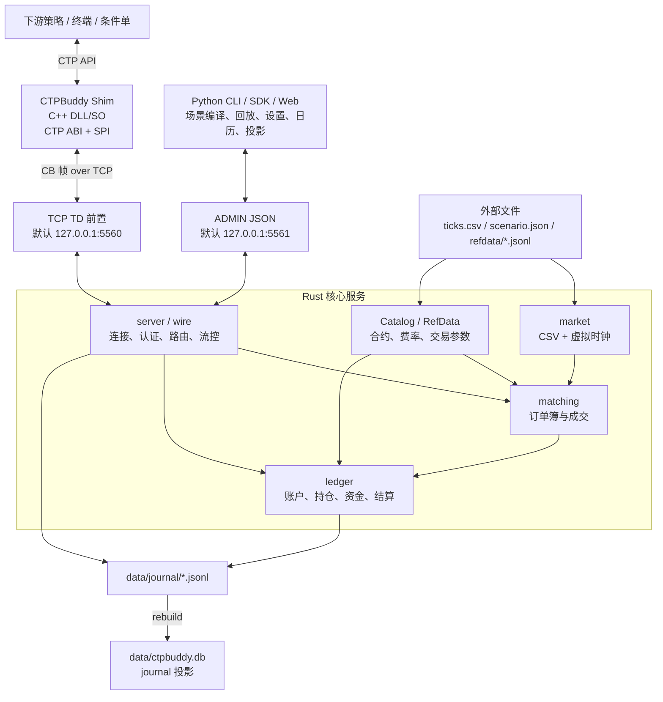

TD 是下游 CTP 应用的数据面，ADMIN 是 Python 控制面；两者使用独立端口。当前核心使用明文 TCP 承载 CB 帧，ZeroMQ 仍是后续传输适配方向。Shim 不承载业务逻辑；Rust 核心保持确定性撮合和账户单写者边界；Python 控制面不实现撮合与账本。

完整设计和 ADR 见仓库根 [`DESIGN.md`](https://github.com/charleszu/ctpbuddy/blob/main/DESIGN.md)。
