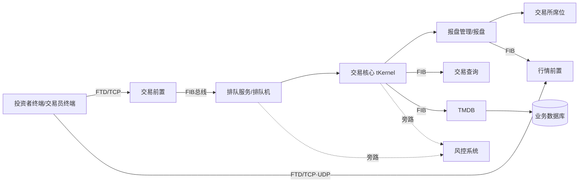
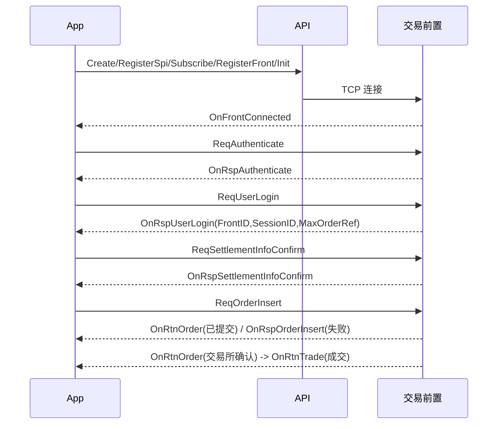

# 01 平台概述与架构

> 适用对象：后续做 CTP 开发的 AI Agent。本章说明 CTP 是什么、由哪些系统/组件构成、FTD 协议与流模型、交易日与结算概念、API 家族、多活与 FENS。
> 参考表见《13_API方法速查表》《14_错误码速查表》《15_枚举常量速查表》《16_结构体字段速查表》。

## 1. 要点速查表

| 先确认什么 | 速查结论 | 依据/边界 |
|---|---|---|
| 接入对象 | Trader API 负责报撤单、查询、结算确认；Md API 负责登录、订阅行情/询价 | 先按 API 家族选头文件和前置 |
| 初始化顺序 | 创建 API → 注册 SPI/流 → 注册前置或名字服务器 → `Init()` → 认证/登录 → 结算确认 → 串行查询 | 私有流/公共流订阅须在 `Init()` 前 |
| 数据流 | 私有流/公共流可断线续传；查询流和对话响应不可靠，行情断线不回补 | 流文件目录必须按实例隔离 |
| 交易日 | 以登录响应 `TradingDay` 和各所时间为准；自然日与交易日不可混用 | 夜盘跨日规则按交易所区分 |
| 报单关联 | 初期用 `FrontID+SessionID+OrderRef`；获得交易所编号后维护 `ExchangeID+OrderSysID` | 撤单发送 `OrderSysID` 必须保留官方回报中的 raw 字符串 |
| 资金/保证金 | `Available`、保证金价格与盈亏算法受经纪公司交易参数影响，不可套用单一公式 | 先查 `ReqQryBrokerTradingParams`，再核对账户快照 |
| 资料优先级 | 官方 HTML/头文件 > 项目 `docs/notes` 的来源考证 > 本知识库通用整理 > 当前 CTPBuddy 实现说明 | 本库不是官方权威，也不替代环境实测 |


## 2. 详细说明

### 2.1 CTP 是什么

综合交易平台（Comprehensive Transaction Platform，简称 CTP）是专为期货公司开发的期货经纪业务管理系统，由**交易、风险控制、结算**三大系统组成，可同时连通国内四家期货交易所（上期所 SHFE、大商所 DCE、郑商所 CZCE、中金所 CFFEX，后续版本另含能源中心 INE、广期所 GFEX 等），支持商品期货、股指期货（及后续的期权等品种）的交易结算业务，并自动生成、报送保证金监控文件与反洗钱监控文件。

核心技术特点（来自平台设计）：

| 特性 | 说明 |
|---|---|
| 内存数据库 | 自主研发，多重索引、直接外键、高效事务管理，并结合“重演”机制解决内存数据持久化；性能约 30 万事务/秒（通用内存库约 10 万事务/秒） |
| 完全精确重演的分布式架构 | 所有输入经排队机序列化为“单源输入”，各业务主机并行处理且结果确定；便于查错、容错灾备、自动回归测试 |
| 排队机 | 所有业务请求按优先级、时间等综合排队，使业务请求序列化 |
| 集群容错 | 多业务主机同时工作、互为备份、自由加入；单点故障切换时间为 0 |
| 性能 | 委托性能超过 2000 笔/秒（软件本身可达 8000 笔/秒）；支持 1 万客户并发在线，可通过增加前置机扩充 |
| 预埋单 | 独立预埋单服务器，预埋指令直接载入内存数据库，由“交易所状态切换”触发 |
| 风控 | 独立风险监控服务器，不影响交易性能；实时试算，自动计算强平数量，生成强平委托单供风控人员手工触发 |
| 结算 | 结算逻辑后台化集中，支持多次重复结算；交易与结算系统完全分开 |
| 安全 | 通信及数据库加密；菜单权限、功能权限、数据访问权限分离 |
| 线路冗余 | 互联网线路双线互备；接入交易所线路双局域网互备；投资者 API 具有自动切换（重连其它前置）功能；到交易所多个席位可负载均衡并互为备份 |

产品定位：

- CTP 面向全市场**免费开放**投资者交易及行情 API，**不提供**投资者使用的交易客户端；市场上的客户端（手工交易、程序化交易）均由第三方基于该 API 开发。
- 期货交易系统仅提供各交易所发布的**普通一档行情**（无 Level2）；部分证券公司部署的 CTP 证券系统提供 Level2 行情（需另取 Level2 API 包）。
- **不提供历史行情**，也**不提供行情回补**（断线/未及时登录丢失的行情不可补）；历史数据需行情商解决。程序化交易可通过多路连接降低断线风险，或托管策略服务器提高连接保障。（工程建议：策略所需历史K线应自行落库/从数据商获取。）
- 部署形态：期货公司“主用系统”与“次用系统”（同一公司可部署多套）；同一套系统可供多家经纪公司使用，用 BrokerID 在业务层隔离。

### 2.2 三大系统：交易、风控、结算

| 系统 | 职责 |
|---|---|
| 交易系统 | 订单处理（报单/撤单/报价/查询）、行情转发、银期转账业务 |
| 风控系统 | 盘中高速实时试算（载入服务端内存数据库），及时揭示并控制风险；自动计算强平数量并生成强平委托单 |
| 结算系统 | 交易管理、账户管理、经纪人管理、资金管理、费率设置、日终结算、信息查询、报表管理；生成保证金监控与反洗钱监控文件 |

要点：交易与结算系统完全分开（逻辑互不影响）；盘中的资金/持仓为交易核心依据**柜台实时计算**，日终结算后以结算结果为准。

#### 2.2.1 身份与标识概念

| 概念 | 含义 |
|---|---|
| BrokerID | 经纪公司代码。CTP 设计之初考虑一套系统服务多家经纪公司，用 BrokerID 在业务层完全隔离各公司的交易、风控、结算用户接入；具体取值向开户的期货公司咨询 |
| UserID / InvestorID | 经纪公司交易员代客下单时，UserID 为操作员代码、InvestorID 为投资者代码；投资者自己下单时两者同为投资者代码 |
| FrontID / SessionID / OrderRef | 报单会话标识：(FrontID, SessionID, OrderRef) 三元组在会话内唯一确定一笔报单；OrderRef 不填则后台自动赋值并回传；OrderActionRef 类似，用于标识撤单 |
| OrderRef 规则 | 字符数组，**必须是阿拉伯数字字符**；同一会话内后发的 OrderRef（OrderActionRef）值必须**大于**之前的最大值；多线程客户端需特别注意 |
| ExchangeID + OrderSysID | 交易所侧报单唯一标识（交易所编码 + 报单编号） |
| AppID / AuthCode / UserProductInfo | 客户端认证（穿透式监管/看穿式）所需：产品信息、认证码 |

### 2.2b 客户端认证、动态密码

- **客户端认证**：保证期货公司的投资者只能使用该公司认可的客户端接入。使用第三方或自研客户端前须向期货公司提交用户端产品信息（UserProductInfo）并获得认证码（AuthCode）；认证时在 ReqAuthenticate 中填写正确的产品信息与认证码。后台开启强制客户端认证（或客户端在本会话主动发起认证）后，只有通过认证才能接入后台。
- **动态密码 OneTimePassword**：基于时间的动态令牌（TOTP），由期货公司选择启用；公司将令牌种子文件导入后台并分配给指定投资者；使用者在 ReqUserLogin 的 OneTimePassword 字段填写令牌当时显示的字符，通过用户名/密码/动态密码校验后登录。
- **名字服务器**：期货公司可选择部署名字服务器，客户端通过 RegisterNameServer 自动获得后台分配的前置地址，不再直接 RegisterFront。
- **SSL 前置**：期货公司可选择部署 ssl 前置，客户端以 `ssl://` 地址加密接入。
- **代理**：API 内置 socks4/socks4a/socks5 代理支持，通过连接字符串指定。
- 查询限流、前置地址格式详见《02_API基础与开发环境》。
### 2.3 交易所接入

> 本章的系统架构与字段概念是通用整理；拒单回调、保证金/可用资金等环境敏感结论，请回到本库 05/06/09/12 的来源边界与官方 HTML，不以本章摘要覆盖具体版本规则。

| 交易所 | ExchangeID | 说明 |
|---|---|---|
| 上海期货交易所 | SHFE | 区分今仓/昨仓；建议用平今(CloseToday)/平昨(CloseYesterday)；“平仓(Close)”等效于平昨 |
| 中国金融期货交易所 | CFFEX | 不区分今昨；统一用平仓；用平今/平昨等效于平仓；后两个季月合约不支持市价单 |
| 大连商品交易所 | DCE | 不区分今昨，用平仓；平今“减半”按数量而非开仓时间计算；有互换单标志 IsSwapOrder、止损/止盈条件单；不维护报价状态 |
| 郑州商品交易所 | CZCE | 不区分今昨，用平仓；平仓规则“先单一后组合，再先开先平”，前一规则优先；夜盘交易日为当日 |
| 上海国际能源交易中心 | INE | 与上期所体系一致（登录响应含 INETime） |
| 上海证券交易所（证券/个股期权） | SSE | 证券/个股期权系统使用 |

> 说明：ExchangeID 的字符串取值以《15_枚举常量速查表》/头文件为准。登录成功响应中带有各交易所时间：SHFETime、DCETime、CZCETime、FFEXTime、INETime，用于判断各所时钟。
> 撤单时报单的 ExchangeID 须填写交易所代码（如 SHFE、CFFEX、DCE、CZCE、SSE），OrderSysID 须保留原样（含前导空格），不能 trim。

**接口兼容与系统形态**：一套接口兼容多种系统——期货主用系统、次用系统、期货 Mini 系统、个股期权系统、证券系统、外盘系统；CTPII 向 CTPI 向下兼容；另支持 FIX 协议接入（FIX 前置，与 FTD 前置并列）。

### 2.4 FTD 协议与三种流

**FTD 协议**：API 与后台通过建立在 TCP 之上的 FTD 协议通讯（行情还可使用 UDP 单播/组播）。FTD 中所有通讯都基于某个“通讯模式”（通讯双方协同工作方式）。通讯模式与网络连接不是简单一对一关系：一个连接中可传送多种模式的报文，一种模式的报文也可在多个连接中传送。

| 通讯模式 | 含义 | 举例 | 对应数据流 |
|---|---|---|---|
| 对话通讯模式 | 客户端主动发起请求，后台处理并响应（与普通 C/S 一致） | 报单、撤单、登录、查询 | 对话流 DialogRsp；其中查询为查询流 QueryRsp |
| 私有通讯模式 | 后台主动向某个特定客户端发送 | 报单回报、成交回报 | 私有流 Private |
| 广播通讯模式 | 后台主动向所有客户端发送相同信息 | 合约交易状态通知、询价 | 公共流 Public（公有流） |

流的特性：

| 流 | 可靠性 | 说明 |
|---|---|---|
| 对话流 DialogRsp / 查询流 QueryRsp | **不可靠** | 后台不维护其状态；通讯故障时会重置，途中数据可能丢失 |
| 私有流 Private | **可靠** | 后台为每个登录用户维护私有流；断线重连后按订阅模式重传 |
| 公共流 Public | **可靠** | 与私有流类似 |

- 行情 API 只涉及 DialogRsp/QueryRsp（行情不是可靠流，断线丢失不回补）。
- 流文件（本地 .con 文件）记录“该账户当日已从后台接收的数据流数量”（进度标识），详见《02_API基础与开发环境》§流文件。

### 2.5 订阅模式（Restart / Resume / Quick / None）

交易 API 创建实例后须订阅私有流与公共流：`SubscribePrivateTopic(THOST_TE_RESUME_TYPE)`、`SubscribePublicTopic(THOST_TE_RESUME_TYPE)`。

| 模式 | 枚举 | 含义 |
|---|---|---|
| Restart | THOST_TERT_RESTART | 从本交易日开始重传（重传当日全部私有/公共流） |
| Resume | THOST_TERT_RESUME | 从上次断线（上次收到）处续传，只重传断线期间数据（依赖本地流文件进度） |
| Quick | THOST_TERT_QUICK | 只传送登录后私有（公共）流的内容，不重传历史 |
| None | （不订阅） | 不接收对应流（旧版文档未列出，新版 API 支持；以头文件为准） |

要点：
- 一个交易日内，断线恢复后后台向使用 Restart 或 Resume 模式订阅私有流的用户重传全部（Restart）或断线期间（Resume）私有流。
- 订阅须在 `Init()` **之前**调用。
- Resume 依赖本地流文件，流文件被覆盖/共用会致数据不连续（见《02》）。
- Restart 模式每次登录会重放当日所有报单/成交回报，策略端须能幂等处理（工程建议）。
- 行情 API 没有订阅模式概念，使用 SubscribeMarketData 订阅合约。
### 2.6 系统架构组件

CTP 是全内存交易系统，支持 7×24 小时连续运行（运维“一键运维”，不必每日启停；新增交易中心不增加运维人力）；另有轻量版 **CTP mini**（更快、配置更小，用 CTP API 开发的客户端可完美兼容 mini）。



| 组件 | 职责 |
|---|---|
| 投资者终端 | 实现交易接口与行情接口的客户端：收行情、交易、银期转账 |
| 交易员终端（UserAPI） | 期货公司层面接口，数据范围远大于交易 API，**不对期货公司之外/投资者开放** |
| FTD 通讯协议 | 期货交易数据交换协议 |
| 交易前置 | 一端 TCP 连终端，一端经 FIB 总线连后台；只做与业务无关的通讯：**链路管理、协议转换、数据路由**；分散压力、降低复杂度、提高安全 |
| 行情前置 | 经 FIB 从报盘管理订阅全部行情，经 TCP 转发给订阅了该合约的终端 |
| FIB 信息总线 | 交易系统通讯底层构件：数据包封装、请求/应答、发布/订阅（一个 FIB 应用可兼发布者与订阅者） |
| 监控系统 | 旁路部分交易数据做应用监控与物理部件容量性能检测 |
| 仲裁服务 | 指导排队服务状态切换 |
| 排队服务（排队机） | 将交易请求序列化、发布交易序列，作为交易核心的数据来源（主/从确认 + 流水落盘，保证精确重演） |
| 交易核心 tKernel | 基于持仓/报单/成交/出入金实时计算资金与仓位（**事前风控**）；校验所有报单；驱动交易所报盘接口；发布实时结果到 FIB |
| 交易查询 | 内含与交易核心相同的内存数据库与业务规则，基于实时结算结果更新，经 FIB 为客户端提供查询（即“查询核心”；ReqQry 流控作用于此） |
| DBMT | 与业务数据库实时交互，将上下场业务数据经交易前置送交易核心 |
| TMDB | 订阅交易核心处理结果，回写物理数据库供结算使用 |
| 交易初始化 | ①据数据库生成交易核心初始化数据；②发出交易准备指令，开启新一轮交易（trading session） |
| 报盘管理 / 报盘 | 管理交易与行情报盘，使交易核心不必处理报盘与交易所前置间复杂通讯；报盘实现交易所行情与交易 API，通过远程席位报单、收回报、取行情 |
| 风控系统 | 旁路排队机交易序列与核心结果，实时监控，提供风险试算和强平 |
| 银期管理 / 清算银行接口 | 管理银期转账接口；与各银行系统交互 |
| 监控中心密钥接口及管理 | 向保证金监控中心查询期货公司密钥 |
| 业务数据库 | 物理存储 |
| 管理平台 | 期货公司业务操作入口 |
| 名字服务器 / FENS / TGate | 前置地址分发（见 §2.9） |
| 查询/报单/连接数流控组件 | 前置（front_se）配置 QryFreq、FTDMaxCommFlux、ConnectFreq 等（见《02》） |

要点：对客户端而言，**所有返回包都由 CTP（前置）发出**，无法也无需区分是柜台还是交易所的包；交易所差异在 CTP 内被归一化。

**两种数据交换模式**：请求/应答（Request/Response）；发布/订阅（Pub/Sub，异步，发布者订阅者相互独立）。

**数据流 vs 通讯模式**：数据流是单向或双向、连续、不重复不遗漏的报文序列；FTD 只规定报文在哪个通讯模式下工作，不规定流的划分。对话模式下一个数据流=一次连接：连接断开后重连是**全新的数据流**，若断开前请求已发出而响应未收到，重连后该响应不会被新流收到；私有/广播模式下一个数据流对应一个交易日内完成某项功能的所有连接，默认**从上次断开处继续**接收。对话模式返回的消息叫“响应”，私有与广播模式返回的叫“回报”。

### 2.7 交易日、交易时段与结算流程

**交易日 TradingDay**
- 期货“交易日”≠自然日：夜盘归属下一个交易日（周五夜盘归属下周一）。登录成功后 `GetTradingDay()` 或登录响应 `TradingDay` 给出当前交易日。
- 行情 `TradingDay`/`ActionDay`：`TradingDay` 为交易日，`ActionDay` 为实际发生日。各所取值：上期所、能源中心夜盘 TradingDay=次一交易日、ActionDay=当天；大商所夜盘两个字段均为交易日（与旧版说明“大商所夜盘为下一日”相符，但 ActionDay 同交易日）；郑商所日夜盘均为当天日期；中金所无夜盘。**各所实现并不统一，客户端不得假设统一规则**（以真实时间戳/行情时间处理）。
- 登录响应中带各交易所时间（SHFETime 等），可校时。
- 交易日内换日由 `TradingDay.con` 与交易初始化（新一轮 trading session）驱动；后台 7×24 运行，但每个交易日需结算与初始化，期间（通常为收盘结算至开盘前）柜台可能不可登录或仅部分可用（以期货公司公告为准）。

**每日流程（概念）**
1. 日终：交易所收盘 → 期货公司结算系统导入交易所数据，计算结算价、盈亏、保证金、费用，生成结算单；可多次重复结算；生成保证金监控与反洗钱文件。
2. 交易初始化：据数据库生成核心初始化数据，发出交易准备指令，开启新交易日；此后前置开放登录。
3. 客户端：连接 → 认证 → 登录 → **投资者结算结果确认**（`ReqSettlementInfoConfirm`，每交易日一次；未确认则**只能查询，不能报单等交易请求**）→ 交易。
4. 结算单：`ReqQrySettlementInfo`（TradingDay 填交易日如 20150422；不填默认查询上一交易日；只填月份如 201503 查月结单）；`ReqQrySettlementInfoConfirm` 查询当日是否已确认。确认时 CTP 记录的**确认日期是交易日而非实际发生日期，确认时间为实际时间**。
5. 交易所状态：`OnRtnInstrumentStatus` 推送交易所/品种级状态变化（集合竞价、连续交易、收盘等），可据此判断市场状态；合约是否可交易看 `ReqQryInstrument` 的 `IsTrading`。预埋单仅非交易时间（开盘前/休市）申报有效，连续交易开始后触发。
6. 非交易时段行情：日盘启动时会重演夜盘流水，可能重推夜盘行情；日盘结束后（一般 3 点~3 点半）交易所结算完成也会发行情（含当日结算价）。建议按交易时间过滤（工程建议：用交易时段表 + ActionDay/UpdateTime 过滤）。

**盘中与日终口径**：盘中资金、持仓由交易核心实时计算，日终以结算为准；`YdPosition` 为昨日（结算后）持仓数量 ≠ 当前昨仓数量；当前昨仓数量 = Position − TodayPosition。资金币种 CurrencyID（CNY/USD）。详细见资金持仓章节。

### 2.8 API 家族

| 家族 | 头文件/库 | 受众 | 说明 |
|---|---|---|---|
| 交易 API（Trader API） | ThostFtdcTraderApi.h / thosttraderapi | 投资者、终端开发商（快期等） | 报单/撤单/预埋/报价/行权/银期转账/查询；订阅私有流与公共流 |
| 行情 API（Md API） | ThostFtdcMdApi.h / thostmduserapi | 同上 | 登录、订阅/退订行情、订阅/退订询价；TCP/UDP/组播 |
| 风控 API（Risk API） | 独立发布包 | 期货公司风控人员 | 获取全体投资者实时资金、持仓、保证金，风险试算与强平；RcWin 风控平台基于它开发；不对个人投资者开放 |
| 结算接口（CSV） | 数据库指令集 | 期货公司 | 部署于可访问物理数据库的机器，读取投资者资料、成交、出入金、持仓；不对个人开放 |
| UserAPI（交易员） | | 期货公司交易员 | 报单、银期转账、查询；范围大，不对外开放 |
| 看穿式/穿透式监管版 API | 同 Trader/Md，带终端信息采集库 | 所有直连用户 | 认证(ReqAuthenticate, AppID+AuthCode)、采集终端信息(`CTP_GetSystemInfo`)、`RegisterUserSystemInfo`/`SubmitUserSystemInfo` 上报；中继模式：认证用中继 AppID，上报用客户端 AppID |
| TGate API | TGateFtdcApi.h / tgateapi.dll | 终端 | 查询服务地址（`ReqQryTGIpAddrParam`），见 §2.9 |
| FIX 接口 | FIX 前置 | 支持 FIX 的客户端 | 与 FTD 前置并列的接入方式 |
| 证券 / 个股期权 API | SSE 版库 | 证券、个股期权 | 新增 BizType 区分期货/证券；新增锁定/解锁(ReqLockInsert/ReqQryLock/ReqQryLockPosition)、备兑开/平仓(HedgeFlag=Covered)、市价转限价/市价转撤销/FOK限价/FOK市价 |
| 外盘 API | | | 一套接口兼容外盘系统（国际版另有开发指南） |

版本记事：V6.3.6_20141230 较前一版本新增中金所期权组保的申报/拆分/查询、中金所五档市价等指令、做市商报价中新增对应询价编号字段、汇率查询接口、版本查询接口；个股期权接口完全兼容该版。

**交易 API 主要功能**：下单、撤单、申报组合（中金所组保）、发起期货端银期转账；查询报单/成交/结算单/持仓/资金/合约/投资者信息/保证金率/手续费率/签约银行/银期签约关系/转账流水/银行余额；修改登录密码/资金账户密码；查询经纪公司算法/交易通知/仓单折抵/交易所/产品/最大报单数量/汇率/监控中心用户令牌等（见《13_API方法速查表》）。

**行情 API 要点**：`SubscribeMarketData`（区分大小写；登录成功后订阅）、`OnRtnDepthMarketData`、`SubscribeForQuoteRsp`/`OnRtnForQuoteRsp`（询价放在行情中，暂不做权限控制）。期权、期货询价由行情接口推送。

### 2.9 多活与 FENS、TGate

**多活交易中心**：CTP 支持 FENS 机制的“一键切换”多活交易中心，主中心宕机可立即切到备用中心实现连续交易。**同一时间用户只能在一个中心拥有交易权限**。

**FENS（fens 连接，已不再维护，推荐 TGate）**
- 痛点：RegisterFront 多地址冗余要求所有地址属同一中心；中心切换需退出程序重新注册备中心地址；客户端打包内置地址列表，前置变更需重新发布。
- 机制：客户端接入 fens 前置（RegisterNameServer），fens 按用户所在中心号自动返回对应中心地址列表，中心切换时自动转到另一中心前置，无需人工干预；亦可按用户网段自定义返回地址。
- `RegisterFensUserInfo(CThostFtdcFensUserInfoField*)`：BrokerID、UserID、LoginMode。
- fens.xml（期货公司端配置）规则：

| LoginMode | 用户所在中心 | 连接的 sysid 组 |
|---|---|---|
| THOST_FTDC_LM_Trade | 主中心 | sysid="1" |
| THOST_FTDC_LM_Trade | 备中心 | sysid="2" |
| THOST_FTDC_LM_Transfer | 主中心 | sysid="1" |
| THOST_FTDC_LM_Transfer | 备中心 | sysid="1"（Transfer 只连主中心前置） |

```cpp
CThostFtdcTraderApi *pUserApi = CThostFtdcTraderApi::CreateFtdcTraderApi("F:\\flow\\");
CSimpleHandler sh(pUserApi);
pUserApi->RegisterSpi(&sh);
pUserApi->SubscribePrivateTopic(THOST_TERT_QUICK);
pUserApi->SubscribePublicTopic(THOST_TERT_QUICK);
CThostFtdcFensUserInfoField fens = {0};
strcpy_s(fens.BrokerID, "9999");
strcpy_s(fens.UserID, "1000001");
fens.LoginMode = THOST_FTDC_LM_Trade;
pUserApi->RegisterFensUserInfo(&fens);
pUserApi->RegisterNameServer("tcp://127.0.0.1:41205");   // 注意：fens 用 RegisterNameServer，不是 RegisterFront
pUserApi->Init();
```
行情 fens：`pUserMdApi->RegisterFensUserInfo(&fens)`（流程与交易相同，先注册 Fens 用户信息再 RegisterNameServer 再 Init）。

**TGate（CTP 交易网关，fens 的新一代）**
- 更轻量、客户端适配成本低、易维护。终端无需登录，通过 TGateApi 向 TGate 查询自己所在交易中心的**全部可接入服务地址**（交易、行情、银期转账等），自行策略选择；盘中切换中心只需重新查询地址并重连。
- 无论用户在次中心还是异构分中心，只需把可连前置地址维护在 CTP 柜台，终端经 TGate 取地址列表后无需再过滤。
- 文件：TGateFtdcApi.h、TGateFtdcApiStruct.h、TGateFtdcApiDataType.h、tgateapi.dll/.lib、error.dtd/error.xml、FTD_tgateapi.xml。
- 类：`CTGateFtdcApi` / `CTGateFtdcSpi`；用法同 TraderApi（至少两线程；Api 线程安全；回调中不要阻塞或发请求）；最大支持 **5000 个终端连接**；在途查询流控 1 笔；`Release` 非线程安全；入参不能为 NULL；返回 0 正确其他错误。
- 新增查询 `ReqQryTGIpAddrParam`（入参 BrokerID、UserID 必填）→ `OnRspQryTGIpAddrParam`（`CTGateFtdcTGIpAddrParamField::Address`）。**连到非 TGate 地址会返回 -4 “API验证失败”。**

```cpp
CTGateFtdcApi *pApi = CTGateFtdcApi::CreateTGateFtdcApi();
pApi->RegisterSpi(this);
pApi->RegisterTGAddr("tcp://127.0.0.1");
CTGateFtdcQryTGIpAddrParamField q;
memset(&q, 0, sizeof(q));            // 注意：原示例对指针做 sizeof 属于笔误，应对结构体本身 sizeof
strcpy(q.BrokerID, "0001");
strcpy(q.UserID, "123456789");
int rst = pApi->ReqQryTGIpAddrParam(&q, 0);
// 回调：void OnRspQryTGIpAddrParam(CTGateFtdcTGIpAddrParamField* p, CTGateFtdcRspInfoField* pRspInfo, int nRequestID, bool bIsLast)
```

### 2.10 流控与会话数概览（系统级）

| 类别 | 作用对象 | 配置位置 | 超限表现 |
|---|---|---|---|
| 报单流控 | ReqOrderInsert/ReqOrderAction 每秒笔数 | 柜台“程序化交易频繁报撤单管理”菜单（期货公司可配；默认约每会话每秒 6 笔交易相关指令） | OnRspOrderAction 提示“CTP:下单频率限制”；也可能仅排队不报错 |
| 查询流控 | 当前 Session 每秒 ReqQry 笔数；投资者受限、操作员不受限 | 交易前置 `QryFreq`（穿透式版本之后 API 登录时会读取前置设置，如配 2 则每秒 2 笔）；API 内置在途 1 笔（旧版固定 1 笔/秒） | 超前置设置：OnRspError “CTP：查询未就绪，请稍后重试”；超在途：请求返回 -2；超每秒：-3 |
| FTD 报文流控 | 所有请求（登录/查询/报单/撤单/报价）每秒总数 | 前置 `FTDMaxCommFlux` | **无任何错误**；超额指令缓存在前置，下一秒再发（表现为后几笔延迟大） |
| 前置连接数流控 | 同一 IP 每秒 API 连接请求（Init→OnFrontConnected 过程） | 前置 `ConnectFreq`（不设则不限） | 被主动断开→OnFrontDisconnected；白名单：front_se bin 目录下 `whiteiplist` 文件，每行一个 IP |
| 同用户最大在线会话数 | 同一 UserID 在整个交易系统同时在线会话 | 柜台/交易核心（后台 6.6.3 及以上支持分用户设置） | OnRspUserLogin 返回“CTP:用户在线会话超出上限”（默认约 6） |
| 交易所 API 流控 | 交易所 API 每秒请求 | 交易所侧阈值，由交易所 API 查询获取 | OnRtnOrder 报“CTP：交易所每秒发送请求数超过许可数”或“CTP:交易所未处理请求超过许可数” |
| 行情转发 | 行情前置 | 上期所转发约每秒 2 次（不严格），有更新才转发，只转发变动字段 | 见《02》行情语义 |

> 所有以 `ReqQuery` 开头的函数（经交易核心而非查询核心处理）不受查询流控限制（原文说明）。CTP 仅对查询限流；交易指令限制由期货公司配置。

### 2.11 报单两阶段与四组交易序列号

交易指令分两阶段提交（TraderApi 异步）：①前置收到指令并校验，失败即 `OnRspOrderInsert`（含 ErrorID/ErrorMsg）；通过则不回 OnRspOrderInsert，而经 `OnRtnOrder` 回报状态；同时转发交易所；②交易所响应/回报经 `OnRtnOrder`、`OnRtnTrade` 通知；交易所认为错误时给 `OnErrRtnOrderInsert`（投资者可不关心，信息已体现在 OnRtnOrder 的 OrderStatusMsg 中）。

| 序列号组 | 产生者 | 用途 |
|---|---|---|
| FrontID + SessionID + OrderRef | 客户端自维（登录响应给 FrontID/SessionID/MaxOrderRef） | 唯一标识自己发出的委托；未收到报单响应可用其撤单 |
| BrokerID + BrokerOrderSeq | CTP 后台 | 每个经纪公司的报单序号 |
| ExchangeID + TraderID + OrderLocalID | 交易席位向交易所报单时产生 | 标识发往交易所的每笔报单 |
| ExchangeID + OrderSysID | 交易所 | 标识交易所已接受的报单；撤单可用 |

登录响应的 FrontID、SessionID 为“当天唯一会话编号”：同一用户多会话在线时私有流彼此可互收（A 会话报单，B 会话也收到回报），可用这组 ID 过滤非本会话回报。

## 3. 标准流程/时序

### 3.1 交易 API 一日标准流程

1. 创建 flow 目录（必须预先存在）→ `CreateFtdcTraderApi(flow)` → `RegisterSpi` → `SubscribePrivateTopic` → `SubscribePublicTopic` → `RegisterFront`/`RegisterNameServer` → `Init`。
2. `OnFrontConnected` → （开启认证则）`ReqAuthenticate`（BrokerID/UserID/UserProductInfo/AuthCode/AppID）→ `OnRspAuthenticate`。
3. （中继模式）终端认证成功后、登录前 `RegisterUserSystemInfo`（或直连 `SubmitUserSystemInfo`）。
4. `ReqUserLogin`（BrokerID/UserID/Password，可选 OneTimePassword）→ `OnRspUserLogin`：取 TradingDay、FrontID、SessionID、MaxOrderRef、各所时间。
5. `ReqQrySettlementInfoConfirm`（可选）→ 未确认则 `ReqQrySettlementInfo` + `ReqSettlementInfoConfirm` → `OnRspSettlementInfoConfirm`。
6. 查询合约/费率/保证金率/资/持仓/报单/成交（遵守查询流控，串行发送）。
7. 报单/撤单与回报处理；断线时 `OnFrontDisconnected(nReason)` → API 自动重连 → `OnFrontConnected` → **重新认证、登录**（交易 API 重连后须重新 ReqUserLogin，登录后按订阅模式续传私有/公共流）。
8. 退出：`ReqUserLogout`→ `RegisterSpi(NULL)` → `Release` →删除 Spi。



### 3.2 行情 API 流程
`CreateFtdcMdApi(flow)` → `RegisterSpi` → `RegisterFront` → `Init` → `OnFrontConnected` → `ReqUserLogin`（BrokerID/UserID/Password行情登录后 `GetTradingDay`）→ `SubscribeMarketData(ppInstrumentID, nCount)`（区分大小写）→ `OnRspSubMarketData`（合法也回调，ErrorID=0，“CTP:No Error”）→ `OnRtnDepthMarketData` → `UnSubscribeMarketData` → `ReqUserLogout`。断线重连后订阅列表被服务端清除，须在重新登录后重新订阅（“检测到网络连接中断后就将该用户从订阅列表中删除”）。

### 3.3 报单/撤单流程（概念）
- 报单：ReqOrderInsert → [CTP 校验失败: OnRspOrderInsert + OnErrRtnOrderInsert] / [通过: OnRtnOrder(已提交)] → [交易所通过: OnRtnOrder(未成交在队)] / [交易所拒绝: OnRtnOrder(废单)+OnErrRtnOrderInsert] → 成交: OnRtnTrade + OnRtnOrder。
- 撤单：ReqOrderAction → [CTP 校验失败: OnRspOrderAction + OnErrRtnOrderAction] / [通过: OnRtnOrder] → [交易所通过: OnRtnOrder(已撤)] / [交易所拒绝: OnErrRtnOrderAction]。
- 建议以 `OnRtnTrade` 判断成交；若仅依据 OnRtnOrder 状态立即平仓，极小概率因核心尚未更新报单状态导致平仓失败。
- OrderStatus 取值：0 全部成交；1 部分成交仍在队列；3 未成交仍在队列；5 已撤单；a 未知（已发交易所未确认）。详见《15_枚举常量速查表》。

## 4. 代码范例

见《02_API基础与开发环境》“最小可运行骨架”（行情与交易完整 C++ 示例），以及本章 §2.9 的 FENS/TGate 示例。以下为按订阅模式选择的片段：

```cpp
// 交易 API：订阅模式选择（须在 Init 之前）
pApi->SubscribePrivateTopic(THOST_TERT_RESUME);  // 续传：只补发上次断线之后的私有流（依赖本地 .con）
pApi->SubscribePublicTopic(THOST_TERT_RESUME);
// 其他： THOST_TERT_RESTART（当日全量重传） THOST_TERT_QUICK（只收登录后新产生的数据）
```

```cpp
// 报单时的字段约定（立即限价单）
CThostFtdcInputOrderField f = {0};
// BrokerID/InvestorID/UserID/InstrumentID/ExchangeID 等按实际填写
f.OrderPriceType     = THOST_FTDC_OPT_LimitPrice;   // 限价
f.TimeCondition      = THOST_FTDC_TC_GFD;           // 当日有效
f.VolumeCondition    = THOST_FTDC_VC_AV;            // 任意数量
f.MinVolume          = 1;
f.ContingentCondition= THOST_FTDC_CC_Immediately;
f.ForceCloseReason   = THOST_FTDC_FCC_NotForceClose;
f.IsAutoSuspend      = 0;                           // 官方建议置 0（永不挂起）
f.UserForceClose     = 0;
// 市价单：OPT_AnyPrice + LimitPrice=0 + TC_IOC
// 上期所平昨：THOST_FTDC_OF_Close 或 CloseYesterday；平今：THOST_FTDC_OF_CloseToday；其他所统一 OF_Close
```

## 5. 常见坑与排查

| 现象 | 原因 | 处理 |
|---|---|---|
| 报单后没有 OnRspOrderInsert 但无反应 | 通过校验的报单不回 OnRspOrderInsert，只回 OnRtnOrder | 监听 OnRtnOrder；失败才会有 OnRspOrderInsert |
| 登录成功但不能报单，只能查询 | 当日未做结算单确 | ReqSettlementInfoConfirm（每交易日一次） |
| 收不到报单回报/收到别人的回报 | 多账号共用流文件；或同一用户多会话互收私有流 | 流文件隔离；用 FrontID+SessionID 过滤 |
| 回调里调用同步等待后程序卡死 | 阻塞了 API 工作线程 | 回调只入队，业务线程处理 |
| 一连接就被断开 | 前置连接数流控（ConnectFreq）或版本不匹配 | 降低连接频率；联系期货公司加白名单 whiteiplist |
| 报单很多但后几笔延迟大且无报错 | FTD 报文流控（FTDMaxCommFlux），超额指令缓存在前置 | 降低指令频率（含查询、登录均计入） |
| OnRspUserLogin “用在线会话超出上限” | 同一 UserID 在线会话数超限 | 关闭多余会话；联系期货公司调整 |
| 行情收到极大值 1.7976931348623157e+308 | 字段无初始值（无效值）而非真实价格 | 当作“无效/缺失”处理（见《02》§数据类型） |
| 行情时间对不上“1 秒 2 次” | 有更新才转发，只转发变动字段，非严格 500ms | 不依赖固定间隔；自行合成 |
| 无历史/断线后缺行情 | CTP 不提供历史行情与回补 | 数据商补数据，多路连接 |
| 查询返回 -2/-3 | 在途查询未完或超每秒 | 串行发送查询，上一笔 IsLast 后再发；间隔 ≥1 秒（工程建议：请求队列定时器） |
| “CTP:无此功能” | 交易/行情端口写反 | 核对前置地址类型 |
| 盘中切换交易中心后无法交易 | RegisterFront 地址跨中心 | 用 FENS/TGate 动态获取 |
| 中金所市价单被拒 | 后两个季月合约不支持市价单 | 改限价或 OPT_BestPrice/FiveLevelPrice（以交易所规则为准） |
| 看不到手续费率（只返回品种） | 合约无单独设置则返回品种费率 | 属正常，取品种费率 |

## 6. 检查清单

**Do**
- 为每个 API 实例使用独立 flow 目录，且事先创建。
- 在 Init 前完成 RegisterSpi、Subscribe*Topic、RegisterFront/NameServer。
- 登录后每交易日确认结算单；用 OnRtnTrade 更新成交与持仓。
- 报单引用 OrderRef 用纯数字、会话内递增（可从 MaxOrderRef 起）。
- 在回调内尽快返回，复制数据后交工作线程处理。
- 对 pRspInfo、数据指针判空；用 bIsLast 判断结束。
- 对请求返回值非 0 做重发/退避（工程建议）。
- 上期所用平今/平昨区分，其他所用平仓。
- 自行持久化行情并做断线补数据；多路冗余连接（工程建议）。

**Don't**
- 不要多账号/多 API 共用流文件，不要手工改删 .con。
- 不要在回调里 Release、阻塞或同步等待。
- 不要把请求返回 0 当作业务成功。
- 不要假设各交易所 TradingDay/ActionDay 规则一致。
- 不要用 RegisterFront 注册跨中心地址。
- 不要对 OrderSysID 做 trim（撤单需保留原样）。
- 不要依赖 CTP 提供历史行情、K 线、主力合约。

## 7. 关键词索引

- CTP / 综合交易平台 / Comprehensive Transaction Platform；CTP mini；CTPI/CTPII；FIX 前置
- 交易系统 / 风控系统 / 结算系统；RcWin；UserAPI；Risk API；CSV 结算接口
- BrokerID（经纪公司代码）；UserID/InvestorID；FrontID/SessionID/OrderRef/MaxOrderRef；OrderSysID；BrokerOrderSeq；OrderLocalID
- FTD（Futures Trading Data Exchange Protocol）；对话/私有/广播通讯模式；DialogRsp / QueryRsp / Private / Public 流；.con 流文件
- THOST_TERT_RESTART / RESUME / QUICK；SubscribePrivateTopic / SubscribePublicTopic
- 交易前置（front_se）/ 行情前置 / FIB 信息总线 / 排队服务（排队机）/ tKernel（交易核心）/ 交易查询 / DBMT / TMDB / 报盘 / 报盘管理 / 仲裁服务 / 交易初始化 / 银期管理
- FENS / fens.xml / RegisterFensUserInfo / LoginMode（THOST_FTDC_LM_Trade / Transfer）/ RegisterNameServer / 名字服务器 / TGate / CTGateFtdcApi / ReqQryTGIpAddrParam / 多活 / 主备中心 / 异构分中心
- 客户端认证 / ReqAuthenticate / AuthCode / UserProductInfo / AppID / 动态密码 OneTimePassword / TOTP / 看穿式监管 / 穿透式监管 / RegisterUserSystemInfo / SubmitUserSystemInfo / 中继
- QryFreq / FTDMaxCommFlux / ConnectFreq / whiteiplist / 报单流控 / 查询流控
- TradingDay / ActionDay / 结算单确认 ReqSettlementInfoConfirm / ReqQrySettlementInfo / OnRtnInstrumentStatus / IsTrading
- SHFE / DCE / CZCE / CFFEX / INE / SSE；平今/平昨；FAK/FOK；预埋单；条件单；行权；做市商报价


