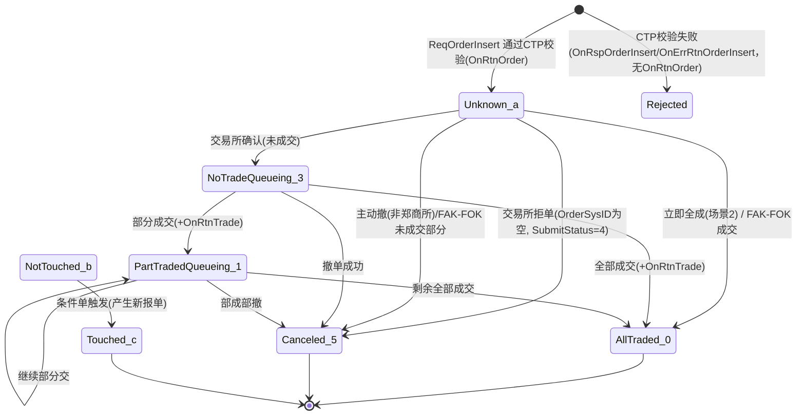

# 05 报单、撤单与回报

> 本章为 CTP 交易核心：报单流程、字段详解、指令组合、三套标识与撤单、回调规则、状态机、回报顺序、预埋单/条件单、订单簿维护、示例代码与排错。枚举全表见《15_枚举常量速查表》，错误码见《14_错误码速查表》。拒单回调按官方 HTML 的“报单回调规则”分层理解；不同年代和环境的 FAQ/入门资料存在冲突时，保留来源差异，不以当前 CTPBuddy 实现反推真实 CTP。

## 目录
1. 要点速查表
2. 详细说明
3. 标准流程/时序
4. 代码范例
5. 常见坑与排查
6. 检查清单
7. 关键词索引

## 1. 要点速查表

| 主题 | 结论 |
|---|---|
| 报单入口 | `ReqOrderInsert`；通过后通常进入 `OnRtnOrder`；CTP/交易所拒绝的具体回调面、参数和顺序必须按官方 HTML、版本与环境核验，不把旧 FAQ 或项目实现当普遍事实 |
| 撤单入口 | `ReqOrderAction`(ActionFlag=`THOST_FTDC_AF_Delete`)；失败 → `OnRspOrderAction` + `OnErrRtnOrderAction`；成功体现为 `OnRtnOrder` 状态 `'5'`(已撤单) |
| 三套订单标识 | ①`FrontID+SessionID+OrderRef`(会话级，撤单须同时填 InstrumentID) ②`ExchangeID+TraderID+OrderLocalID` ③`ExchangeID+OrderSysID`(交易所级，推荐用于撤单) |
| 状态与提交状态 | `OrderStatus`针对"报单"；`OrderSubmitStatus`针对某条"指令(报单申报/撤单)" |
| 终态 | `'0'`全部成交、`'5'`撤单、`'2'`部成不在队列、`'4'`未成不在队列、`'c'`已触发(条件单)；`'2'`/`'4'`是自动挂起遗留，现自动挂起标志为0，不会出现 |
| 未知状态 `'a'` | CTP 已接收并发往交易所，尚未收到交易所确认(含废单信息) |
| 交易所拒单 | 常见可见 `OrderStatus='5'`/`OrderSubmitStatus='4'` 等组合，但 `OrderSysID`、错误回调面与顺序需按官方回调规则和接入环境核验 |
| 回报顺序 | 先若干 `OnRtnOrder`，成交时 `OnRtnOrder`(状态变化)→`OnRtnTrade`；但"最后一笔 OnRtnTrade"与"终态 OnRtnOrder"先后不保证，必须两种顺序都能处理(Late Fill) |
| 订单真正结束 | 终态 + `OnRtnOrder.VolumeTraded` == 累计 `OnRtnTrade.Volume` |
| 大商所特例 | 全部成交时交易所只给成交回报，CTP 补发"全部成交"的 OnRtnOrder(不重复推送前一状态)；大商所只要进入报单簿都会先给"未成交"回报 |
| 成交开平标志 | 上期所/能源中心：与报单一致；大商所/郑商所/中金所：开仓'0'，所有平仓类(平今/平昨)成交均为'1'(平仓) |
| 平仓顺序 | 上期所/能源中心：由报单指平今/平昨；大商所/郑商所/中金所：先开先平、优先平昨(平今有减免则优先平今) |
| 市价单 | 郑商所市价须 LimitPrice=0；上期所/能源中心生产暂不支持(2026年7月6日起所有合约支持，LimitPrice 为保护价且不能为0)；大商所/郑商所最优对手价；中金所用五档/最优价 |
| 指令类型 | 四所均有 FAK(`TC_IOC`+`VC_AV`)/FOK(`TC_IOC`+`VC_CV`)/GFD；郑商所期货无 FOK(期权有)；上期所/中金所 FAK 可指定最小成交量(`VC_MV`) |
| 撤单必填 | 方式1：ExchangeID+OrderSysID(+InstrumentID)；方式2：FrontID+SessionID+OrderRef+InstrumentID(+ExchangeID) |
| OrderRef | 读作字符串写作整数；须递增，否则"重复的报单"；有符号32位整数 |
| 成交 Volume | 单次成交量，非累；累计看 OnRtnOrder.VolumeTraded；组合合约成交至少推两次(两个单腿) |

## 2. 详细说明

### 2.1 报单全链路

#### 2.1.1 请求路径
终端(API) → 交易前置(Front，会话/流控) → 排队机(风控、资金/持仓校验、报单引用重复校验) → tKernel(交易核心) → 报盘(各交易所报盘机) → 交易所。

#### 2.1.2 回报路径
交易所 → 报盘 → 排队机/tKernel → 前置 → API 私有流。
- 回报走**私有流**(Private Stream)，受 `SubscribePrivateTopic` 订阅方式(RESTART/RESUME/QUICK)影响，见《03_》登录/订阅章节。
- CTP 本地(前置/排队机)拒绝：官方页面明确 `OnRspOrderInsert` 用于 CTP 报错；是否同时出现 `OnErrRtnOrderInsert`、参数是否为空及其它回报，需按对应版本官方回调规则和实际柜台核验。常见原因可包括合约、持仓、资金、权限和流控问题。
- 交易所拒绝以 `OnRtnOrder` 体现(OrderStatus='5'，OrderSubmitStatus='4'，OrderSysID 为空，StatusMsg 含交易所原因，如"CZCE:出错:不支持无限制期权组合订单")，通常同时 `OnErrRtnOrderInsert`。常见原因：报单字段不正确(如在不支持市价的合约上报市单)、不在交易时间、超出涨跌停板。
- `ReqOrderInsert` 返回 0 仅表示 socket.write 成功，**不保证柜台已收到**，也不保证一定有 OnRsp/OnErrRtn。

#### 2.1.3 术语
| 术语 | 含义 | 回调 |
|---|---|---|
| 报单回报 | 报单的状回报：未知单、未成交、部分成交、全部成交、撤单回报，以 OrderStatus 区分 | `OnRtnOrder` |
| 成交回报 | 报单成交后推送 | `OnRtnTrade` |
| 错单响应 | 报单被 CTP 拒绝后的响应，ErrorID/ErrorMsg 指明原因 | `OnRspOrderInsert` |
| 错单回报 | 报单被 CTP 或交易所拒绝后的状态回报 | `OnErrRtnOrderInsert` |

### 2.2 ReqOrderInsert 字段详解

原型：`virtual int ReqOrderInsert(CThostFtdcInputOrderField *pInputOrder, int nRequestID) = 0;`
返回值：0 成功；-1 网络连接失败；-2 未处理请求超过许可数；-3 每秒发送请求数超过许可数。
用途：限价单、市价单、条件单等交易所支持的指令；撤单用 `ReqOrderAction`；预埋单不能用本接口，用 `ReqParkedOrderInsert`。

#### 2.2.1 CThostFtdcInputOrderField 字段表
| 字段 | 含义 | 填写 |
|---|---|---|
| BrokerID | 经纪公司代码 | 必填 |
| InvestorID | 投资者代码 | 必填 |
| InstrumentID | 合约代码 | 必填 |
| OrderRef | 报单引用 | 可自定义或不填(不填由系统填写) |
| UserID | 用户代码 | 建议与 InvestorID 同填 |
| OrderPriceType | 报单价格条件 | 必填 |
| Direction | 买卖方向 | 必填 |
| CombOffsetFlag | 组合开平标志(char[5]，取[0]) | 必填 |
| CombHedgeFlag | 组合投机套保标志(char[5]，取[0]) | 必填 |
| LimitPrice | 价格 | 必填 |
| VolumeTotalOriginal | 数量 | 必填 |
| TimeCondition | 有效期类型 | 必填 |
| GTDDate | GTD 日期 | 无 |
| VolumeCondition | 成交量类型 | 必填 |
| MinVolume | 最小成交量 | 配合 VC_MV；示例填 1 |
| ContingentCondition | 触发条件 | 必填 |
| StopPrice | 止损价(条件单触发价) | 必填(非条件单填 0) |
| ForceCloseReason | 强平原因 | 必填，普通用户 `THOST_FTDC_FCC_NotForceClose`('0') |
| IsAutoSuspend | 自动挂起标志 | 必填 0 |
| BusinessUnit | 业务单元 | 保留，CTP 内部使用，建议不要使用 |
| RequestID | 请求编号 | 无；OnRtnOrder 原值返回 |
| UserForceClose | 用户强平标志 | 无 |
| IsSwapOrder | 互换单标志 | 必填；互换单填 1 |
| ExchangeID | 交易所代码 | 必填(7.0 起强制) |
| InvestUnitID | 投资单元代码 | 无 |
| AccountID | 投资者帐号 | 无 |
| CurrencyID | 币种代码 | 不填默认 CNY |
| ClientID | 客户代码 | 无 |
| IPAddress | IP 地址 | 中继需填客户 IP；非中继填写无效(取登录会话 IP)。ipv4 原样；ipv6 转为非零压缩的原始地址并去掉冒号，如 `AAAABBBBCCCCDDDDEEEEFFFFGGGGHHHH` |
| MacAddress | Mac 地址 | 中继需填；非中继取登录会话 MAC |
| OrderMemo | 报单回显字段 | CTP 不处理，填什么回什么，可供终端厂商/多账户系统标记订单 |
| SessionReqSeq | session 上请求计数 | API 自动维护，客户填写无效 |
| reserve1/reserve2 | 保留的无效字段 | 不使用(新版用 InstrumentID/IPAddress 替代) |

#### 2.2.2 关键字段语义
- **OrderPriceType**：限价 `THOST_FTDC_OPT_LimitPrice`、市价(任意价) `THOST_FTDC_OPT_AnyPrice`、中金所五档价 `THOST_FTDC_OPT_FiveLevelPrice`、最优价 `THOST_FTDC_OPT_BestPrice`。大商所止损/止盈用 AnyPrice+ContingentCondition 触发类。全表见《15_枚举常量速查表》。
- **Direction**：`THOST_FTDC_D_Buy`('0') / `THOST_FTDC_D_Sell`('1')。
- **CombOffsetFlag**：开仓 `OF_Open`('0')、平仓 `OF_Close`('1')、强平 `OF_ForceClose`('2')、平今 `OF_CloseToday`('3')、平昨 `OF_CloseYesterday`('4')。上期所/能源中心支持平昨/平今，分别对昨仓/今仓；报入"平仓"等同于平昨。大商所、广期所、郑商所、中金所只能报平仓，报入平今/平昨 CTP 会转成平仓报出。
- **CombHedgeFlag**：投机 `THOST_FTDC_HF_Speculation`('1')、套利、套保。**郑商所平仓只能报"投机"**。除中金所有投机/套保/套利三个交易编码外，其他交易所只有投机交易编码(另有做市商类型，但投机套保字段中没有做市商这一类)；部分交易所不支持多交易编码。
- **TimeCondition**：目前只支持 GFD(当日有效)与 IOC(立即完成，否则撤销)，其他不支持；为支持大商所 GIS 属性指令，新增 `THOST_FTDC_TC_GFS` 枚举。
- **VolumeCondition**：`VC_AV` 任意数量、`VC_MV` 最小数量(配合 MinVolume)、`VC_CV` 全部数量。
- **ContingentCondition**：立即 `CC_Immediately`；条件单触发条件见 2.11。
- **StopPrice**：条件单触发价格。
- **LimitPrice**：郑商所价格会被交易所按最小变动价位**截取**(报 1500.9、最小变动价位 1，被截为 1500)；其他交易所直接返回错误。
- **OrderRef**：本地会话内唯一编号，**必须保持递增**，可由用户维护或系统自动填写，**一定为数字**；不递增报"CTP:报单错误：不允许重复报单"。本质是有符号 32 位整数(部分货公司柜台转为 64 位)，允许负数，超出约 -2147483468 ~ 2147483467 范围可能被服务端判为 0 而失败。读作字符串写作整数，回报中是带前导空格的右对齐字符串(如 `"         3"`)。
- **nRequestID**(函数参数)：对应响应里的 nRequestID，无递增规则，由用户维护。与结构体字段 `RequestID` 不同：`OnRspOrderInsert` 的参数 nRequestID = 请求时传入的 nRequestID；`OnRtnOrder` 结构体里的 RequestID = 报单时填入的 RequestID。CTP 允许重复，且无法区分同账户不同会话。
- **UserID / InvestorID**：交易员代下单或"一对多"中继时，UserID 为操作员代码、InvestorID 为投资者代码；投资者自己下单两者同为投资者代码。建议都填。
- **ExchangeID**：7.0 版本起报单/撤单强制要求。

### 2.3 ReqOrderAction 撤单

原型：`virtual int ReqOrderAction(CThostFtdcInputOrderActionField *pInputOrderAction, int nRequestID) = 0;` 返回值同 ReqOrderInsert。错误响应 `OnRspOrderAction`、`OnErrRtnOrderAction`；正确响应 `OnRtnOrder`。

| 字段 | 含义 | 填写 |
|---|---|---|
| BrokerID / InvestorID / UserID | 经纪公司/投资者/用户 | 必填 |
| InstrumentID | 合约代码 | 必填 |
| ExchangeID | 交易所代码 | 必填 |
| OrderRef | 要撤报单的引用 | 必填*1；须用 OnRtnOrder 中完整字符串，不可增减(含前导空格) |
| FrontID / SessionID | 要撤报单的前置/会话编号 | 必填*1 |
| OrderSysID | 要撤报单的报单编号 | 必填*2；须完整字符串，不可增减 |
| OrderActionRef | 报单操作引用 | 必填，递增 |
| ActionFlag | 操作标志 | 必填；**只支持删除** `THOST_FTDC_AF_Delete`('0')，不支持修改/激活/挂(其他柜台做的激活/挂起 CTP 能正常接收) |
| VolumeChange / LimitPrice | 数量变化/价格 | 无(不支持改单；改单=撤单后重新报单) |
| InvestUnitID / MacAddress | 投资单元/MAC | 无 |
| IPAddress | IP | 手工填本机 IP，不自动获取；格式同报单 |
| RequestID / OrderMemo / SessionReqSeq | 同报单 | 无 |

"必填*1、必填*2：两组选一组必填，能对应要撤的报单。"

撤未知单：665 版本以上柜台不允许撤郑商所的未知单('a')，其他交易所可撤。

### 2.4 三套报单标识与撤单三种方式

#### 2.4.1 三套 Key
| 标识 | 组成 | 范围 | 何时可得 |
|---|---|---|---|
| 会话键 | `FrontID + SessionID + OrderRef` | 本次登录会话；换会话/重连后 SessionID 变化 | 报单时即知(FrontID/SessionID 来自登录响应，OrderRef 自己填)，OnRtnOrder 含 |
| 席位键 | `ExchangeID + TraderID + OrderLocalID` | 交易所内；TraderID 是**交易所交易员(席位)代码**，不是 TradeID 成交编号(多一个"r") | 报单被交易所/报盘接收后 |
| 交易所键 | `ExchangeID + OrderSysID` | 交易所内全局；跨会话有效 | 交易所确认后(此前 OrderSysID 为空) |

- OnRtnTrade 含 OrderSysID、OrderRef、TraderID、OrderLocalID，**缺失 FrontID+SessionID**，故成交与订单关联应使用交易所键或席位键。
- `RequestID` 可一键对应请求与 OnRtnOrder，但允许重复、不区分会话(见 2.2.2)。
- OrderSysID 是数字字符串，可能右对齐带前导空格(如 `" 012865"`、`" 131"`)，不同交易所规则不同(有的不右对齐、不一定 6 位)，**不要截断空格，完整保存**；OrderRef 同理。

#### 2.4.2 撤单三种方式
1. **ExchangeID+OrderSysID**(推荐)：只需维护 OrderSysID；符合未来强制填 ExchangeID 的要求；须等交易所确认后(OnRtnOrder 状态为未成交/部分成交等)才有 OrderSysID。
2. **FrontID+SessionID+OrderRef**(须同时填 InstrumentID，未来也需 ExchangeID)：撤本会话(或已知该会话号)的报单，可在未知单阶段撤(郑商所 665 以上除外)。
3. **ExchangeID+TraderID+OrderLocalID**：席位键。ReqOrderAction 官方示例给出前两种。

#### 2.4.3 撤单失败常见原因
- 对已全成/已撤的报单再撤：`OnRspOrderAction`/`OnErrRtnOrderAction` 提示"CTP:报单已全成交或已撤销，不能再撤"。
- 标识填错：提示"CTP:撤单找不到相应报单"。
- 郑商所未知单不可撤(665 以上)。
- 交易所拒绝撤单：OnRtnOrder 的 OrderSubmitStatus='5'(撤单已经被拒绝)。
- 流控/权限同报单(-2/-3、"每秒报单数超过许可数")。

### 2.5 OrderStatus / OrderSubmitStatus 状态

#### 2.5.1 OrderStatus(针对"报单")
| 值 | 宏 | 含义 | 备注 | 终态 |
|---|---|---|---|---|
| '0' | `THOST_FTDC_OST_AllTraded` | 全部成交 | | 是 |
| '1' | `PartTradedQueueing` | 部分成交还在队列中 | 收到部分成交回报，报单仍在交易所队列 | 否 |
| '2' | `PartTradedNotQueueing` | 部分成交不在队列中 | 暂不使用(自动挂起遗留) | 是 |
| '3' | `NoTradeQueueing` | 未成交还在队列中 | 收到交易所报单确认，在队列中 | 否 |
| '4' | `NoTradeNotQueueing` | 未成交不在队列中 | 暂不使用(自动挂起遗留) | 是 |
| '5' | `Canceled` | 撤单 | 撤单成功；废单；全撤；部成部撤 | 是 |
| 'a' | `Unknown` | 未知 | CTP 接收报单并发给交易所，但尚未收到交易所确认信息(含废单信息) | 否 |
| 'b' | `NotTouched` | 尚未触发 | 条件单 | 否 |
| 'c' | `Touched` | 已触发 | 条件单特有终态 | 是 |

- 全部成交 → 终态"全部成交"；部成部撤、全部撤单 → 终态"撤单"。
- '2'/'4'成因：CTP 柜台有"自动挂起标志"(沿用上期所系统)，若设置，客户断线时其未成交报单自动挂起、离开撮合队列，状态即为"未成交不在队列中"/"部分成交不在队列中"；挂起的报单可撤单也可通过"激活"指令重新入队。目前自动挂起标志设置为 0，订单永远不会挂起；填 `IsAutoSuspend`=0。若其他柜台对报单挂起/激活，CTP 支持未成交的挂单(OrderStatus='4')，不支持部分成交的挂单('2')。
- 备注：OnRtnOrder 在报单成功/成交/撤单时 OrderStatus 流转，部分情形下 OrderStatus 为 '2' 等也可认为是自己撤单导致。

#### 2.5.2 OrderSubmitStatus(针对"指令"：报单申报/撤单)
| 值 | 宏 | 含义 |
|---|---|---|
| '0' | `InsertSubmitted` | 报单已经提交(提交给 CTP 报盘) |
| '1' | `CancelSubmitted` | 撤单已经提交(提交给 CTP 报盘) |
| '2' | `ModifySubmitted` | 修改已经提交(暂不使用) |
| '3' | `Accepted` | 已经接受(交易所接收报单/撤单) |
| '4' | `InsertRejected` | 报单已经被拒绝(被 CTP 报盘或交易所拒绝) |
| '5' | `CancelRejected` | 撤单已经被拒绝(被 CTP 报盘或交易所拒绝) |
| '6' | `ModifyRejected` | 改单已经被拒绝(暂不使用) |

OrderSubmitStatus 官方标注"CTP 内部使用，普通投资者可以忽略"，但可用于辅助区分撤单来源(见 2.8)。

#### 2.5.3 状态转换图

撤单本身的状态：撤单请求被接受 → OnRtnOrder(OrderSubmitStatus 经 '1' 撤单已提交 → '3' 已接受)，随后状态变 '5'；被拒绝 → OrderSubmitStatus='5'，OnErrRtnOrderAction。

#### 2.5.4 StatusMsg
OnRtnOrder.StatusMsg 为状态信息文本，如"未成交"、"全部成交"、"已撤单"、"报单已提交"、"CTP:..."(CTP 本地拒绝原因)、"CZCE:..."/"SHFE:..."等(交易所拒绝原因，如"已撤单报单被拒绝CZCE:出错:不支持无限制期权组合订单")。程序逻辑应以 OrderStatus/OrderSubmitStatus/ErrorID 判定，StatusMsg 仅作展示与排错(工程建议)。

### 2.6 回调触发条件与报单回调规则

| 回调 | 触发条件 |
|---|---|
| `OnRspOrderInsert` | ReqOrderInsert 后被 CTP 判定字段/风控等错误(如字段填写不对)；pRspInfo 的 ErrorID≠0；参数 nRequestID/bIsLast |
| `OnErrRtnOrderInsert` | 报单被 CTP 报错或被交易所拒绝的错误回报；参数仅 pInputOrder、pRspInfo |
| `OnRtnOrder` | 报单通过 CTP 并报出后，每次报单状态变化(未知/未成交/部分成交/全部成交/撤单)及撤单成功/被拒；私有流 |
| `OnRtnTrade` | 报单有成交；私有流 |
| `OnRspOrderAction` | ReqOrderAction 后被 CTP 判定错误(如找不到报单、已全成或已撤) |
| `OnErrRtnOrderAction` | 撤单被 CTP 或交易所拒绝的错误回报；pOrderAction 含 OrderActionStatus、StatusMsg、ActionDate/ActionTime |

在给定交易所报单回报顺序的前提下，CTP 返回给 API 的回调顺序是固定的。

#### 2.6.1 回调序列场景表(以 ag1207 报入为例)
| 场景 | 序列 |
|---|---|
| 1 先未成交后全成1手 | ReqOrderInsert → OnRtnOrder(未知) → [收到交易所未成交] OnRtnOrder(未成交) → [收到成交+全成回报] OnRtnOrder(未成交) → OnRtnOrder(全部成交) → OnRtnTrade |
| 2 立即全成(无未成交回报) | ReqOrderInsert → OnRtnOrder(未知) → [收到成交+成交报单回报] OnRtnOrder(未知) → OnRtnOrder(全部成交报单已提交) → OnRtnTrade |
| 3 先未成交后撤单 | OnRtnOrder(未知) → OnRtnOrder(未成交) → ReqOrderAction → [收到撤单回报] OnRtnOrder(未成交) → OnRtnOrder(已撤单) |
| 4 10手：未成交→成交3→余7全成 | OnRtnOrder(未知)→(未成交)；[成交3] OnRtnOrder(未成交)→OnRtnOrder(部分成交)→OnRtnTrade；[余7成交] OnRtnOrder(部分成交)→OnRtnOrder(全部成交)→OnRtnTrade |
| 5 10手：未成交→成交4→余6撤 | (未知)→(未成交)；[成交4] (未成交)→(部分成交)→OnRtnTrade；ReqOrderAction → [撤单回报] OnRtnOrder(部分成交)→OnRtnOrder(已撤单) |
| 6 对已撤单再撤 | ReqOrderAction → OnRspOrderAction(CTP:报单已全成交或已撤销，不能再撤) → OnErrRtnOrderAction(同) |
| 7 撤不存在的委托(标识填错) | ReqOrderAction → OnRspOrderAction(CTP:撤单找不到相应报单) → OnErrRtnOrderAction(同) |

规律(据上述序列归纳)：每次状态变化类的交易所回报，CTP 先推送一条"变化前状态"(按 CTP 内部先落旧状态)再推送新状态；因此成交会出现一对 OnRtnOrder(旧状态→新状态)后再接 OnRtnTrade；撤单则出现 OnRtnOrder(旧状态)→OnRtnOrder(已撤单)(OnRtnOrder 数量多于直觉，须幂等处理)(工程建议：以 OrderStatus+VolumeTraded 去重而非按条数计数)。

#### 2.6.2 大商所特殊回调规则
大商所在一笔委托全部成交后，只返回成交回报，不返回状态为"全部成交"的报单回报；CTP 补一个"全部成交"的 OnRtnOrder(CTP 补充生成，且不重复推送前一状态)。大商所无论是否立即成交，只要委托进入报单簿都会返回一笔"未成交"报单回报给 CTP。以 c1911-C-1760 为例：
| 场景 | 序列 |
|---|---|
| 1 先未成交后全成 | OnRtnOrder(未知) → OnRtnOrder(未成交) → [收到成交] OnRtnOrder(全部成交，CTP补充) → OnRtnTrade |
| 2 立即全成 | 同场景1(大商所会先给未成交回报) |
| 3 先未成交后撤单 | OnRtnOrder(未知) → OnRtnOrder(未成交) → ReqOrderAction → OnRtnOrder(未成交) → OnRtnOrder(已撤单) |

### 2.7 回报顺序与"订单真正结束"

1. CTP/交易所拒单的回调面与状态组合按官方回调规则、版本和环境核验；本库不把旧 FAQ、notes/09 或当前实现拼成无条件序列。
2. CTP 校验通过后通常进入 `OnRtnOrder` 状态回报；首条状态、OrderSysID 产生时点和后续顺序需按场景核对。
3. `OrderStatus='5'`、`OrderSubmitStatus='4'` 可作为部分环境识别拒单的线索，但不能单独推导所有拒单来源；保留 `StatusMsg`、错误回调和 raw 标识用于审计。
4. 订单完全成交(或撤单时恰好有成交)时，**最后一笔 OnRtnTrade 与最后一个(终态)OnRtnOrder 无严格先后**，两种都可能：
   - 情况1：OnRtnOrder(未知)→…→OnRtnOrder(全部成交/已撤单)→OnRtnTrade(可能不止一笔)
   - 情况2：OnRtnOrder(未知)→…→OnRtnTrade→OnRtnOrder(全部成交/已撤单)
5. **误区**：收到终态 OnRtnOrder 就把订单从本地删除，导致无法处理后续 OnRtnTrade(Late Fill)。
6. **正确做法**：根据 OnRtnOrder 维护总成交数量 A(=`VolumeTraded`)，累加 OnRtnTrade 的 `Volume` 得到 B；仅当状态为终态且 A==B 才认为订单真正结束。
7. 关于 K线/持仓更新：持仓/资金的变化应以 OnRtnTrade 为准(成交才改变持仓)，基于 OnRtnOrder 状态为"全部成交"就更新持仓可能早于或晚于 OnRtnTrade，须以累计成交量对账(工程建议)。合成 K 线用行情快照，不同软件规则不同(见 2.14)。
8. 大商所："全部成交"的 OnRtnOrder 为 CTP 补发，位于 OnRtnTrade 之前(见 2.6.2)。
9. 组合合约(套利/互换)成交按两个单腿分别推送 OnRtnTrade，至少两次。
10. 郑商所分笔成交：`ZCETotalTradedVolume`(OnRtnOrder 字段)用于在郑商所分笔成交时返回总成交手数。例：报入 10 手一次性分笔成交，会有多个 OnRtnTrade，直到最后一个成交回报才能收到 VolumeTraded=10，但有 ZCETotalTradedVolume 则在第一个分笔成交回报中就能知道本次共成交几手。

### 2.8 区分撤单来源

OnRtnOrder 的 `OrderStatus=THOST_FTDC_OST_Canceled('5')` 可能来自：①自己发起撤单；②交易所拒单；③IOC 单(FAK/FOK)自动撤掉剩余手数。若出现 '2' 等其他状态的已撤单，可认为都是自己发起撤单。三种判断方法：

| 方法 | 自己撤单 | 交易所拒单 | IOC 自动撤 |
|---|---|---|---|
| ① OrderSysID 是否为空 | 非空(已进入交易所撮合队列) | 空(或未入交易所即被自己撤) | 适用判断 IOC，规则同左 |
| ② ActiveUserID 是否为空 | 为你的账户名 | 空 | 不适用：该字段始终为空 |
| ③ OrderSubmitStatus | '3'(已经接受) | '4'(报单已被拒绝) | '3' 或 '0' |

建议组合使用：OrderSysID 非空且 ActiveUserID==UserID → 主动撤；OrderSysID 空 + SubmitStatus='4' → 被拒；IOC 单且 VolumeTraded<VolumeTotalOriginal 且未发过撤单 → 自动撤(工程建议)。另可记录本地"已发撤单"标记辅助判断(工程建议)。

交易所拒单常见原因：报单字段不正确(如在不支持市价指令的合约上报市价单)、不在交易时间内、超出涨跌停板价格等。

### 2.9 OnRtnOrder 字段要点
(完整结构见《16_结构体字段速查表》/头文件。)
- **InsertTime**：未知单时为 CTP 系统时间，从交易所返回后变更为交易所时间。
- **InsertDate**：未知单、错单、上期所/能源/郑商所回报为自然日；大商所回报为交易日。**确认报单时间用 TradingDay+InsertTime**。
- **OrderSource**：由交易所返回报文取值；上期所除被交易所打回的报单及秒成交的委托外，该字段为空。
- **ActiveTraderID**：从交易所原值收回，CTP 核心不处理；在撤单回报中由报单席位号修改为撤单席位号，便于看出撤单从哪个席位发起；大商所该字段为空，上期所被打回的报单及秒成交委托该字段也为空。
- **TraderID**：席位号。**ActiveUserID**：操作用户代码，一般只有撤单才有值。
- **CancelTime**：交易所未返回撤单时间时取排队机收到交易所撤单成功回报的时间。中金所、大商所六期系统返回撤单时间；上期所、能源中心、郑商所、大商所七期不返回。
- **BusinessUnit**：CTP 内部使用，不要使用。**InstallID/OrderSubmitStatus**：CTP 内部使用。
- **RelativeOrderSysID**：相关报单；条件单触发产生的新报单中等于条件单的 OrderSysID。
- **IsSwapOrder**：是否互换单，是 1 否 0。**ForceCloseReason**：投资者发出填 0。**OrderType**：报单类型，报价中的情况。
- **VolumeTotalOriginal / VolumeTraded / VolumeTotal**：原始数量/今成交数量(累计)/剩余数量。

### 2.10 成交回报 OnRtnTrade

| 字段 | 说明 |
|---|---|
| TradeID | 成交编号(交易所内，通常需与 ExchangeID 联合唯一，见 2.10.2) |
| OrderSysID/OrderRef/TraderID/OrderLocalID | 关联订单(无 FrontID/SessionID) |
| Direction | 买卖方向 |
| OffsetFlag | 开平标志(见 2.12.2) |
| HedgeFlag | 投机套保标志 |
| Price / Volume | 成交价 / **本笔成交量**(非订单累计) |
| TradeDate / TradeTime | 成交日期/时间 |
| TradeType | 成交类型(报价中的情况) |
| PriceSource | 成交价来源 |
| TradingRole | 交易角色 |
| TradeSource | 成交来源 |
| TradingDay / SettlementID / SequenceNo / BrokerOrderSeq | 交易日/结算编号/序号/经纪公司报单编号 |
| ParticipantID/ClientID/ClearingPartID/BusinessUnit | 会员/客户/结算会员/业务单元 |

- **TradeDate**：大商所、郑商所回报中为交易日；上期所、能源中心为自然日。**确认成交时间用 TradingDay+TradeTime**。
- **PriceSource**(成交价来源)：报单撮合产生的最新成交价取买价、卖价及前成交价三者居中的价格——买价≥卖价≥前成交价时，最新成交价=卖价；买价≥前成交价≥卖价时=前成交价；前成交价≥买价≥卖价时=买价。与头文件三个枚举值(前成交价/买委托价/卖委托价)匹配。
- 成交 Volume 例：委托 4 手分两次(1 手、3 手)成交，OnRtnTrade 的 Volume 依次为 1、3；总成交量看 OnRtnOrder.VolumeTraded。
- 与订单关联：用 ExchangeID+OrderSysID 或 ExchangeID+TraderID+OrderLocalID。
- 交易日规则：OnRtnTrade/OnRtnOrder 的 TradingDay 字段准确。

### 2.11 各交易所报单指令字段组合

#### 2.11.1 各交易所指令支持概览
| 指令 | 上期所/能源中心 | 大商所 | 郑商所 | 中金所 |
|---|---|---|---|---|
| 市价单 | 生产暂不支持；测试环境已测，生产时间不确定(2026年7月6日起所有合约支持：LimitPrice 为保护价，须在涨跌停板内且不能为0)；内部将市价转成限价涨跌停板价参与撮合(成交价可能不等于对手价) | 支持，最优对手价成交 | 支持，最优对手价成交(LimitPrice 须填 0) | 五档市价(与对手方五档尝试成交，剩余撤销)；五档市价转限价(剩余转最新价限价单)；最优价(与对手方最优价成交，剩余撤销)；最优价转限价(剩余转最优价限价单)；新增：任意价转限价(任意价未成交部分转最新价限价单) |
| 止损/止盈 | 无 | 支持：最新价>/<触发价(StopPrice)时触发新报单(可市价也可限价)；买止损平仓/卖止损平仓是数年前提出的概念，一直未实施 | 无 | 无 |
| 特殊指令 | FAK, FOK, GFD(当日有效) | FAK, FOK, GFD | FOK, IOC, GFD(注：此处 IOC 在 CTP 中映射为 FAK 语义，期货无 FOK、期权有 FOK，见组合表) | FAK, FOK, GFD |
| 套利 | 无 | 跨期、跨品种(交易所提供规范合约) | 展期(同品种不同月份)、互换(不同品种同月份，CTP 报单录入 IsSwapOrder=true)；另有期权跨式/宽跨式 | 跨期、跨品种(交易所提供规范合约)；未来计划开放期×期货、期货×期权、期权×期权组合保证金 |

注：套利栏不同交易所/版本表述有差异，按"哪个交易所提供规范合约"以合约查询结果为准。

#### 2.11.2 详细字段组合表(OrderPriceType / ContingentCondition / TimeCondition / VolumeCondition)
记号：OPT_ = `THOST_FTDC_OPT_`，CC_ = `THOST_FTDC_CC_`，TC_ = `THOST_FTDC_TC_`，VC_ = `THOST_FTDC_VC_`。除特别注明外，ContingentCondition 均为 CC_Immediately。

**郑商所 CZCE**
| 品种/业务 | 指令 | OrderPriceType | TimeCondition | VolumeCondition |
|---|---|---|---|---|
| 期货单腿 | 限价单 | OPT_LimitPrice | TC_GFD | VC_AV |
| 期货单腿 | FAK | OPT_LimitPrice | TC_IOC | VC_AV |
| 期货单腿 | 市价单 | OPT_AnyPrice | TC_GFD | VC_AV |
| 期货单腿 | 市价 FAK | OPT_AnyPrice | TC_IOC | VC_AV |
| 期货 跨期套利/跨品种套利/互换(跨期、跨品种) | 限价 | OPT_LimitPrice | TC_GFD | VC_AV |
| 同上 | FAK | OPT_AnyPrice(此处原表如此) | TC_IOC | VC_AV |
| 期权单腿 | 限价 | OPT_LimitPrice | TC_GFD | VC_AV |
| 期权单腿 | FAK | OPT_LimitPrice | TC_IOC | VC_AV |
| 期权单腿 | FOK | OPT_LimitPrice | TC_IOC | VC_CV |
| 期权单腿 | 市价 / 市价FAK / 市价FOK | OPT_AnyPrice | GFD / IOC / IOC | AV / AV / CV |
| 期权 跨式套利(STD)/宽跨式套利(STG) | FAK | OPT_AnyPrice | TC_IOC | VC_AV |
| 同上 | FOK | OPT_AnyPrice | TC_IOC | VC_CV |

郑商所组合合约下单 TimeCondition 须用 `TC_IOC`，否则报"已撤单报单被拒绝CZCE:出错:不支持无限制期权组合订单"；组合合约代码写法：跨式 `STD SR703C5300&SR703P5300`，宽跨式 `STG SR703C5300&SR703P5200`，支持 FAK 和 FOK。

**大商所 DCE**
| 品种/业务 | 指令 | OrderPriceType | ContingentCondition | TimeCondition | VolumeCondition |
|---|---|---|---|---|---|
| 期货单腿 | 限价 | OPT_LimitPrice | CC_Immediately | TC_GFD | VC_AV |
| | FAK | OPT_LimitPrice | CC_Immediately | TC_IOC | VC_AV |
| | FOK | OPT_LimitPrice | CC_Immediately | TC_IOC | VC_CV |
| | 止损 | OPT_AnyPrice | **CC_Touch** | TC_GFD | VC_AV |
| | 止盈 | OPT_AnyPrice | **CC_TouchProfit** | TC_GFD | VC_AV |
| | 市价 / 市价FAK / 市价FOK | OPT_AnyPrice | CC_Immediately | GFD / IOC / IOC | AV / AV / CV |
| | 市价止损 / 市价止盈 | OPT_AnyPrice | CC_Touch / CC_TouchProfit | TC_GFD | VC_AV |
| 套利/互换 | 限价 | OPT_LimitPrice | CC_Immediately | TC_GFD | VC_AV |
| 期权单腿 | 限价 / FAK / FOK | OPT_LimitPrice | CC_Immediately | GFD / IOC / IOC | AV / AV / CV |
| 期权单腿 | 止损 / 止盈 | OPT_AnyPrice | CC_Touch / CC_TouchProfit | TC_GFD | VC_AV |

**上期所 SHFE / 能源中心 INE(期货/期权)**
| 指令 | OrderPriceType | TimeCondition | VolumeCondition |
|---|---|---|---|
| 限价 | OPT_LimitPrice | TC_GFD | VC_AV |
| FAK(任意成交数量) | OPT_LimitPrice | TC_IOC | VC_AV |
| FAK(指定成交数量，最小成交量=MinVolume) | OPT_LimitPrice | TC_IOC | VC_MV |
| FOK | OPT_LimitPrice | TC_IOC | VC_CV |

**中金所 CFFEX**
| 品种/业务 | 指令 | OrderPriceType | TimeCondition | VolumeCondition |
|---|---|---|---|---|
| 期货单腿 | 限价 | OPT_LimitPrice | TC_GFD | VC_AV |
| | FAK(任意数量) | OPT_LimitPrice | TC_IOC | VC_AV |
| | FAK(指定数量) | OPT_LimitPrice | TC_IOC | VC_MV |
| | FOK | OPT_LimitPrice | TC_IOC | VC_CV |
| | 五档市价 | OPT_FiveLevelPrice | TC_IOC | VC_AV |
| | 五档市价转限价 | OPT_FiveLevelPrice | TC_GFD | VC_AV |
| | 最优价 | OPT_BestPrice | TC_IOC | VC_AV |
| | 最优价转限价 | OPT_BestPrice | TC_GFD | VC_AV |
| 期权单腿 | 限价 | OPT_LimitPrice | TC_GFD | VC_AV |
| | FAK(任意数量) | OPT_LimitPrice | TC_IOC | VC_AV |
| | FAK(指定数量) | OPT_LimitPrice | TC_IOC | VC_MV |
| | FOK | OPT_LimitPrice | TC_IOC | VC_CV |

说明：①大商所止损/止盈是**交易所原生**的止损止盈指令(ContingentCondition 为 Touch/TouchProfit)，与 CTP 柜台条件单(2.13)不同——后者不得使用 Touch/TouchProfit。②FAK/FOK 的细则与交易所差异见《10_》。③套利组合合约的 InstrumentID 必须使用交易所提供的规范合约/组合合约代码。④FOK 在期货上郑商所不支持(表中期货无 FOK)。

#### 2.11.3 市价单要点
- 郑商所市价类报单须将 LimitPrice 填 0，否则被拒；其他交易所无此规定，但**建议所有市价报单都填 0**，以防未来规则变动(见 2.5)。
- 2026年7月6日起上期所/能源中心将在所有合约支持市价单，LimitPrice 表示"保护价"(可接受的最差成交价)，须在涨跌停板范围内，不能为 0。
- 在不支持市价单的合约上报市价单会被交易所拒绝(OnRtnOrder 状态 '5')。
- 中金所无 AnyPrice 的普通市价，应使用五档/最优价指令。

### 2.12 开平仓语义

#### 2.12.1 报单开平标志
| 交易所 | 平仓类指令 |
|---|---|
| 上期所/能源中心 | 支持平今(`CloseToday`)与平昨(`CloseYesterday`)指令，分别对应今仓、昨仓；报"平仓(Close)"等同平昨；今仓/昨仓各自内部先开先平 |
| 大商所/广期所/郑商所/中金所 | 只能报平仓；报平今/平昨 CTP 转成平仓报出 |

#### 2.12.2 成交开平标志(OnRtnTrade.OffsetFlag)与报单 CombOffsetFlag[0] 不一定相等
- 上期所/能源中心：成交与报单的开平方向相同。
- 大商所/郑商所/中金所：开仓则成交为 `OF_Open`('0')；平仓则无论报单用平今/平昨，成交均为 `OF_Close`('1')。
- 仿真环境(SimNow)成交开平标志遵循上期所规则(随报单)，如大商所合约报"平今"，即使实际平的是昨仓，成交标志也是平今(隐藏的坑，与生产不同)。

#### 2.12.3 各交易所平仓顺序
- 大商所/郑商所：先开先平，优先平昨；平今手续费有减免则优先平今。
- 中金所同上，先开先平优先平昨；但**股指期货计算平仓手续费时按优先平今**规则。
- 上期所/能源中心：下单时自己指定平今/平昨，各自内部先开先平。

中金所股指举例(IF2203 平昨 20 元/手，平今 300 元/手)：持多头昨仓 2 手，今天再开多 1 手(共 3 手：昨 2、今 1)。卖平 1 手：实际平掉的是昨仓，余昨 1+今 1，但手续费按平今 300 元；再卖平 1 手：实际仍平昨仓，余昨 0+今 1，由于手续费系统中今仓已按平今算完，这次按平昨 20 元。合计 300+20=320 元。可理解为手续费计算系统中另有一套"优先平今"的假想持仓并行运行；若要算准股指期货手续费，可用该套假想持仓。

### 2.13 条件单

- 本质：触发条件后，以报入的其他参数(价格、数量等)立即自动下一个普通单；条件单存储在**期货公司机房服务器**，不同期货公司支持情况不同(可报入数量等)，需咨询期货公司。
- 接口与普通报单一样都是 `ReqOrderInsert`；是否条件单取决于 `ContingentCondition` 和 `StopPrice`。
- ContingentCondition 应填 `THOST_FTDC_CC_LastPriceGreaterThanStopPrice`(最新价大于条件价)等触发宏，**不能填 `CC_Touch`(止损)/`CC_TouchProfit`(止盈)**(这两个用于大商所原生止损止盈)；常见的最新价大于/小于/大于等于/小于等于条件价等触发条件一般都支持，具体需咨询期货公司(全部枚举见《15_枚举常量速查表》)。
- `StopPrice` 注释为"止损价"，实际是触发价格；与 `LimitPrice` 无关：LimitPrice 是触发后新报单的价格，二者可相等可不等。
- 条件单不止用于止损，也可用于止盈或开仓。其他字段含义同普通报单。
- 报入后同样收到 OnRtnOrder，OrderStatus 为 `NotTouched`('b' 尚未触发)与 `Touched`('c' 已触发)；条件单的 OrderSysID 一般以 `"TJBD_"`(条件报单拼音首字母)开头，与普通报单区分。
- 触发后自动产生的新报单由服务器发出，其 OnRtnOrder 的 FrontID 和 SessionID 均为 0；新报单的 `RelativeOrderSysID` 等于触发它的条件单 OrderSysID，用于关联。
- 条件单报入时不检测合法性(参见预埋单)(工程建议：自行预检持仓/资金)。

### 2.14 预埋单(ParkedOrder / ParkedOrderAction)

- 定义：**仅能在非交易时间**(集合竞价前或交易节之间的休息时间)报入，并在新交易时段开始时自动触发执行的指令；包含预埋报单和预埋撤单。触发后转化为普通报单/撤单，处理过程与普通完全一致。
- 存储于期货公司机房服务器，使用前咨询期货公司支持情况。

| 项 | 预埋报单 | 预埋撤单 |
|---|---|---|
| 录入 | `ReqParkedOrderInsert`，结构 `CThostFtdcParkedOrderField`(类似 InputOrder) | `ReqParkedOrderAction`，结构 `CThostFtdcParkedOrderActionField` |
| 响应 | `OnRspParkedOrderInsert`(无报单回报推送函数) | `OnRspParkedOrderAction` |
| 编号 | `ParkedOrderID`(代替 OrderSysID，可用于删除) | `ParkedOrderActionID` |
| 状态 Status | `THOST_FTDC_PAOS_NotSend`(未发送=未触发)、`PAOS_Send`(已发送=已触发)、`PAOS_Deleted`(已删除) | 同左 |
| 删除 | `ReqRemoveParkedOrder`(删除已报入未触发的预埋报单) | `ReqRemoveParkedOrderAction` |
| 查询 | `ReqQryParkedOrder` → `OnRspQryParkedOrder` | `ReqQryParkedOrderAction` → `OnRspQryParkedOrderAction` |

- **没有任何通知**：预埋单的报入、触发、删除均无通知，只能通过查询获知，多处同时登录 API 时需注意。
- 预埋报单**不检测合法性**(如可预埋平不存在的持仓)；预埋撤单**会检合法性**(允许重复撤同一单)，撤单字段组合最好用 `ExchangeID+OrderSysID`(在仿真环境用 FrontID+SessionID+OrderRef+InstrumentID 无法通过检测)。
- 触发后报入交易所的新报单 SessionID、FrontID 为 0，OrderRef 由 CTP 自动生成；**与条件单不同，预埋单没有字段可关联其触发产生的新报单**。
- 预埋单可嵌入条件单(用预埋单下一个条件单)。

### 2.15 批量报单/批量撤单
- `ReqBatchOrderAction`(`CThostFtdcInputBatchOrderActionField`)标注"批量报单操作请求，**暂不可用**"；错误回报 `OnErrRtnBatchOrderAction`、`OnRspBatchOrderAction`；正确回报 `OnRtnOrder`。字段：InvestorID 必填，BrokerID/ExchangeID/UserID/InvestUnitID/IPAddress/MacAddress/OrderActionRef/RequestID/FrontID/SessionID 无。
- 当前没有批量报单接口；需要批量时由程序循环调用 ReqOrderInsert/ReqOrderAction，并受流控约束(见 2.16)。

### 2.16 流控(与报单撤单相关)
| 类型 | 说明 | 触发表现 |
|---|---|---|
| 报单流控 | 每秒允许最大 ReqOrderInsert+ReqOrderAction 笔数，配置于柜台【程序化交易频繁报撤单管理】菜单 | OnRspOrderAction 提示"CTP:下单频率限制"；FAQ 另述 "ctp：每秒报单数超过许可数" |
| FTD 报文流控 | 每 Session 每秒最大请求笔数(前置配置 FTDMaxCommFlux)，含登录/查询/报单/撤单等所有请求；超出的被缓存在前置，下一秒才发出 | **无错误信息**，表现为后几笔延迟很大(例：配置 6、一秒报 10 笔，前 6 立即发出，后 4 下一秒发) |
| 查询流控 | 前置 QryFreq；API 内置在途查询 1 笔 | OnRspError"CTP：查询未就绪，请稍后重试"；在途超限返回值 -2 |
| 交易所 API 流控 | 交易所 API 每秒最大请求数，由交易所设定 | OnRtnOrder 报"CTP：交易所每秒发送请求数超过许可数"/"CTP:交易所未处理请求超过许可数" |
| 前置连接数流控 | ConnectFreq，每 IP 每秒最大连接数 | 超限被断开 OnFrontDisconnected |
| 同一用户最大在线会话数 | 柜台或核心配置(6.6.3+ 可分用户设置) | OnRspUserLogin"CTP:用户在线会话超出上限" |

补充：Front 的流控会顺延到下一秒、不报错；柜台"程序化交易频繁报撤单管理"中的流控会报错。Req 函数返回 -3 表示每秒发送请求数超过许可数。

### 2.17 本地订单簿维护方法(工程建议，基于上述规则)
1. 报单前生成递增 OrderRef(并保存 FrontID/SessionID 来自登录响应)，本地先建立订单记录，key=(FrontID,SessionID,OrderRef)，状态"待确认"。
2. `OnRtnOrder`：用 (FrontID,SessionID,OrderRef) 匹配(非本会话订单——如其他终端、条件单触发的新单(Front/Session=0)、重连后——用 ExchangeID+OrderSysID 建新记录)；补全 OrderSysID、ExchangeID、TraderID、OrderLocalID，建立三套 Key 索引；更新 OrderStatus、VolumeTraded、VolumeTotal。
3. `OnRtnTrade`：用 ExchangeID+OrderSysID(或 TraderID+OrderLocalID)匹配订单；按 (ExchangeID, TradeID, Direction) 去重(重连/RESUME 订阅可能重复推送——工程建议)；累加 Volume。
4. 订单关闭条件：终态且 VolumeTraded==累计 Trade.Volume。
5. 程序启动/重连后：用 `ReqQryOrder`/`ReqQryTrade` 回补(查询受流控，一秒一笔、在途一笔)，再处理私有流增量。
6. OnRspOrderInsert/OnErrRtnOrderInsert：按 OrderRef(及 FrontID/SessionID 有)标记订单为"已拒绝"，保存 ErrorID/ErrorMsg。
7. 一个订单可能收到多条 OnRtnOrder 内容相同(CTP 在状态变化前补发旧状态)，处理要幂等。

### 2.18 报单字段填写补充(入门要点)

- **ExchangeID** 全大写：`CFFEX`、`CZCE`、`DCE`、`INE`、`SHFE`(广期所 `GFEX`)；仿真环境必填，生产环境曾不必填，未来必填。
- **LimitPrice**：仅限价单有意义；价格必须是合约最小变动价位(`PriceTick`，查询合约得到)的整数倍，否则被拒；**VolumeTotalOriginal** 必须大于 0。
- **CombOffsetFlag / CombHedgeFlag**：C++ 中是字符数组，普通单只有第一个字符[0]有用。`OF_Open` 开仓；`OF_Close` 平仓/平昨；`OF_CloseToday` 平今。除上期所/能源中心外不区分平今平昨，平仓统一用 `OF_Close`。
- **ContingentCondition**：一般 `CC_Immediately`(立即有效)；`CC_Touch`/`CC_TouchProfit` 是止损止盈单，需交易所支持才能填；`CC_ParkedOrder` 是预埋单(预埋在 CTP 服务端需非交易时间报入，开市后自动报往交易所)；其他举为条件单(存入 CTP 服务端，条件达到后自动报入交易所)。
- **TimeCondition**：目前只有 GFD 与 IOC 有用。GFD=当日有效，报单挂在交易所直到成交或收盘自动撤销；IOC=立即完成否则撤销，与 VolumeCondition、MinVolume 配合设 FAK/FOK。

| 字段 | 普通 | FAK | FOK |
|---|---|---|---|
| TimeCondition | `TC_GFD` | `TC_IOC` | `TC_IOC` |
| VolumeCondition | `VC_AV` | `VC_AV`(任意数量) 或 `VC_MV`(指定最小成交量) | `VC_CV` |
| MinVolume | 不需要填 | `VC_AV` 时不需填；`VC_MV` 时设为要求的最小成交手数 | 不需要填 |

- **ForceCloseReason**：填 `THOST_FTDC_FCC_NotForceClose`。

### 2.19 撤单补充

- 撤单流程：ReqOrderAction → 若通过 CTP 检查返回第 1 个 OnRtnOrder(该报单在 CTP 中的**现状态**，与上一次收到的 OnRtnOrder 一致，如现状态 OrderSubmitStatus=Accepted 则该状态再收一次)；不通过则 OnRspOrderAction+OnErrRtnOrderAction。通过后报入交易所，交易所检查通过则返回第 2 个 OnRtnOrder(撤单成功：OrderSubmitStatus=`Accepted`，OrderStatus=`Canceled`)；不通过则 OnErrRtnOrderAction。
- **UserID** 非必填但不填会收不到 OnErrRtnOrderAction 回报，一般与 InvestorID 同填；InvestUnitID 不需要管。
- **OrderStatus 为 Canceled 或 AllTraded 时不允许再撤**，其他状态都可以。
- 撤单失败常见原因与处理：
  1. "CTP：报单已全成交或已撤销，不能再撤"。
  2. "CTP:无此权限"：BrokerID/InvestorID(账号)填错，或 InvestorID 不属于 UserID 的组织架构。
  3. "CTP:撤单找不到相应报单"：序号填错。用 OrderSysID 时必须与 CTP 返回完全一致(OrderSysID 有效位 20 字节，返回 `"                 121"` 前 17 个空格，撤单也要原样右对齐)；用 FrontID+SessionID+OrderRef 时，若报单时 OrderRef 自己赋值，撤单也要同样赋值；若报单时留空由 CTP 自动赋值，该 OrderRef 同样是右对齐的，撤单时原样右对齐填写。
  4. 交易所返回的错误，如"SHFE：报单已经全部成交"：该单已在交易所成交但 CTP 尚未收到成交通知，撤单通过 CTP 检查后被交易所因已成交拒绝。
- 批量撤单：不支持。API 中的 `ReqBatchOrderAction` 仅支持大商所，且只有做市商用户可用，普通客户须自行循环撤单。
- 撤单数量：不能指定数量，只能撤销该笔报单的**全部剩余**(报 20 手成交 10 手，撤单撤剩余 10 手)；改单只能撤单后新报单。
- 撤单次数与异常交易：各交易所将频繁撤单列入异常交易管理。上期所明确规定**单个合约撤单数不能超过 500 笔**，CTP 内无该项风控，建议策略自行加入；其他交易所无明确数量规定，需查看交易所公告自行风控。**FAK 和 FOK 的撤单不计入该数**，故会有大量撤单的策略宜使用 FOK/FAK 报单。

### 2.20 拒单回调分层与来源边界
- 官方“报单回调规则”把**错单响应**（`OnRspOrderInsert`）与**错单回报**（`OnErrRtnOrderInsert`）区分开；报单回调还会随拒绝发生在 CTP 层、交易所层、账户/会话和版本场景而变化。不要把当前项目实现、旧 FAQ 或某一次客户端实测拼成一条无条件规则。
- [`OnRspOrderInsert`](../api-doc-html/pages/237-JYJK-CTHOSTFTDCTRADERSPI-ONRSPORDERINSERT.html) 的官方页面说明字段等 CTP 报错通过此接口返回；[`OnErrRtnOrderInsert`](../api-doc-html/pages/214-JYJK-CTHOSTFTDCTRADERSPI-ONERRRTNORDERINSERT.html) 同样提及 CTP 报错。官方 [`报单回调规则`](../api-doc-html/pages/389-QTYWGZ-DBHB.html) §1 区分错单响应/回报，场景6/7明确撤单拒绝先 `OnRspOrderAction` 后 `OnErrRtnOrderAction`；**该页没有列出报单拒绝时“成功响应→错误回报”的场景**。因此 notes/09 的交易所层 163/164/165 双面解释及 CTP 层仅响应/空指针约定是既有项目对齐口径，本次不能仅凭这些官方页面确认其普遍性。
- 既有 [`../notes/09-错单推送面与错误码对账.md`](../notes/09-错单推送面与错误码对账.md) 记录了本项目采用的 6.7.13/实现对齐口径；[`../notes/13-入门系列-报撤单与成交回报.md`](../notes/13-入门系列-报撤单与成交回报.md) 保留旧资料/实操口径及冲突说明。两者不能替代当前目标柜台核验。
- 处理：同时接入并记录 `OnRspOrderInsert`、`OnErrRtnOrderInsert`、`OnRtnOrder`，保留 `ErrorID/ErrorMsg/OrderSubmitStatus/StatusMsg` 原文；错误全集见《14_错误码速查表》。

### 2.21 订单表维护的两种方案(OnRtnTrade 无 FrontID/SessionID)
1. 报单时用 FrontID+SessionID+OrderRef 保存本地报单；当第 2 个 OnRtnOrder(带 OrderSysID)回来后，将 OrderSysID 填入本地报单，之后全部用 ExchangeID+OrderSysID 维护订单。
2. 本地维护 OrderRef，在当前交易日内无论多少连接都单调递增，则不必管 FrontID/SessionID，仅凭 OrderRef 即可定位；但多策略多连接开发时需要各 API 连接间同步 OrderRef，有一定难度。
- 报单回报中还有 RequestID、NotifySequence、SequenceNo、BrokerOrderSeq、RelativeOrderSysID(条件单)等序号相关字段，一般投资者用不到。
- OrderLocalID 在 ExchangeID、TraderID 固定的情况下单调递增，由 CTP 内部维护，客户无法改变，建议不要本地维护这一组序号。
- 请求时不填 OrderRef，CTP 会自动递增赋值，且是右对齐的，后续使用须保持一致。

### 2.22 成交唯一性、持仓更新依据与回报条数
- **确定唯一一笔成交**：`ExchangeID + TradeID + Direction`。除郑商所外，交易所对成交时互为对手方的两笔成交编号相同，所以须加 Direction；三字段重复的成交回报可直接丢弃(幂等去重)。
- **更新持仓**依据成交中的 InstrumentID、Direction、OffsetFlag：国内持仓分多头/空头，上期所/能源中心还分昨仓/今仓。
- **成交价**：由撮合时买委托价、卖委托价、上一次成交价三者取居中；**Volume** 是本次成交数量。
- **官方建议以 OnRtnTrade 为准**判断报单是否成交、成交数量与价格；若以 OnRtnOrder 的状态/数量为准，由于二者之间存在理论时间差(极微小)，而 CTP 后台以成交回报更新持仓，可能导致随后平仓不成功(可平量不足)。
- **成交伴随的报单回报条数**：有的交易所是 2 条(先返回成交前的旧状态，再返回成交后更新状态)，有的(如大商所，CTP 补发)是 1 条(只有更新后状态)。上期所等：未成交→成交 1 手：OnRtnOrder(未成交)×2 → OnRtnOrder(全部成交) → OnRtnTrade；大商所：OnRtnOrder(未成交) → OnRtnOrder(全部成交) → OnRtnTrade(见 2.6)。立即成交时的状态序列也略有差异。

### 2.23 FAK 回报序列(按交易所)
对"FAK 报入后部分成交、部分撤单"，各交易所回报形状不同(省略开头的 OnRtnOrder 未知单)：

| 交易所 | 序列 |
|---|---|
| 上期所(能源中心、中金所与之一致) | OnRtnOrder(未知) → [收到撤单状态回报] OnRtnOrder(已撤单，此时 VolumeTraded 已有值) → [收到成交回报] OnRtnOrder(已撤单) + OnRtnTrade (撤单状态在成交回报**之前**；每笔成交只有一条 OnRtnOrder(已撤单)，状态未变不重复推送) |
| 大商所(广期所与之一致) | OnRtnOrder(未知) → OnRtnOrder(未成交) → [成交] OnRtnOrder(部分成交) + OnRtnTrade → [撤单状态] OnRtnOrder(已撤单) |
| 郑商所 | OnRtnOrder(未知) → OnRtnOrder(未成交) → [部分成交] OnRtnOrder(未成交) → OnRtnOrder(部分成交) → OnRtnTrade → [撤单状态] OnRtnOrder(已撤单) |

含义：①上期所系的 FAK 不进簿，无'3'(未成交)状态，先出已撤单(已带总成交量)再出成交，所以"收到终态 OnRtnOrder 就丢弃订单"会丢掉全部 OnRtnTrade；②依赖'1'(部分成交)累加成交量的程序在上期所系收不到'1'，在郑商所会重复计数(前态+新态)；③FAK 全部成交时官方未单列场景，一般按 2.6.1 场景2/2.6.2 规则(工程建议：以 VolumeTraded 与累计 OnRtnTrade 对账，而非依赖条数/形状)。FAK/FOK 剩余部分由交易所自动撤销，不是客户端 ReqOrderAction。

### 2.24 异常交易监管阈值(自成交 / 报撤单)
| 行为 | 上期所 | 大商所 | 郑商所 | 中金所 |
|---|---|---|---|---|
| 自成交 | 单日单合约 ≥5 次 | ≥5 次 | ≥5 次 | ≥5 次 |
| 频繁报撤单 | 单日单合约 ≥500 次 | ≥500 次 | ≥500 次 | ≥500 次 |
| 大额报撤单 | ≥50 次且单笔撤单量超合约最大下单手数 80% | ≥400 次且单笔撤单量超合约最大下单手数 80% | ≥50 笔且每笔 ≥800 手 | ≥100 次且单笔撤单量 ≥ 限价指令每次最大下单量 80%(即 80 手) |
| 日内过度交易 | — | — | — | 开仓交易量 >1200 手(套保、套利除外) |

- 豁免：大商所办法规定，统计自成交/频繁报撤单/大额报撤单时，市价指令、止损(盈)指令、套利指令、FOK、FAK 属性形成的撤单和自成交不计入；套利、套保交易产生的上述行为不作为异常交易。上期所、大商所、郑商所因套利、套保、FAK、FOK 产生的上述行为不作为异常交易；**中金所仅限使用套利、套保编码的交易**(中金所程序化大量报撤仍有踩线风险)。郑商所可事前/事后申请豁免，使用市价指令、套利指令等特殊指令发生的异常交易可豁免。
- 处理阶梯：第一次电话提示、写承诺书；第二次列入重点监管、写情况说明；第三次限制开仓不低于 1 个月(大商所对非会员第三次不低于 3 个月)。
- CTP 本身不做撤单数风控，需策略自行加入(见 2.19)。
- 自成交的防范(工程建议)：同一账户同合约买卖价交叉时(买价≥自己的挂卖价)会形成自成交；本地订单簿应在报单前检查是否存在会与之对敲的反向挂单；中金所仿真环境带自成交风控与"价格保护带"(报单价格不得偏离最新价一定幅度)，用自成交方式测试成交在该环境不适用。
- 双边报价必须低价买、高价卖，否则形成自成交(大商所提示"双边报价指令卖价必须大于买价")。

### 2.25 其他语义与细节补充
- **固定值**：普通报单 `VolumeCondition=VC_AV`、`MinVolume=1`、`ForceCloseReason=FCC_NotForceClose`、`IsAutoSuspend=0`、`UserForceClose=0`；立即市价单 = AnyPrice + LimitPrice=0 + IOC。
- **MaxOrderRef**：登录响应给出 FrontID、SessionID、MaxOrderRef；FrontID+SessionID 变化(重连/登出重登)后 MaxOrderRef 重置；OrderRef 在同一会话内必须严格递增(多线程尤其注意)。
- **UserID 必填**：投资者自己下单时 UserID 与 InvestorID 相同；不填 UserID 的报单被拒后收不到 `OnErrRtnOrderInsert`(拒单通知按报单 UserID 推送)。
- **结算单确认**：每个交易日首次登录后须 `ReqQrySettlementInfo` 并 `ReqSettlementInfoConfirm` 确认结算单才能交易(当天已确认的会话再次登录可直接交易)；否则报单被拒(错误码见《14_错误码速查表》，"结算单未确认")。
- **撤单报单的常见错误码**(旧口径参考，具体以《14_错误码速查表》为准)：25 已全成交或已撤销、26 找不到相应报单、116 下单频率限制、23 字段错误；报单侧如 16 未知合约、17 合约不能交易、30 平仓超量、31 资金不足、50 平今仓位不足、51 平昨仓位不足、63 客户端认证失败；163/164/165 交易所层规则拒绝(如涨跌停板价、数量规范、最小变动价位)；91 交易所返回的错误。
- **CTP 层 vs 交易所层拒绝**：CTP 层(会话/字段/风控/流控/资金/持仓不足)拒绝时回 `OnRspOrderInsert`(pInputOrder 常为空，错误信息在 pRspInfo)，不跟 OnRtnOrder；交易所层拒绝(涨跌停板价、数量规范、最小变动价位等)时，客户端会看到 OnRtnOrder(已撤单/被拒)与 OnErrRtnOrderInsert；撤单被拒则 OnRspOrderAction 与 OnErrRtnOrderAction 成对出现(先响应后回报)。程序应同时处理 OnRspOrderInsert、OnErrRtnOrderInsert、OnRtnOrder(SubmitStatus='4')三处(工程建议)。早期 FAQ 的说法：正确的报单根本不会"马上收到 OnRspOrderInsert"，只有被 CTP 拒绝才会收到；超出涨跌停板由交易所判断，错误体现在 OnRtnOrder 的状态变化而没有错误代码，OnErrRtnOrderInsert 的作用是 CTP 在检查委托发现错误时，给发出委托的投资者发 OnRspOrderInsert、同时发 OnErrRtnOrderInsert 给相关交易员。
- **OnRtnOrder 重复推送**：撤单时会先推一个当前状态(如"已报")，再推"已撤"；重复推送不会出错，但需幂等处理。
- **登录后重推旧回报**：与私有流订阅方式相关，`TERT_RESTART` 从本交易日开始重传(登录后重推旧单即是它导致)；`TERT_RESUME`(默认)从上次收到的续传；`TERT_QUICK` 只传登录后的内容。
- **集合竞价**：集合竞价时不更新买卖价/量；集合竞价时发送的市价单会被交易所认为没有对手方，作为交易不成功自动撤单。FAK/FOK 不得在集合竞价时段使用。
- **FAK/FOK 定义**：FOK=在限定价位下达指令，若该指令所有申报手数未能全部成交，则全部自动撤销；FAK=部分申报手数成交，剩余自动撤销；FAK 可设最小成交数量，若可成交手数 ≥ 最小成交数量则剩余撤销，< 最小成交数量则全部撤销。算例(Cu，卖一 52010×15 手，卖二 52020×13 手)：FOK 买 50 手@52020 → 最多成交 28 手，全部撤销；FAK 买 50@52020 不设最小量 → 52010 成 15、52020 成 13，剩 22 撤销；FAK 买 50@52020 最小成交量 30 → 可成交 28<30，全部撤销。细则见《10_》。
- **撤单与持仓冻结**(工程建议，据保证金/持仓规则)：平仓挂单冻结对应方向可平量(可平 = Position − 对应方向冻结量)；撤单或错单后按剩余量解冻。
- **投资者不能撤未知单**(早期培训口径)；现行口径见 2.3(仅郑商所 665 以上柜台禁止)。

<!-- SECTION-2C -->

## 3. 标准流程/时序

<!-- SECTION-3 -->

## 4. 代码范例

<!-- SECTION-4 -->

## 5. 常见坑与排查

<!-- SECTION-5 -->

## 6. 检查清单

<!-- SECTION-6 -->

## 7. 关键词索引

<!-- SECTION-7 -->

