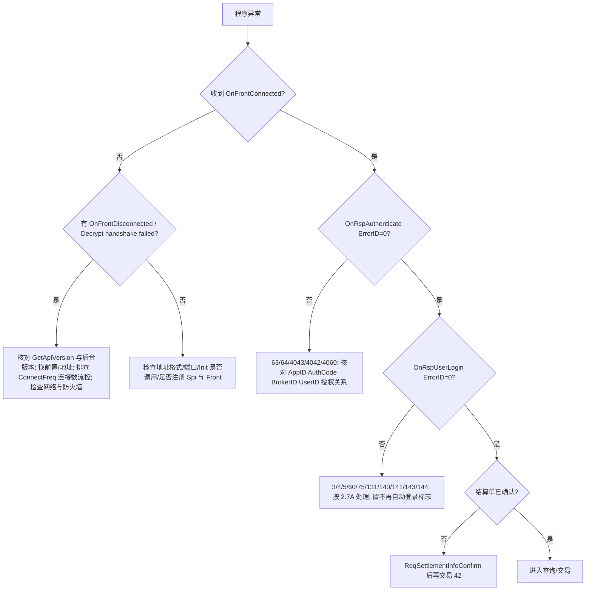

# 09 流控、错误与排障

> 适用对象：CTP 交易 API（6.x 穿透式监管版本为基线）。错误码总表见《14_错误码速查表》（共 299 项，本章只做归类与解读，不重复整表）；登录/认证/会话流程见《03_连接登录认证与会话》。

---

## 1. 要点速查表

### 1.1 流控全景（共六类，分布在 API前置、柜台、交易所多处）

| # | 流控 | 配置位置 | 阈值 / 机制 | 超限表现 |
|---|---|---|---|---|
| 1 | 报单/撤单每秒笔数 | 柜台端“程序化交易频繁报撤单管理”菜单 | 报单 `ReqOrderInsert` 与撤单 `ReqOrderAction` 各自有每秒最大笔数，**分开计算**；按投资者(InvestorID)级别，多开会话无效 | 通过 `OnRspOrderAction` 提示“CTP:下单频率限制”（ErrorID=116 `ORDER_FREQ_LIMIT`） |
| 2 | 查询每秒笔数 | 交易前置组件，配置项 `QryFreq`（穿透式版本以后配置在 front_se） | 例：配 2 笔/秒，则连接该前置的 API 每秒只能发 2 笔查询；投资者受限，操作员不受限；旧版API内置固定 1 笔/秒 | 前置返回 `OnRspError`：“CTP：查询未就绪，请稍后重试”（ErrorID=90 `NEED_RETRY`），查询不执行 |
| 3 | 查询在途笔数 | API 内置，永远存在，与前置配置无关 | **在途 1 笔**：上一笔查询没有收完所有响应（`bIsLast`）前不能发下一笔 | 查询函数返回值 **-2**（未处理请求超过许可数），请求根本没发出 |
| 4 | FTD 报文流控 | 交易前置，配置项 `FTDMaxCommFlux` | 针对当前 Session 的所有请求（登录、查询、报单、撤单、报价…）每秒笔数；例：配 6 则每秒最多 6 个请求报文 | **无错误无返回**，超限指令缓存在前置，延至下一秒发出（现象=后几笔报单延迟很大） |
| 5 | 前置连接数流控 | 交易前置，配置项 `ConnectFreq`（不设置=不限） | 同一 IP 每秒允许的 API 连接请求数（一次 `Init` 到 `OnFrontConnected` 算一次，与登录无关）；例：20 | 前置主动断开连接，触发 `OnFrontDisconnected`；白名单：front_se 的 bin 目录下新建文件 `whiteiplist`，每行一个 IP |
| 6 | 同一用户最大在线会话数 | 柜台/交易核心（针对整个交易系统而非单个前置） | 按 `UserID` 计数；登录成功在线即算 1 个会话（其它客户端登录也计入）；后台 6.6.3 及以上支持按用户维度单独设置 | `OnRspUserLogin` 返回“CTP:用户在线会话超出上限”（ErrorID=60） |
| 7 | 交易所 API 流控 | 交易所端，由交易所 API 查询获取，实际控制在交易所 API 端 | 经交易所 API 发送报单等请求的每秒最大数 | `OnRtnOrder` 报“CTP：交易所每秒发送请求数超过许可数”(ErrorID 41) 或“CTP:交易所未处理请求超过许可数”(40) |

> 链路：客户交易程序 → ① 底层动态库 → ② CTP 柜台（前置/核心） → ③ 交易所 API → ④ 交易所后台。①②是客户直接面对的流控；③④由柜台厂商处理。

### 1.2 请求返回值（所有 `ReqXxx` 通用）

| 返回值 | 含义 | 说明 |
|---|---|---|
| 0 | 发送成功 | 仅代表发出，不代表业务成功 |
| -1 | 网络连接失败 | 当前未连接 |
| -2 | 未处理请求队列总数量超限（在途过多） | 对查询：上一笔查询未收完响应；**sleep 无效**，需串行化 |
| -3 | 每秒发送请求数超限 | **旧版穿透式之前的 API 内置 1 次/秒**；新版本改为后台配置并通过登录应答传给动态库；**sleep 有效** |
| 非 0 | 请求没有发出 | 本次调用无效，也不会有任何回调，需自行重试 |

### 1.3 断线原因码速查（`OnFrontDisconnected(nReason)`，十进制需转十六进制）
`0x1001`(4097) 读失败；`0x1002`(4098) 写失败；`0x2001`(8193) 接收心跳超时（前置每 53 秒心跳，API 120 秒无数据即断）；`0x2002`(8194) 发送心跳失败（API 每 15 秒心跳，40 秒无发送即断）；`0x2003`(8195) 收到错误报文。

### 1.4 最常用 ErrorID 一览（完整表见《14》）

| ID | 常量 | 含义 | 类别 |
|---|---|---|---|
| 3 | INVALID_LOGIN | 不合法的登录 | 登录 |
| 5 | DUPLICATE_LOGIN | 重复的登录 | 登录 |
| 6 | NOT_LOGIN_YET | 还没有登录 | 会话 |
| 15 | BAD_FIELD | 报单字段有误 | 报单参数 |
| 16 | INSTRUMENT_NOT_FOUND | 找不到合约 | 合约 |
| 17 | INSTRUMENT_NOT_TRADING | 合约不能交易 | 合约状态 |
| 22 | DUPLICATE_ORDER_REF | 不允许重复报单 | 重复 |
| 23 | BAD_ORDER_ACTION_FIELD | 错误的报单操作字段 | 撤单参数 |
| 24 | DUPLICATE_ORDER_ACTION_REF | 撤单已报送，不允许重复撤单 | 重复 |
| 25 | ORDER_NOT_FOUND | 撤单找不到相应报单 | 撤单 |
| 26 | INSUITABLE_ORDER_STATUS | 报单已全成交或已撤销，不能再撤 | 撤单 |
| 28 | NO_TRADING_RIGHT | 没有报单交易权限 | 权限 |
| 29 | CLOSE_ONLY | 只能平仓 | 权限/限制 |
| 30 | OVER_CLOSE_POSITION | 平仓量超过持仓量 | 持仓 |
| 31 | INSUFFICIENT_MONEY | 资金不足 | 资金 |
| 42 | SETTLEMENT_INFO_NOT_CONFIRMED | 结算结果未确认 | 结算 |
| 50/51 | OVER_CLOSETODAY/YESTERDAY_POSITION | 平今/平昨仓位不足 | 持仓 |
| 60 | SINGLEUSERSESSION_EXCEED_LIMIT | 用户在线会话超出上限 | 流控/会话 |
| 63/64 | AUTH_FAILED / NOT_AUTHENT | 客户端认证失败/未认证 | 认证 |
| 75 | LOGIN_FORBIDDEN | 连续登录失败次数超限，登录被禁止 | 登录锁定 |
| 90 | NEED_RETRY | 查询未就绪，请稍后重试 | 查询流控 |
| 91 | EXCHANGE_RTNERROR | 交易所返回的错误 | 交易所 |
| 95 | BAD_PRICE_VALUE | 不支持的价格 | 价格 |
| 116 | ORDER_FREQ_LIMIT | 下单频率限制 | 报撤单流控 |
| 143/144 | IP_FORBIDDEN / IP_BLACK | IP 被禁止/黑名单 | 登录锁定 |
| 154 | QK_BUSY | 查询核心忙，请稍后重试 | 查询 |
| 162 | NOT_TRADING_PERIOD | 产品不在可以交易的阶段 | 交易时段 |
| 163 | PRICE_OVER_LIMIT | 报单价格不在涨跌停板价范围内 | 价格 |
| 164 | VOLUME_NOT_VALID | 下单数量不符合交易所规范 | 数量 |
| 165 | PRICE_WRONG_TICK | 报单价格非最小变动价位整数倍 | 价格 |

---

## 2. 详细说明

### 2.1 查询流控详解

#### 2.1.1 两侧流控
查询流控是“两侧”的：
- **API 侧（动态库）**：只针对 `ReqQry*` 开头的函数（查资金、持仓、合约等）。在途限制为 1 笔，任何配置下都存在；被限制的请求在动态库内被阻断，不发往后台，本次调用无效。
- **前置侧**：`QryFreq` 每秒笔数。API 在连接前置时读取该设置（穿透式监管版本起），执行仍在前置；为防止用户用特殊手段不停查询后台，后台也会检查。超限回调 `OnRspError`（ErrorID=90）。
- 所有以 `ReqQuery` 开头的函数不受查询流控限制（它们走交易核心而非查询核心）。
- 投资者受查询流控限制，操作员不受限制。
- 旧版API：内置固定“每秒 1 笔 + 在途 1 笔”，每秒超限返回 -3；历史文档口径也说明“仅对查询限流、交易指令不限流”，现代柜台则对报撤单有显式流控（见下）。

#### 2.1.2 排查方法
查询没有返回时，首先打印查询函数的返回值：只要非 0，说明查询根本没发出，更不会有回调。

| 返回值/现象 | 流控 | 解法 |
|---|---|---|
| -2 | 在途超限 | **sleep 无效**。原因：API 是异步单底层线程架构，请求读取（从缓存）与 socket 读写、SPI 回调由同一线程负责，在 SPI 回调里 sleep 会阻塞读写，最终所有查询在回调结束后一起从 socket 发出。正确做法：一个 SPI 回调里只放一个查询并串行等待响应；或使用事件队列/独立线程顺序查询 |
| -3 | 每秒超限（旧版穿透式前） | sleep 有效，两次查询间隔 1~2 秒；一般出现在异步线程中连续发多个查询时 |
| `OnRspError` ErrorID=90 | 前置每秒流控 | 降速并在 1 秒后重试（工程建议：串行队列 + 间隔 ≥ 1.1 秒；新版每秒允许值由后台配置，向期货公司确认） |
| ErrorID=154 | 查询核心忙 | 稍后重试 |

#### 2.1.3 查询流控的正确实现模式（工程建议）
- 维护全局查询队列；发送一笔后等待其 `bIsLast=true` 再发下一笔；收到 `bIsLast` 后若间隔不足 1 秒则等待。
- 对返回值 -2/-3、ErrorID=90 的查询做有限次重试（退避），不要无限重试。
- 启动期集中查询（合约/资金/持仓/订单/成交…）应排序并串行化（顺序见《03》2.7）。

### 2.2 报撤单流控详解

- 机制：柜台端“程序化交易频繁报撤单管理”配置每秒最大报单与撤单笔数；`ReqOrderInsert` 与 `ReqOrderAction` **分开计算**；按投资者级别，所以**多开 session 没法绕开**，需要更高频只能分账户（具体合规性由期货公司和交易所决定）。
- 表现：超限时在撤单/报单的错误回调中返回“CTP:下单频率限制”（ErrorID=116）。勿与 91（交易所返回的错误）混淆。
- 区别于 FTD 报文流控（第 4 类）：报撤单流控是**显式拒绝**，FTD 报文流控是**静默缓存延迟**。
- 旧版 API/旧文档口径：交易指令默认每会话约 6 笔/秒、同账户最多 6 会话，超限排队不报错。现代柜台以后台配置为准。
- 交易所侧另有异常交易监管：自成交、频繁报撤单（撤单数）等。CTP 内部并没有“单合约撤单数 500 笔”的风控，各交易所依据异常交易管理规范监管，**需策略自行控制**；FAK/FOK 报单造成的撤单与自成交通常不计入异常交易（以各交易所规则为准）。可能大量撤单的策略可考虑 FAK/FOK。

### 2.3 FTD 报文流控与前置连接数流控

- FTD 报文流控：所有请求都在其围内。例：配置 6，1 秒内报单 10 笔，前 6 笔立即发出，后 4 笔缓存在前置，下一秒才发出——用户感受是后几笔延迟很大，但没有任何错误信息。排查延迟突增时需要考虑此项。
- 前置连接数流控：超限被动断开。**症状：一连接就被断开**。除版本问题外应怀疑此项。此项按前置（IP 地址）配置，如 SimNow 有多套地址，某套触发可换另一套。重连与连接数流控会互相放大：被踢后立刻重连会再次被踢（工程议：退避、排查同 IP 实例数）。密码错误或终端认证失败也可能触发 `OnFrontDisconnected`，原因即前置的 `ConnectFreq` 拒绝了连接。

### 2.4 会话数上限与登录锁定

- 会话数：同 `UserID` 在整个交易系统的并发在线会话数上限；错误：60；具体阈值咨询期货公司（后台 6.6.3+ 可按用户设置）。
- 登录锁定（阈值以期货公司设置为准）：
  - IP 维度：错误“CTP：登录失败次数超限，IP被禁止”(143)，阈值一般 5000，单个交易日累积；
  - IP+账号维度：错误“CTP：连续登录失败次数超限，登录被禁止”(75)，阈值一般 6~10，**连续**计算；解法：换 IP 或联系期货公司解锁；
  - 认证维度：4060“认证失败次数过多，IP进入认证禁止列表”；144 IP 黑名单。
  - “用户不活跃”(4)：UserID 不存在的场景不受会话数参数限制，超限也不锁 IP（防止中继被误锁）。

### 2.5 4097 的根源

- 4097(0x1001) 是 API 在检测到与前置的网络断开时回调 `OnFrontDisconnected` 传出的 `nReason`，底层会同时打印一行断开日志。同类现象还包括：没有 `OnFrontConnected` 回调、`Decrypt handshake data failed`、8193。
- 排查顺序：
  1. **版本**：CTP 要求 API 版本与后台版本一致。版本不对会表现为不停回调 `OnFrontDisconnected`、输出 `Decrypt handshake data failed` 或毫无反应。此时**重连无用**。调用 `GetApiVersion()` 核对；期货公司正式生产和 SimNow 常见基线为 v6.3.15_20190220，评测可使用 6.3.13 或 6.3.16；穿透式与非穿透式 API 互不兼容。
  2. **网络/前置拥堵**：生产环境一般不会；SimNow 用户多时会拥堵，7×24 地址也不稳定。切换另外两套模拟地址；仍不行问客服。
  3. **连接数流控**（见 2.3）。
  4. **心跳**：8193/8194 与网络质量或进程被挂起有关。
- 不要把 4097 一律当成网络抖动而无限重试。

### 2.6 回调分层与报单错误面（决定“错误从哪里收”）

> **来源边界**：下表原稿混合了旧 FAQ/客户端入门资料和 [`notes/09`](../notes/09-错单推送面与错误码对账.md) 的项目分层约定。官方 [`报单回调规则`](../api-doc-html/pages/389-QTYWGZ-DBHB.html) §1 定义错单响应/回报，场景6/7明确指定撤单错误先响应后回报，但没有证明“所有交易所层报单拒绝都先成功响应再错误回报”。旧 FAQ 的“正确报单无 OnRsp、交易所拒单仅 OnRtnOrder”和 notes/09 的双面解释存在冲突，不能硬拼统一规则；下表仅保留作来源对照，实际处理边界见 [05章](05_报单撤单与回报.md) §2.20。当前代码及 e2e 不是对真实 CTP 普遍行为的证明。

| 层 | 拒绝内容 | 回调 | 说明 |
|---|---|---|---|
| CTP 层（报盘机/前置/核心） | 会话未登录、字段解析失败、BrokerID 不一致、报单字段非法、ExchangeID 不符、条件单/预埋单不支持、流控超限、资金不足、持仓/平今平昨不足、未认证等 | `OnRspOrderInsert(pInputOrder=…, pRspInfo.ErrorID≠0)`（发出报单的会话），**不跟任何 `OnRtnOrder`**；同账户其它会话（按报单的 `UserID`）收到 `OnErrRtnOrderInsert` | 合法报单**不会**收到“成功”的 `OnRspOrderInsert`，只有被 CTP 拒绝才会收到 |
| 交易所层 | 涨跌停板价(163)、数量规范(164)、最小变动价位(165) 等 | 先 `OnRspOrderInsert`(无错误) 后 `OnErrRtnOrderInsert`(带错误)；`OnRtnOrder` 状态相应变化（如 OrderSubmitStatus=已被拒绝、`StatusMsg` 带交易所错误文本） | 只挂 `OnRspOrderInsert` 会漏掉交易所层拒单 |
| 撤单拒绝 | 找不到报单(25)、状态不当(26)、流控(116)、字段错(23) | `OnRspOrderAction` + `OnErrRtnOrderAction` 成对（先响应后回报） | 缺一不可 |
- 一次操作多次回报：发一笔委托通常收到 CTP 的“已提交/尚未触发”类回报（OrderSubmitStatus=已提交）和转发交易所的“未成交”回报；撤单则先 CTP 修改后再转发交易所“已撤单”。所有返回包对终端都由 CTP 发出，无法区分来自 CTP 还是交易所。故 `OnRtnOrder` 重复推送属正常，需幂等处理。详见报单回调规则相关章节。
- 报单未填 `UserID` 时收不到 `OnErrRtnOrderInsert`/`OnErrRtnOrderAction`。
- 撤单定位：使用 `FrontID+SessionID+OrderRef` 时必须同时填 `InstrumentID`；使用 `ExchangeID+OrderSysID` 时注意首次报单回报中 `OrderSysID` 为空。

### 2.7 全部关键 ErrorID 分类解读

（按功能分组，括号内为 ErrorID；完整常量与原文提示见《14_错误码速查表》。）

**A. 会话 / 登录 / 认证**
- 1 不在已同步状态、2 会话信息不一致、3 不合法登录、4 用户不活跃、5 重复登录、6 还没有登录、7 还没有初始化、8 前置不活跃、9 无此权限、10 修改别人的口令、11~13 找不到用户/经纪公司/投资者、14 原口令不匹配、48 无效的投资者或者密码、49 不合法的登录 IP、60 会话数超限、63 认证失败、64 未认证、75 登录被禁止、131 弱密码、132 密码过于简单、140 首次登录必须改密、141 密码过期、142 新旧密码相同、143 IP 被禁止、144 IP 黑名单、145 终端在本系统没有认证权限、4040 API Front shake hand err、4042 IP 授权验证失败、4043 用户与客户端授权验证失败、4060 认证失败过多、3039 不支持该 API 版本、3040 无效的 API KEY。
- 动态令牌：56 同步失败、57 校验错误、58 找不到配置、59 不支持类型。
- 短信验证码：6014 非预留手机号、6015 未开启短信验证、6016 重复申请、6017 不匹配、6018 已使用、6019 已过期、6020 已开启短信认证需填写验证码、6021 中心未配置、6023 已登录成功不允许申请验证码。
- 加密/SM 相关：4100~4111 系列（国密证书、PIN 等）。

**B. 结算 / 查询**
- 42 结算结果未确认、38 不合法的结算引用、90 查询未就绪、154 查询核心忙、158 超过信息量限制、5002 系统忙。

**C. 报单参数**
- 15 报单字段有误、16 找不到合约、17 合约不能交易、18 经纪公司不是交易所会员、19 投资者不活跃、20 投资者未在交易所开户、21 交易席位未连接交易所、27 不支持的功能、37 现货不能卖空、61 该交易所不支持套利/做市商类型报单、65 不支持互换类型、66 期权只支持投机、80 交易所不支持的价格类型、82 无效的组合合约、88 组合期权只支持 IOC、95 不支持的价格、146~150 缺少/无效 InvestorID/ExchangeID/AccountID/交易所代码错误、163/164/165 价格涨跌停/数量/最小变动价位。
- 与交易时段相关：44 交易所已进入连续交易状态（某些操作不再允许）、113/114 当前时间/价差禁止询价、139 当前时间禁止行权、162 产品不在可交易阶段、6022 到期日盘后禁止自对冲。

**D. 报单唯一性 / 撤单**
- 22 重复报单、23 错误的撤单字段、24 重复撤单、25 撤单找不到报单、26 已全成交或已撤销不能再撤、55 重发未知单信息不匹配、78 发送报单失败、79 发送报单操作失败、92 报价衍生单要等交易所返回才能撤、94 不允许撤销 OTC 衍生报单、103 交易所不支持批量撤单、157 交易所不支持撤销未知单。

**E. 资金 / 持仓 / 权限**
- 28 没有报单交易权限、29 只能平仓、30 平仓量超过持仓量、31 资金不足、50 平今仓位不足、51 平昨仓位不足、74 执行仓位不足、101 用户在本系统没有报单权限、106 投资者限仓、156 平期权多头后资金为负只可由风控强平、153 拆分组合钱不足、4061 未满足质押配比。

**F. 流控 / 繁忙 / 交易所**
- 39 交易所网络连接失败、40 交易所未处理请求超过许可数、41 交易所每秒发送请求数超过许可数、91 交易所返回的错误、116 下单频率限制、60 会话数超限、5002 系统忙、6000 订阅合约过多。

**G. 条件单 / 预埋单**
- 52/53 条件单数量不足、54 经纪公司不支持条件单、62 没有条件单交易权限、45~47 预埋单找不到/已发送/已删除、159/160 超过预埋单最大量、161 预埋单不支持的触发类型、6011~6013 不允许组合合约预埋单/预埋撤单/条件单。

**H. 期权 / 执行 / 对冲 / 做市商**
- 67~73、81、84~87 执行宣告与报价相关；3041~3046 期权自对冲/履约对冲；6001~6010 对冲与套利/套保申请；3047 报价不支持该投机套保类型；4050 报价指定顶单编号不合法（中金所）。

**I. 银期 / 银期换汇**
- 1000~1047、2000~2070、3001~3038、5050、5051、999999：银期转账与换汇业务错误，另见银期专题文档，不属于交易链路。

**J. 参数 / 风控数据缺失**
- 96~100 SPBM/RULE 参数找不到、5000/5001 RCAMS 参数找不到、93 找不到组合合约映射、102 系统缺少灾备标示号、155 未连接监控中心。

### 2.8 典型错误处理手册

#### 2.8.1 报单被拒
1. 判断层次：`OnRspOrderInsert` 带错误→ CTP 层；`OnErrRtnOrderInsert` 或 `OnRtnOrder` 中 `OrderSubmitStatus=已被拒绝(4)` 且 `StatusMsg` 带文本→交易所层（`StatusMsg` 开头的数字是交易所错误码；在 SimNow 中统一按上期所规则赋值）。
2. 在本地账本中解冻：被 CTP 拒绝(`OnRspOrderInsert`)时，须把报单时冻结的保证金/手续费/持仓冻结释放。
3. 常见原因对照：见 2.7。

#### 2.8.2 撤单失败
- 25 找不到相应报单：核对定位键（首次回报 OrderSysID 为空；FrontID/SessionID 是否为本会话；InstrumentID 是否填）。
- 26 已全成交或已撤销：单子已终态。上期所存在“报单已经全部成交”的特殊情形——交易所已成交但 CTP 尚未收到成交通知，撤单通过 CTP 检查后被交易所拒绝。**因此撤单失败后应以后续成交/撤单回报为准**，不要立刻重发。
- 24 撤单已报送，不允许重复撤单：已发过撤单，等待回报。
- 23 撤单字段错误：ActionFlag 仅支持 `THOST_FTDC_AF_Delete`；挂起/激活/修改目前不支持（“无此功能”）。
- 116：撤单过于频繁。
- 批量撤单 `ReqBatchOrderAction` 仅大商所且仅做市商客户可用；一般客户需自行逐笔撤。

#### 2.8.3 资金不足(31)
- 冻结保证金 = 价格 × 未成交手数 × 合约乘数 × 保证金率（按金额）+ 未成交手数 × 保证金率（按手）；价格取成交均价/开仓价/最新价（昨仓用昨结算价）取决于期货公司“保证金价格类型”配置（可通过 `ReqQryBrokerTradingParams` 查询，类型 `'1'` 昨结算价、`'2'` 最新价、`'3'` 成交均价、`'4'` 开仓价）。
- 另需计入手续费冻结；“浮盈可开仓”等算法由经纪公司交易参数决定。
- 处理：查询 `ReqQryTradingAccount`，降低手数；注意保证金优惠（组合持仓只收大单边）。

#### 2.8.4 合约不可交易(17)/找不到合约(16)/产品不在交易阶段(162)
- 16：合约代码不存在（拼写、已退市、过期）；17：合约已过期、未上市或状态不可交易。
- 判断合约是否可交易：`IsTrading` 表示当天是否可交易；是否当前可交易看合约状态（仅上期所推送单合约状态）或交易所状态（`OnRtnInstrumentStatus`）；大商所/郑商所盘中不推单个合约状态，不能依赖 `InstLifePhase`/`IsTrading` 获得及时信息。
- 订阅 `OnRtnInstrumentStatus`（公共流）可识别交易所小结休息、集合竞价等阶段，以便在非连续交易阶段改用预埋单等。

#### 2.8.5 不在交易时段
- 非交易时段报单被拒（CTP 或交易所层均可能拒绝，常见 162/17 或相关提示）；集合竞价期间 FAK/FOK 不可使用。
- 柜台通常 7:30~8:00 启动，早时可挂预埋单；夜盘/日盘的合约列表可能不同（夜盘前与日盘前各查一次合约）。
- 交易日判定：夜盘 `TradingDay` 为下一个交易日（上期所/能源中心/大商所），郑商所以当日计；以登录应答与行情中的 `TradingDay` 为准，需按交易所区分。

#### 2.8.6 重复报单(22)
- OrderRef 必须单调递增；重连/换会话后沿用旧计数导致重复，或多线程竞争。OrderRef 超有符号 32 位范围会被判为 0 而重复。
- 同一 FrontID+SessionID+OrderRef 再次出现即重复。

#### 2.8.7 价格/数量类
- 163 价格超出涨跌停；165 不是最小变动价位整数倍（用 `PriceTick` 对齐，避免浮点误差，工程建议整数化处理）；164 数量不合规（限价单/市价单最大最小下单量见合约信息 `MaxLimitOrderVolume` 等）；95 不支持的价格。
- 市价单：郑商所价格非 0 会被拒；上期所在生产环境曾暂不支持（以当前交易所规则为准）。

#### 2.8.8 持仓类
- 30 平仓量超过持仓量：可平数 = 持仓 − 对手方向冻结（多头持仓可平 = 持仓 − 空头冻结）。未结报单会冻结持仓，在平仓单未返回前不能重复报平仓。
- 50/51：上期所/能源中心区分今昨仓，平今/平昨量需分别满足。其它交易所 `CloseToday/CloseYesterday` 后台统一转换为平仓。
- 持仓查询无记录：回调时指针为空且 `bIsLast=true`，不是返回一条空记录。当天开仓后全平或报单未成交的键上仍可查到持仓记录，`Position` 为 0。

### 2.9 其它重要排障知识

- 登录前提：开启强制认证时先认证后登录；每次重连需重新认证；非强制时认证失败不影响登录。
- 回报去重：成交按 `ExchangeID + TradeID`（并结合方向）；订单按 `FrontID+SessionID+OrderRef` 或 `ExchangeID+OrderSysID`。
- 订单最终状态：全部成交(0)、已撤销(5)、未成交不在队列中、部分成交不在队列中。（“部成部撤”即部分成交不在队列中）
- 自动挂起标志 `IsAutoSuspend` 请固定为 0。
- `OnHeartBeatWarning` 永不回调。
- 模拟环境提示：行情在“连续交易→非交易状态”切换时可能停止转发数分钟；模拟环境时钟校时周期长，可能偏差。
- 费率：`ReqQryInstrumentMarginRate` 返回的保证金率是绝对值（含交易所保证金及调整）；查手续费返回“品种”仅说明该合约费率取自品种设置。

---

## 3. 标准流程 / 排障决策树

### 3.1 连接 → 登录排障



### 3.2 查询排障
1. 打印 `ReqQry*` 返回值；
2. 返回 -2：存在未结束的查询 → 串行化（回调里只放一个查询，或队列/线程）；
3. 返回 -3：每秒超限 → 间隔 ≥ 1~2 秒；
4. 返回 0 但 `OnRspError`(90)：前置流控 → 降速重试；
5. 返回 0 但无回调：是否 `bIsLast` 误判、是否被 FTD 报文流控缓存、是否已断线。

### 3.3 报单排障
1. 返回值非 0 → 请求未发出（-1/-2/-3）；
2. `OnRspOrderInsert` 有错误 → CTP 层拒绝，按 ErrorID 处理（15/16/17/22/30/31/42/50/51/116/…）；
3. 无 `OnRspOrderInsert` 错误但 `OnErrRtnOrderInsert`/`OnRtnOrder` 被拒 → 交易所层（163/164/165/91…）；读 `StatusMsg`；
4. 一直无回报 → 检查是否订阅私有流、FTD 报文流控延迟、是否断线、是否使用了 QUICK 之外模式造成历史干扰；
5. 状态停在“未知”(`'a'`)/“尚未触发”→ 等待回报，勿重复报；断线后用查询订单核对。

### 3.4 撤单排障
1. 核对撤单键（见 2.6）；2. 检查订单是否终态；3. 区分 25/26；4. 撤单频率（116）；5. 以后续回报为准。

---

## 4. 代码范例

### 4.1 查询串行化队列（工程建议）
```cpp
// 一次只放一个在途查询，收到 bIsLast 后至少间隔 1.1 秒再发下一个
struct QryTask { std::function<int(int)> send; };
class QryQueue {
    std::deque<QryTask> q; bool inflight = false;
    std::chrono::steady_clock::time_point last;
public:
    void push(QryTask t){ q.push_back(std::move(t)); pump(); }
    void onLast(){ inflight = false; last = std::chrono::steady_clock::now(); /* 定时器到点后 pump() */ }
    void pump(){
        if (inflight || q.empty()) return;
        if (std::chrono::steady_clock::now() - last < std::chrono::milliseconds(1100)) return;
        int rc = q.front().send(++reqId);
        if (rc == 0) { inflight = true; q.pop_front(); }
        else if (rc == -2 || rc == -3) { /* 稍后重试，不弹出 */ }
        else { /* -1: 断线，等待重连 */ }
    }
};
// 在 OnRspError 中遇到 ErrorID==90：把该查询重新入队并延后 1 秒
```

### 4.2 错误回调统一处理
```cpp
bool IsErr(CThostFtdcRspInfoField* r){ return r && r->ErrorID != 0; }

void OnRspOrderInsert(CThostFtdcInputOrderField* p, CThostFtdcRspInfoField* r, int rid, bool last) {
    if (IsErr(r)) {            // CTP 层拒绝: 解冻本地资金/持仓冻结
        log("insert rejected %d %s", r->ErrorID, r->ErrorMsg);
        unfreeze(p);
    }
}
void OnErrRtnOrderInsert(CThostFtdcInputOrderField* p, CThostFtdcRspInfoField* r) {
    // 交易所层拒单也会走这里(163/164/165...)，需要 UserID 非空才能收到
}
void OnRspOrderAction(CThostFtdcInputOrderActionField* p, CThostFtdcRspInfoField* r, int rid, bool last) {
    if (IsErr(r)) { /* 25 找不到 / 26 已终态 / 116 频率 / 23 字段 */ }
}
void OnErrRtnOrderAction(CThostFtdcOrderActionField* p, CThostFtdcRspInfoField* r) { /* 撤单被交易所拒绝 */ }
void OnRspError(CThostFtdcRspInfoField* r, int rid, bool last) {
    if (r && r->ErrorID == 90) { /* 查询流控: 延迟重试 */ }
}
```

### 4.3 撤单键填写
```cpp
CThostFtdcInputOrderActionField a{};
strcpy(a.BrokerID, broker); strcpy(a.InvestorID, investor); strcpy(a.UserID, user);
a.ActionFlag = THOST_FTDC_AF_Delete;
// 方式一(推荐): ExchangeID + OrderSysID (首次回报 OrderSysID 为空，不能用)
strcpy(a.ExchangeID, ex); strcpy(a.OrderSysID, sysid);
// 方式二: FrontID + SessionID + OrderRef (必须同时填 InstrumentID)
// a.FrontID = frontId; a.SessionID = sessionId; strcpy(a.OrderRef, ref); strcpy(a.InstrumentID, inst);
api->ReqOrderAction(&a, ++reqId);
```

### 4.4 断线原因日志
```cpp
void OnFrontDisconnected(int nReason) {
    log("disconnected reason=0x%X (%d)", nReason, nReason);
    // 0x1001 读失败 / 0x1002 写失败 / 0x2001 接收心跳超时 / 0x2002 发送心跳失败 / 0x2003 错误报文
}
```

---

## 5. FAQ（问答）

**Q1：为什么查询没有任何返回？**  A：先看返回值。非 0 表示根本没发出（-1 断线、-2 在途超限、-3 每秒超限）。返回 0 仍无回调时，检查是否已断线、是否收到 `OnRspError`(90)。

**Q2：为什么 -2 用 sleep 治不好？**  A：SPI 回调和 socket 读写在同一底层线程，回调内 sleep 会阻塞读写；各查询最终在回调结束后一并发出。应在一个回调里只发一个查询，并用队列/线程串行。

**Q3：为什么报单后几笔延迟很大？**  A：可能受 FTD 报文流控（超限缓存到下一秒，无报错）。

**Q4：一连接前置就掉线？**  A：版本不匹配；或前置连接数流控；或 SimNow 拥堵。

**Q5：登录被锁怎么办？**  A：IP 被禁止(143)或登录被禁止(75)：换 IP 或联系期货公司解锁；停止脚本循环重试。

**Q6：“CTP:重复的登录”是什么？**  A：已登录成功后又发登录，极端情况下前置未收到核心成功应答时会放行第二个登录，核心返回此错误，可忽略。

**Q7：“用户在线会话超出上限”？**  A：同一 UserID 在整个系统的在线会话数超限（含其它客户端）；关闭多余会话或让期货公司调高。

**Q8：报单没收到 `OnErrRtnOrderInsert`？**  A：报单未填 `UserID`。

**Q9：报单没有 `OnRspOrderInsert` 就是成功吗？**  A：合法报单不会收到成功的 `OnRspOrderInsert`；只有被 CTP 拒绝才收到。但交易所层拒单会收到“无错误的 `OnRspOrderInsert`”之后的 `OnErrRtnOrderInsert`，需结合 `OnRtnOrder` 判断。

**Q10：每次登录 `OnRtnOrder` 都重推旧单？**  A：私有流使用了 RESTART；改用 RESUME 或 QUICK。

**Q11：为什么 `MaxOrderRef` 每次都从 1 开始？**  A：FrontID+SessionID 变化后 MaxOrderRef 重置；OrderRef 由客户端管理，只需单调递增。

**Q12：撤单提示“报单已全成交或已撤销”但我没看到成交？**  A：上期所特殊情形：交易所已成交、CTP 尚未收到成交通知；等待成交回报。

**Q13：为什么保证金与预期不同？**  A：保证金价格类型（昨结算价/最新价/成交均价/开仓价）由期货公司配置，用 `ReqQryBrokerTradingParams` 查询；返回的保证金率是含交易所保证金率及调整后的绝对值。

**Q14：仿真环境的行情为什么 9:04 才出现？**  A：模拟环境行情在“连续交易→非交易”切换时曾停止转发约 5 分钟，且校时周期长。

**Q15：能否通过多开会话突破报撤单流控？**  A：不能，按投资者(InvestorID)级别限制；需要更高频只能分账户。

**Q16：调试 Linux 程序，GDB 莫名停止？**  A：API 使用 `SIGUSR1`，执行 `handle SIGUSR1 nostop noprint`。

**Q17：查询所有合约保证金率？**  A：`ReqQryInstrumentMarginRate` 一次只能查一个合约（代码留空只返回有持仓的合约）；可用 `ReqQryInstrument` 获取交易所级 `LongMarginRatio/ShortMarginRatio`，再加期货公司固定加成。

**Q18：Release 时崩溃？**  A：不要在 SPI 回调线程中调用；顺序 `RegisterSpi(NULL) → Release → 置空 → delete SPI`。

---

## 6. 常见坑与排查（现象 → 原因 → 处理）

| 现象 | 原因 | 处理 |
|---|---|---|
| 查询返回 -2 | 上一笔查询未结束 | 串行化，等 `bIsLast` |
| 查询返回 -3 | 每秒超限(旧版) | 间隔 1~2 秒 |
| `OnRspError` 90 | 前置查询流控 | 降速重试 |
| 报单后延迟大且无报错 | FTD 报文流控 | 降低总请求速率（含登录、查询） |
| 撤单 116 | 报撤单流控 | 限速、减少无效撤单 |
| 一连接就掉线 | 版本不匹配/连接数流控 | 核对版本；换前置；退避 |
| 登录死循环 | 失败后仍在 `OnFrontConnected` 重登 | 失败置不再自动登录 |
| 登录 143/75 | 失败次数过多被锁 | 换 IP/联系期货公司 |
| 60 | 会话数超限 | 清理其它会话 |
| 63/64/4043 | 认证问题 | 核对 AppID/AuthCode、授权关系 |
| 42 | 未确认结算单 | 确认后再报单 |
| 报单被拒 163 | 价格超涨跌停 | 用 `UpperLimitPrice/LowerLimitPrice` 校验 |
| 报单被拒 165 | 非 `PriceTick` 整数倍 | 价格对齐，避免浮点误差 |
| 30/50/51 | 平仓冻结/今昨仓不足 | 按可平数下单，等待平仓单结果 |
| 22 | OrderRef 重复/回绕 | 原子递增 |
| 收不到 `OnErrRtn*` | 缺 UserID | 填写有效 UserID |
| 重连后回报缺失/重复 | 模式选择不当 | RESUME/QUICK 搭配查询补全；去重 |
| `Decrypt handshake data failed` | API/后台版本不一致 | 换匹配 API |
| 数据错乱 | flowPath 共用 | 每实例独立目录 |

---

## 7. 检查清单

Do：
- 每个 `Req*` 都检查返回值；非 0 视为未发出。
- 所有查询串行化并限速；对 90/-2/-3 有限重试。
- 区分 CTP 层与交易所层拒单，同时挂 `OnRspOrderInsert`、`OnErrRtnOrderInsert`、`OnRtnOrder`、`OnRspOrderAction`、`OnErrRtnOrderAction`。
- 日志记录 `ErrorID`、`ErrorMsg`、`nReason`、API 版本。
- 报撤单频率、撤单数在策略侧自行风控。
- 登录失败不要自动重登；认证失败先排查配置。
- 回报幂等处理；以成交回报为准更新持仓与资金。

Don't：
- 不要在 SPI 回调内 sleep 来“解决”-2；不要在回调里做大量同查询。
- 不要对被拒报单无限重试。
- 不要把 4097 一律当作网络抖动。
- 不要依赖多会话突破报撤单流控。
- 不要假设 `OnRtnOrder` 能区分 CTP/交易所来源。

---

## 8. 关键词索引

流控；查询流控；报单流控；撤单流控；FTD 报文流控；`FTDMaxCommFlux`；前置连接数流控；`ConnectFreq`；`whiteiplist`；`QryFreq`；front_se；在途查询；-1；-2；-3；会话数上限；最大在线会话数；4097；0x1001；4098；8193；8194；8195；`OnFrontDisconnected`；`Decrypt handshake data failed`；`GetApiVersion`；`OnRspError`；ErrorID 90 / NEED_RETRY / 查询未就绪；116 / ORDER_FREQ_LIMIT / 下单频率限制；60；63；64；75；143；144；4043；4060；42 结算单未确认；22 重复报单；25；26；30；31；50；51；17；16；162；163；164；165；91；40；41；`OnRspOrderInsert`；`OnErrRtnOrderInsert`；`OnRspOrderAction`；`OnErrRtnOrderAction`；`OnRtnOrder`；`StatusMsg`；`OrderSubmitStatus`；`UserID`；`OrderSysID`；`OrderRef`；`FrontID`；`SessionID`；资金不足；平仓量超过持仓量；合约不可交易；不在交易时段；重复报单；排障决策树；FAQ；SimNow；`ReqQryBrokerTradingParams`；保证金价格类型；`IsTrading`；`OnRtnInstrumentStatus`。

